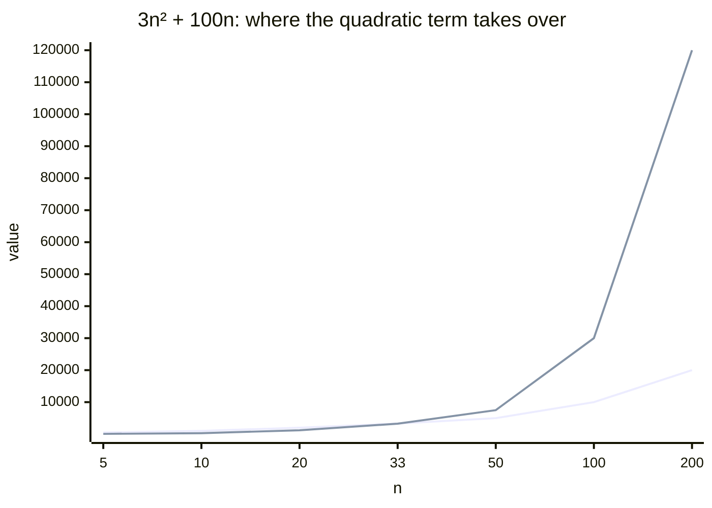

import LevelIntro from "../../../components/LevelIntro.astro";
import Checkpoint from "../../../components/Checkpoint.astro";

L1 named the three bounds — O, Ω, Θ — and warned that a small-`n`
benchmark can look linear while the true class is quadratic. L2 pins down
exactly what those bounds mean, exactly where that crossover happens, and
exactly what a doubling ratio does and doesn't prove.

<LevelIntro
  items={[
    "The precise O/Ω/Θ definitions",
    "Finding where the dominant term takes over",
    "What a doubling ratio does and doesn't prove",
  ]}
/>

## What "grows no faster than" actually means, precisely

**"O(n²) means it's roughly n² operations" is the intuitive version — but
what does it mean _exactly_, in a way you could actually check?** Formally,
`T(n)` is `O(f(n))` if there exist positive constants `c` and `n₀` such
that:

```text
T(n) ≤ c · f(n)   for all n ≥ n₀
```

In words: past some starting point `n₀`, `T(n)` never exceeds a constant
multiple of `f(n)`. The constant `c` absorbs things like hardware speed or
a fixed per-operation cost; `n₀` is exactly what lets Big-O ignore
small-`n` behavior — which is also exactly why a benchmark run only at
small `n` can't validate or refute a Big-O claim on its own.

With simple numbers, if `f(n)` is `n²` and `c = 4`, the bound says:
"after some point, the work is never more than four times `n²`." It does
not say the work equals `n²` exactly, and it does not care if the first
few small values behave strangely. The phrase "for all n ≥ n₀" means
"from that starting size onward, with no later exceptions."

## Ω and Θ: bounding from below, and from both sides

**If O(f(n)) is an upper bound, is there a way to state a lower bound —
and a way to say "exactly this rate," not just "no worse than"?**

| Notation  | Meaning                             | Formal condition                          |
| --------- | ----------------------------------- | ----------------------------------------- |
| `O(f(n))` | grows no faster than `f(n)`         | `T(n) ≤ c·f(n)` for `n ≥ n₀`              |
| `Ω(f(n))` | grows at least as fast as `f(n)`    | `T(n) ≥ c·f(n)` for `n ≥ n₀`              |
| `Θ(f(n))` | grows at exactly the rate of `f(n)` | both an O(f(n)) and an Ω(f(n)) bound hold |

`T(n) = 3n² + 100n` is `Θ(n²)` — it is both `O(n²)` (never exceeds `4n²`
for `n ≥ 100`, say) and `Ω(n²)` (never drops below `3n²`). It is _also_
technically `O(n³)` (a looser, still-true upper bound) — but calling it
`Θ(n²)` is the precise, tightest true statement.

<Checkpoint question="Is T(n) = 3n² + 100n correctly described as O(n²)? Is it correctly described as Θ(n²)? Do those two labels contradict each other?">

Both are correct at once, and they don't contradict — `Θ(n²)` is just a
_stronger_ claim than `O(n²)`. `O(n²)` only says "grows no faster than
n²" (an upper bound alone, which even `O(n³)` would also satisfy).
`Θ(n²)` says the growth is pinned from _both_ sides — no faster and no
slower — which is exactly true here, since `3n² + 100n` never drops below
`3n²` either. Calling it `Θ(n²)` is more informative than calling it
`O(n²)`, but neither statement is false.

</Checkpoint>

## Why the dominant term wins, and exactly when it starts winning

**`3n² + 100n` — at what point does the `n²` term actually take over from
the `100n` term?** They're equal when `3n² = 100n`. Since input size is
positive, divide both sides by `n`:

```text
3n² = 100n
3n² / n = 100n / n
3n = 100
n = 100/3 ≈ 33
```

Below that, `100n` is larger; above it, `3n²` grows away from `100n`
increasingly fast:



At `n = 5` or `n = 10`, the linear term is still 6-16× larger than the
quadratic term — a benchmark there genuinely _looks_ linear, because for
those specific input sizes, it very nearly is. The formal `n₀` in the
Big-O definition is exactly this crossover region: below it, lower-order
terms can dominate the observed behavior; the asymptotic classification
only describes what happens once you're safely past it.

## Reading a doubling ratio correctly

**Doubling `n` and watching the runtime roughly double is real evidence
— evidence of what, exactly?** It's evidence about the growth rate _in
the neighborhood of the `n` you tested_, not a global proof. The ratio
`T(2n)/T(n)` itself is a function of `n` for anything that isn't a pure
power of `n` — for `3n² + 100n`, that ratio is close to 2 (linear-looking)
at small `n` and climbs toward 4 (quadratic) as `n` grows, exactly
tracking the crossover in the chart above.

| Where you measure     | `T(2n)/T(n)` for `3n² + 100n` | What it looks like         |
| --------------------- | ----------------------------- | -------------------------- |
| n = 5 → 10            | ≈ 2.26                        | Looks close to linear      |
| n = 50 → 100          | ≈ 3.2                         | Ambiguous, trending upward |
| n = 100,000 → 200,000 | ≈ 4.0                         | Unambiguously quadratic    |

For the first row, the actual arithmetic is:

```text
T(5) = 3·25 + 100·5 = 575
T(10) = 3·100 + 100·10 = 1300
T(10) / T(5) = 1300 / 575 ≈ 2.26
```

That ratio is genuinely near 2 at this small size. The mistake is
treating that local ratio as proof that the ratio will stay near 2 when
`n` becomes much larger.

<Checkpoint question="A colleague doubles n from 50 to 100, sees the runtime roughly triple (not double, not quadruple), and concludes 'it's not linear and it's not quadratic — it must be some other class entirely.' What's wrong with that conclusion?">

The ratio at `n = 50 → 100` (≈3.2) sits _between_ the linear (2) and
quadratic (4) signatures precisely because it's measured in the
crossover region, not because the function belongs to some third growth
class. `3n² + 100n` really is `Θ(n²)` — the ratio simply hasn't finished
climbing toward its true limit of 4 yet at that `n`. Reading an
in-between ratio as "a different class" repeats the same mistake as
reading a near-2 ratio as "definitely linear": both treat one local
measurement as the whole asymptotic story instead of a point still
converging toward it.

</Checkpoint>

## The generalizable lesson

**Does this mean small benchmarks are useless?** No — they're genuinely
informative about performance _at the sizes you actually run in
production_, if those sizes stay small. The mistake isn't benchmarking
small; it's treating a small-`n` doubling ratio as a proof of the
asymptotic class, when the whole point of "asymptotic" is behavior as
`n → ∞`. The fix is either testing at the actual production scale, or
doing the algebraic analysis (finding the dominant term directly, as
above) instead of relying on measurement alone.
