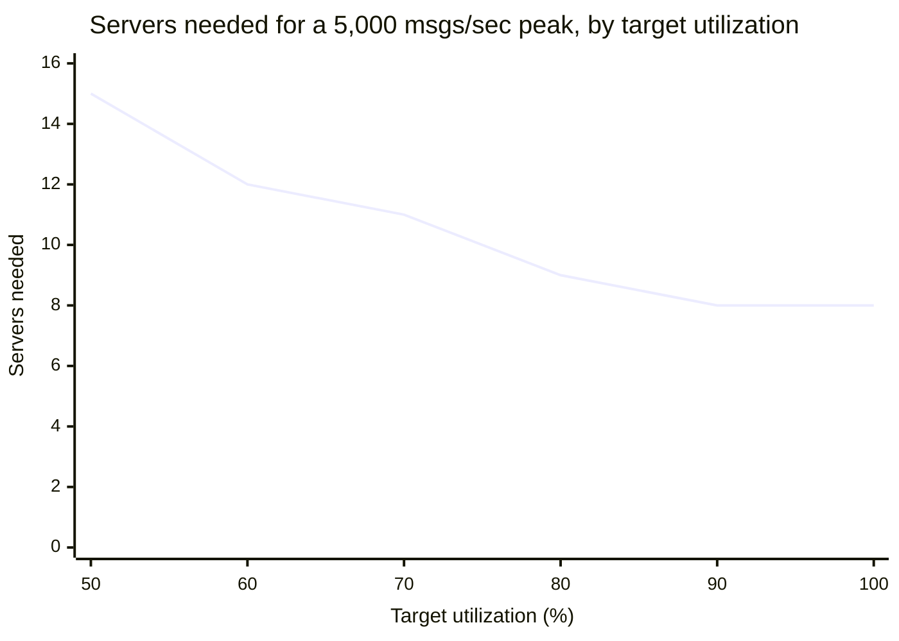
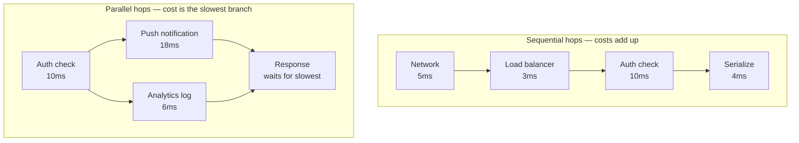

import LevelIntro from "../../../components/LevelIntro.astro";
import Checkpoint from "../../../components/Checkpoint.astro";

L1 named the gap: StreamCast's fleet was sized against a guessed
number, not a real peak, and had no explicit latency budget at all.
This level turns both into actual formulas — how many servers a real
peak requires at a chosen safety margin, and how a total time limit
gets divided across hops that run in sequence versus hops that run
at the same time.

<LevelIntro
  items={[
    "The fleet-sizing formula and why target utilization isn't 100%",
    "Sequential vs. parallel hops in a latency budget",
    "Combining both into one back-of-envelope capacity plan",
  ]}
/>

## How many servers does a real peak actually require?

**Given a peak traffic number and a per-server capacity, is the
answer just "peak ÷ capacity, rounded up"?** Almost — but running
every server at exactly 100% of its raw capacity is exactly what
made StreamCast's latency (and then its retries) blow up. The
formula needs a third input: a **target utilization**, the fraction
of raw capacity a server is actually allowed to run at.

```js
function computeServersNeeded(
  peakRequestsPerSecond,
  perServerCapacity,
  targetUtilization,
) {
  const safeCapacityPerServer = perServerCapacity * targetUtilization;
  return Math.ceil(peakRequestsPerSecond / safeCapacityPerServer);
}
```

For a peak of 5,000 msgs/sec and a properly load-tested per-server
capacity of 700 msgs/sec, the target utilization is the knob that
decides how much of that capacity is actually usable:



Two things worth noticing in that curve: going from 50% to 80%
target utilization saves almost half the fleet (15 servers down to 9) — real money. But going from 80% to 100% only saves one more
server (9 down to 8), while removing _all_ headroom for a traffic
spike or a slow deploy. That last step is a bad trade: a small,
uncertain saving for a system with zero margin left. Most real
capacity plans land somewhere around 70–80% target utilization for
exactly this reason — enough headroom to absorb normal variance
without paying for a mostly-idle fleet.

<Checkpoint question="A team targets 95% utilization to squeeze out one extra server's worth of savings. Traffic comes in 8% above forecast on launch day — a routine miss, not a disaster. What actually happens to their fleet?">

At 95% target utilization there's only 5% raw headroom left, and an
8% traffic overshoot exceeds it entirely — the fleet has no spare
capacity to absorb even a routine forecasting miss. This isn't a
gentle overrun; it's the same mechanism from L1: as utilization
pushes past what's left, per-request latency starts climbing faster
than traffic itself is climbing, clients start retrying slow
requests, and those retries add real load on top of a fleet that was
already out of room. A team targeting 70–80% instead would have
absorbed the same 8% overshoot as a shrug, not an incident.

</Checkpoint>

## Sequential vs. parallel hops: it isn't always addition

**A request budget is 50ms. It passes through 5 hops, each
individually well under 50ms. Is the request necessarily within
budget?** Depends entirely on whether those hops run one after
another or several at once — and treating every hop as if it adds to
the total is one of the most common latency-budget mistakes:



A **sequential** chain's total time is the sum of every hop, because
each one has to finish before the next starts. A **parallel**
fan-out's total time is the _slowest_ branch, not the sum of all
branches, because they all start at the same moment and the response
can't go out until the last one finishes. Modeling a parallel
fan-out as if it were sequential (adding every branch's cost) makes
a system look far more over-budget than it actually is — and
modeling a _sequential_ dependency as if it were parallel does the
opposite, silently hiding real latency that's actually there.

<Checkpoint question="A request has a sequential chain — network (5ms) + load balancer (3ms) + auth (10ms) — followed by a fan-out to a push notification (18ms) and an analytics log write (6ms) that happen at the same time, followed by 4ms of response serialization. What's the total, and which single number in this plan matters most for staying under a 50ms budget?">

Total = 5 + 3 + 10 + max(18, 6) + 4 = 40ms — the fan-out contributes
only its slowest branch (18ms), not both branches added together
(which would wrongly suggest 24ms there and a 46ms total, still
technically under 50 but with far less real margin than the true
number shows). The single number that matters most is that 18ms push
notification hop: it's both the slowest branch in the fan-out _and_
the largest single line item in the whole plan, so it's the one hop
where a small increase eats directly into the 10ms of margin the
correct 40ms total actually has.

</Checkpoint>

## Combining both into one back-of-envelope plan

A real capacity plan needs both formulas together, not just one:
the fleet-sizing formula answers "how many servers," and the latency
budget answers "will a single request inside that fleet actually
finish in time." A fleet sized correctly for throughput can still
blow its latency budget if it's run too close to 100% utilization —
which is exactly the connection L1 hinted at and L3 works through
with real numbers: StreamCast's fleet wasn't just under-sized for
peak throughput, it was also running close enough to its raw limit
that ordinary hops started taking far longer than their nominal
cost, blowing the latency budget on top of the throughput shortfall.

## Failure modes at this level

- **Sizing from average traffic, or from a guessed per-server
  number, instead of a measured or forecast peak.** Both were true
  of StreamCast's original plan, and both understate the real
  number needed.
- **Targeting 100% (or close to it) utilization to save a server or
  two.** The marginal savings shrink fast near the top of the curve
  while the headroom lost is total — a bad trade almost every time.
- **Adding every hop's cost as if all requests were purely
  sequential.** Any real fan-out (parallel calls, concurrent lookups)
  makes that overcount the budget — but the reverse mistake, treating
  a genuinely sequential dependency as parallel, silently hides real
  latency.
- **Sizing throughput and latency budgets independently.** They
  interact: a fleet with too little throughput headroom runs hot
  enough that its latency budget blows too, even if the latency plan
  looked fine on paper at low load.
