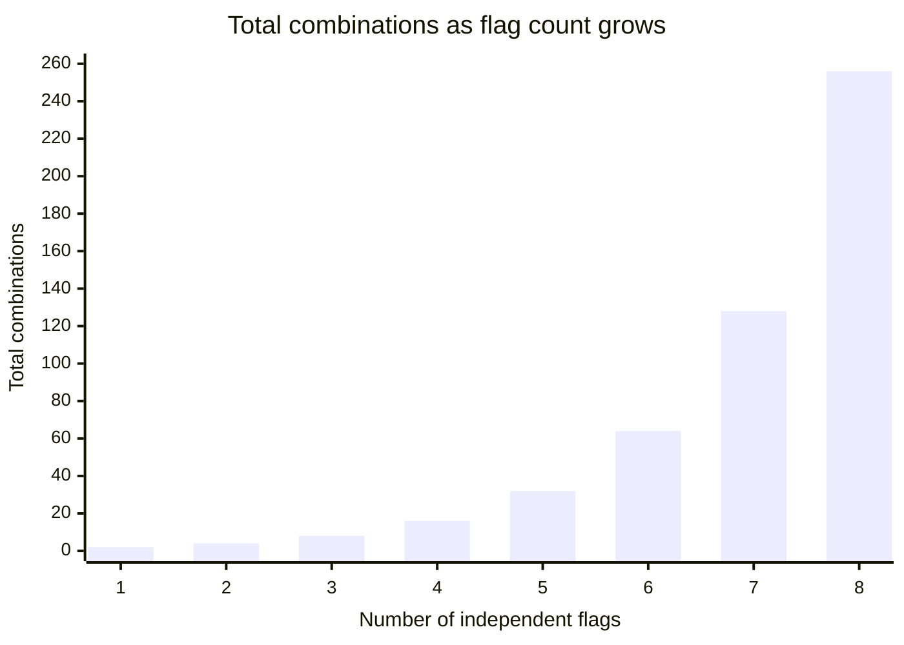

## Why 4 flags aren't "4 things to test"

**If there are 4 flags, why isn't the number of things to test just
4, or maybe 8 for a generous margin?** Because each flag is
independently on or off, and every combination of those independent
choices is a distinct situation the code can be in. With 1 flag there
are 2 possible states (on, off). With 2 flags there are 2 × 2 = 4
states. With 4 independent flags, it's 2 × 2 × 2 × 2 = 16 — every flag
doubles the count, because it doubles the number of situations every
existing combination could be paired with.



**Is this growth roughly steady, or does it accelerate?** It
accelerates — going from 4 flags to 8 flags doesn't double the count,
it multiplies it by 16 (from 16 combinations to 256). This is exactly
why "the important combinations, picked by hand" quietly stops being a
representative sample as flag count grows: the space of possibilities
is growing far faster than anyone's list of "important" ones.

This is exponential growth: the count multiplies each time you add one
more independent choice. Linear growth would add a fixed amount each time
(4, 5, 6, 7). Flag states do not behave that way; they double (4, 8, 16, 32) because every old state can now appear with the new flag off _and_
with the new flag on.

## How to read the notation

| Notation | Read it as                                       | Example                           |
| -------- | ------------------------------------------------ | --------------------------------- |
| `n`      | Total items available                            | 5 candidates                      |
| `r`      | Items chosen or arranged                         | Pick 3 of those candidates        |
| `4!`     | `4 × 3 × 2 × 1`                                  | 24 ordered arrangements           |
| `2^4`    | `2 × 2 × 2 × 2`                                  | 16 on/off flag states             |
| `nPr`    | Arrange `r` chosen items from `n`; order matters | 1st/2nd/3rd places from finalists |
| `nCr`    | Choose `r` items from `n`; order does not matter | A team of 3 from 5 candidates     |

## Permutations: when order matters

**Suppose 3 finalists need to be ranked 1st, 2nd, and 3rd — how many
possible rankings are there?** This is a permutation, because _order_
matters (1st is different from 2nd). There are 3 choices for 1st
place, then 2 remaining choices for 2nd, then 1 for 3rd:
`3 × 2 × 1 = 6` possible rankings. In general, the number of ways to
arrange `r` items chosen from `n`, where order matters, is written
`nPr` and computed as `n! / (n - r)!`.

## Combinations: when order doesn't matter

**Suppose instead 3 people need to be picked (not ranked) from 5
candidates for a team — how many possible teams are there?** This is a
combination, because _order doesn't matter_ — picking Alice-then-Bob
and Bob-then-Alice both produce the same team. Combinations are
computed as `nCr = n! / (r! × (n - r)!)` — the permutation count
divided by the number of ways the chosen `r` items could themselves be
reordered, since those reorderings would otherwise be counted as
different outcomes.

|                     | Permutation (nPr)            | Combination (nCr)          |
| ------------------- | ---------------------------- | -------------------------- |
| Order matters?      | Yes                          | No                         |
| Formula             | `n! / (n - r)!`              | `n! / (r! × (n - r)!)`     |
| Example             | Ranking 3 finalists out of 5 | Picking a team of 3 from 5 |
| Result for n=5, r=3 | 60                           | 10                         |

The combination count is always smaller than or equal to the
permutation count for the same `n` and `r`, because it's collapsing
every group of reorderings down to a single outcome.

## Back to the flags: which one applies?

**Is the flag-combination problem a permutation or a combination
problem?** Neither, exactly — it's a third pattern: each of `n`
independent items has 2 states (on/off), giving `2^n` total
states. People may casually call these "combinations," but the formula
`nCr` is a narrower mathematical tool for choosing groups. But
combinations become directly useful once the question shifts to
_pairs_ of flags — "how many distinct pairs of flags are there to
check together?" is a combination question (`nC2`), and it's the key
to the fix in L3: instead of hoping a hand-picked list happens to
cover every pair, compute exactly which pairs exist and check whether
each one was actually tested.

For four flags A, B, C, D, the distinct pairs are:

```text
AB, AC, AD, BC, BD, CD
```

That is 6 pairs. The shortcut `nC2 = n(n - 1) / 2` gives the same answer:
`4 × 3 / 2 = 6`. We divide by 2 because `AB` and `BA` are the same pair,
not two different pairs.

## The generalizable lesson

**Does this only apply to feature flags?** No — any situation with
several independent, binary choices (settings, permissions, device
types, user roles) has the same `2^n` growth, and any situation
choosing or ranking a subset of items follows the same permutation or
combination formulas. The specific numbers change; the fact that
"seems like enough" intuition breaks down as the count grows does not.
