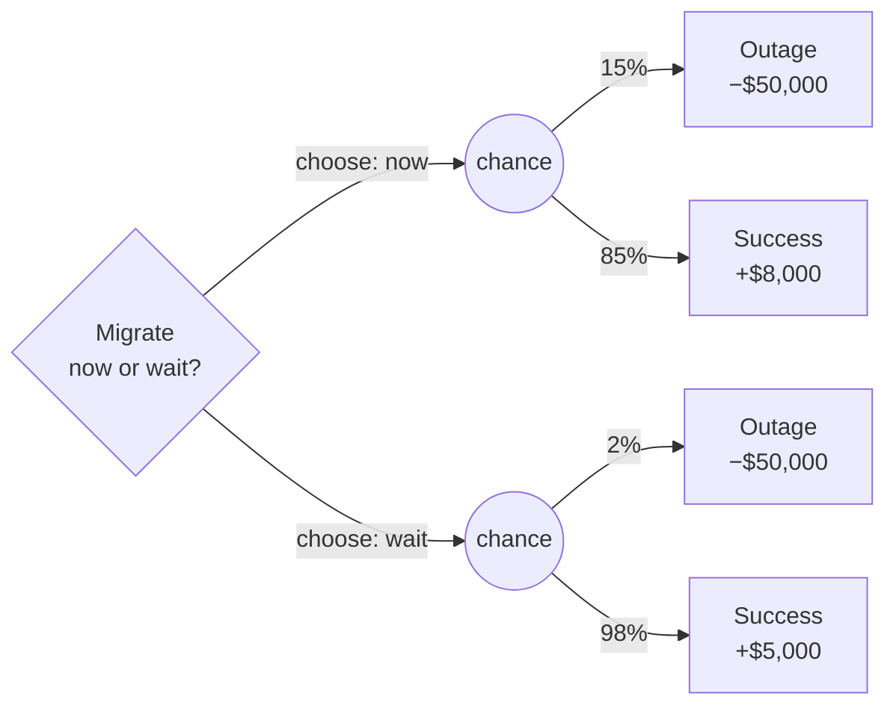
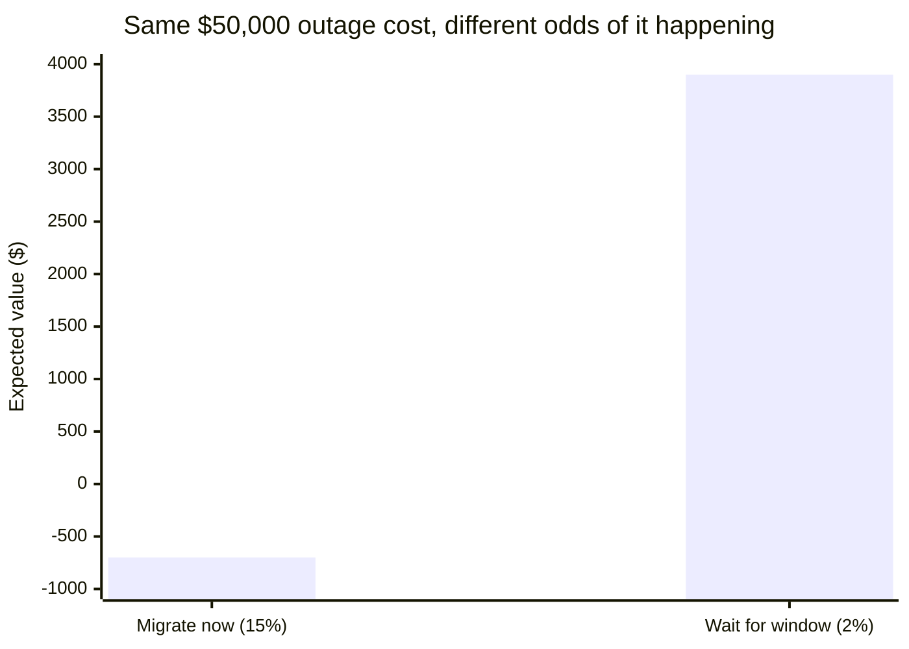

import LevelIntro from "../../../components/LevelIntro.astro";
import Checkpoint from "../../../components/Checkpoint.astro";

L1 computed two numbers — EV(now) = −$700, EV(wait) = +$3,900 — and
picked the higher one. This level covers the structure behind that
arithmetic (the decision tree) and the one honest caveat: a number
that looks worse on average can still be the right call, if the
option with the better average also carries a risk the business
can't survive.

<LevelIntro
  items={[
    "How to lay out a decision as a tree, node by node",
    "Reading probabilities and payoffs off branches correctly",
    "Why a rare catastrophic outcome can outweigh a better average",
  ]}
/>

## Turning the scenario into a tree

**The migration decision has two choices, and each choice has two
possible outcomes. What's the clearest way to lay that out so nothing
gets miscounted?** A decision tree — square nodes for choices you
control, circular ("chance") nodes for outcomes you don't:

Every chance node's outgoing probabilities must sum to 1 — 15% + 85%
and 2% + 98% both do. That constraint isn't decoration; it's what
makes "the average outcome" a well-defined number instead of an
arbitrary weighted guess. To evaluate a decision node, compute the EV
of every branch beneath it and take the best one — that's exactly
what L1's table did, one option at a time.

<Checkpoint question="Suppose a third option existed — 'migrate now, but only during the lowest-traffic hour' — with a 6% outage chance and $7,000 success value. Where would it go on the tree above, and what determines whether it's worth adding as a branch?">

It would hang off the same top-level decision node `D` as a third
option, `D -->|"choose: low-traffic hour"| C3`, with its own chance
node splitting 6% / 94% into −$50,000 and +$7,000. Whether it's worth
adding isn't about the tree structure — any number of options can
branch off one decision node — it's about whether its EV
(`0.06 × −50000 + 0.94 × 7000 = 3580`) changes which option wins.
Here it doesn't: $3,580 is still less than waiting's $3,900, so
adding the branch changes the picture (a genuine middle option
exists) without changing the decision.

</Checkpoint>

## Computing EV top-down instead of guessing

**Once the tree is drawn, how do you actually get from branches to
one number per option, without re-deriving the arithmetic from
scratch each time?** Walk each option's chance node once: multiply
each branch's probability by its payoff, then add the products.

| Node                 | Branch (probability × payoff)   | Sum       |
| -------------------- | ------------------------------- | --------- |
| Migrate now (chance) | `0.15 × −50000` + `0.85 × 8000` | **−700**  |
| Wait (chance)        | `0.02 × −50000` + `0.98 × 5000` | **+3900** |

This is the same rule applied twice, once per chance node — it
doesn't get more complicated as the tree grows deeper, because each
node only ever needs the numbers directly beneath it. A tree with
three sequential decisions (migrate → succeeds → then decide whether
to also flip on a risky new index) evaluates the same way, from the
bottom up: solve the leaves first, then treat each solved sub-tree as
a single number feeding the node above it.

## When expected value alone isn't the whole story

**EV says waiting is worth $4,600 more, on average, than migrating
today. Does that settle the decision?** Not by itself — EV only
describes the _average_ across many hypothetical repeats. It says
nothing about how bad the worst outcome would actually be for this
specific company, right now, in this one attempt that will only
happen once.

Two situations where the higher-EV option is still the wrong call:

| Situation                                              | Why EV alone misleads                                                                                                                                                                           |
| ------------------------------------------------------ | ----------------------------------------------------------------------------------------------------------------------------------------------------------------------------------------------- |
| The company only has $60,000 in the bank               | A single 15% chance at a $50,000 loss can be an existential risk even when the average looks only mildly negative — there's no "next attempt" to average over if this one wipes the company out |
| The decision only happens once, not thousands of times | EV describes the long-run average of _repeating_ a bet — a one-shot decision doesn't get to average anything; it gets exactly one draw from the distribution                                    |

This isn't a reason to throw out expected value — it's still the
right first number to compute, and in most repeated business
decisions (the kind a team makes dozens of times a year) EV really is
close to "what actually happens on average." The correction is
narrower: **when a single outcome could be catastrophic and
unrecoverable, the size of that tail risk matters on top of the
average, not instead of it.** A team with a healthy cash cushion and
a decision it will face many times over the year should usually just
follow the higher EV. A team for whom the $50,000 loss would be
genuinely existential should weigh that tail risk explicitly, even
if it drags the "worse-EV" option into being the safer real choice.

<Checkpoint question="A startup has $55,000 in the bank. Migrating now has EV = −$700, waiting has EV = +$3,900, and both share the exact same $50,000 outage cost if things go wrong. Does the existential-risk correction above argue for choosing 'migrate now' or 'wait for the window'?">

Wait for the window. The correction isn't about which option has the
worse EV — it's about how likely the catastrophic branch is, since
both options share the same catastrophic _size_ ($50,000, which
would sink a company with $55,000 in the bank either way). Migrating
now hits that branch 15% of the time; waiting hits it only 2% of the
time. Waiting already has the better EV _and_ the much smaller chance
of the outcome the company can't survive — this is the ordinary case
where the higher-EV option is also the prudent one, not a case where
the correction overrides EV.

</Checkpoint>

## Failure modes at this level

- **Drawing a chance node whose branch probabilities don't sum to 1.** If they don't, the "average" computed from it isn't actually
  an average of anything real — it's silently over- or
  under-weighting some outcome.
- **Treating EV as a guarantee for a single attempt.** EV(now) =
  −$700 is not a prediction that this specific migration will lose
  $700 — it will hit exactly one of the two actual outcomes, +$8,000
  or −$50,000.
- **Applying the "just follow the higher EV" rule to a genuinely
  one-shot, unrecoverable decision without checking the size of the
  worst branch first.** The rule is safe by default for repeated
  decisions with survivable worst cases — check the exception before
  assuming it never applies.
