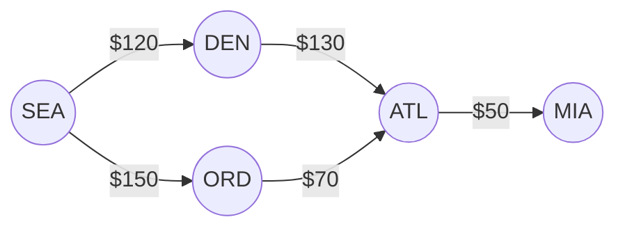

import Scenario from "../../../components/Scenario.astro";
import LevelIntro from "../../../components/LevelIntro.astro";

<Scenario label="The problem">

You're booking a flight from Seattle (SEA) to Miami (MIA). There's no direct flight, so a search engine has to stitch together connections. It offers two options: one gets you there in **3 stops for $300**, another gets you there in **the same 3 stops for $270**. Same number of hops, $30 apart — because "shortest" secretly meant two different things depending on which button you clicked, "fewest layovers" or "cheapest total."

That ambiguity — "shortest" meaning different things depending on what you're counting — is exactly the problem graph theory exists to make precise. Once you can say exactly what a "hop" costs, the question stops being fuzzy.

<Fragment slot="facts">

**Flight network (partial), cost per direct leg:**

| From | To  | Cost |
| ---- | --- | ---- |
| SEA  | DEN | $120 |
| SEA  | ORD | $150 |
| DEN  | ATL | $130 |
| ORD  | ATL | $70  |
| ATL  | MIA | $50  |

**Two SEA → MIA routes, both 3 hops:**

- SEA → DEN → ATL → MIA — **$300**
- SEA → ORD → ATL → MIA — **$270**

Same hop count, different cost — "shortest" needs a definition.

</Fragment>

</Scenario>

<LevelIntro
  items={[
    "Nodes, edges, and what a graph actually models",
    "Directed vs. undirected, weighted vs. unweighted",
    "Why 'shortest path' isn't one single algorithm",
  ]}
/>

## What is a graph, precisely?

A graph is two things and nothing more:

- **Nodes** (also called vertices) — the entities. Cities, people, services, web pages, git commits.
- **Edges** — the relationships between pairs of nodes. A flight route, a friendship, a network call, a link.

That's the entire vocabulary. Everything else in this unit is a variation on "which nodes, connected how."

Six cities, five listed routes, one small graph — and it already contains the SEA → MIA ambiguity from the scenario above: two different 3-hop paths, two different total costs.

## Directed or undirected? Weighted or unweighted?

Two independent yes/no questions describe almost every graph you'll meet:

| Question                                          | If yes                                                        | If no                                                          |
| ------------------------------------------------- | ------------------------------------------------------------- | -------------------------------------------------------------- |
| Does the edge only go one way?                    | **Directed** — "A follows B" ≠ "B follows A"                  | **Undirected** — "A is friends with B" = "B is friends with A" |
| Does each edge carry a cost, distance, or weight? | **Weighted** — the flight legs above, each with a dollar cost | **Unweighted** — every edge counts as exactly "1 step"         |

A flight route is directed (a SEA→DEN fare doesn't imply a DEN→SEA fare exists at the same price) and weighted (cost per leg). A Facebook friendship is undirected. A "who does this service call" dependency graph is directed. Whether it's weighted depends on what you're measuring — call count, latency, or nothing at all if you only care about "does a path exist."

## Where this actually shows up

Graphs aren't a niche topic — most systems you'll touch are a graph wearing a different name:

- **Service dependency maps** — which services call which, used to answer "what breaks if X goes down"
- **Package/module dependency trees** — used to detect circular imports before they cause a deploy deadlock
- **Git commit history** — commits as nodes, parent pointers as directed edges
- **Social/recommendation graphs** — "people you may know," "products bought together"
- **Road and flight networks** — the scenario above, generalized to routing and logistics
- **Web link structure** — pages as nodes, links as directed edges (this is literally what PageRank was built on)

Any time you ask "how are these things connected, and what's the cheapest/fastest/shortest way to get from one to another," you're doing graph theory whether you call it that or not.

## "Shortest path" is a family, not one algorithm

The scenario's $30 gap comes down to one choice: does every edge cost the same "1 step," or does each edge carry its own weight?

| Graph type                       | Right tool                     | What it answers                                                     |
| -------------------------------- | ------------------------------ | ------------------------------------------------------------------- |
| Unweighted (every edge = 1 step) | **BFS** (breadth-first search) | Fewest hops — e.g. fewest layovers, ignoring price                  |
| Weighted, non-negative weights   | **Dijkstra's algorithm**       | Cheapest total — e.g. lowest total fare, however many hops it takes |

BFS found "3 hops" as the answer to a question it was never asked to weigh by cost — that's why it can just as easily return the $300 route as the $270 one; both are 3 hops, and BFS stops at the first one it reaches. Dijkstra is the algorithm that actually looks at the dollar signs. L2 builds the representation both algorithms run on top of; L3 implements both and a couple of their close relatives (cycle detection, in particular) in real, runnable code.
