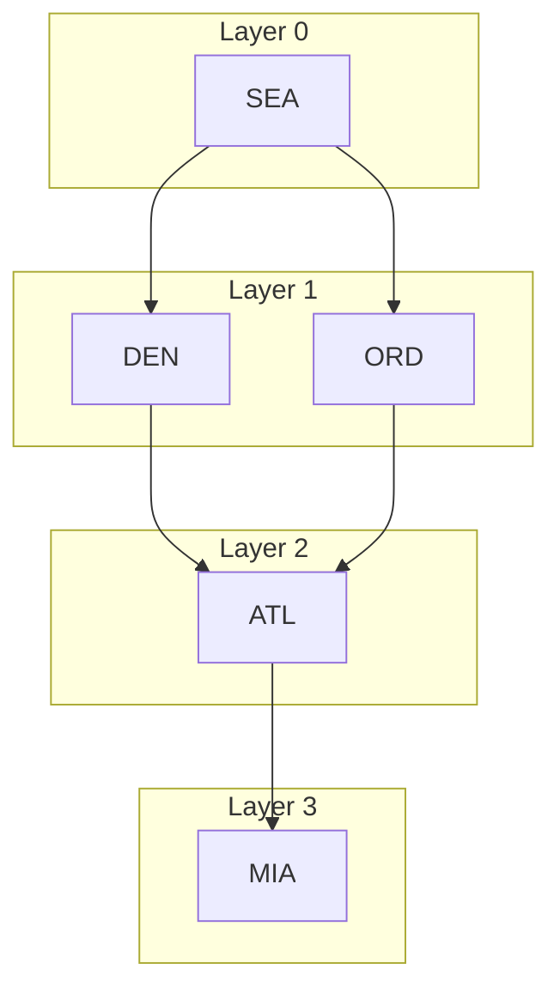

import Checkpoint from "../../../components/Checkpoint.astro";
import LevelIntro from "../../../components/LevelIntro.astro";

L1 named the parts — nodes, edges, directed/undirected, weighted/unweighted — and named BFS and Dijkstra as the two shortest-path tools that answer different questions. L2 is about the layer underneath both of those algorithms: how a graph actually lives in memory, and the mechanics each algorithm runs on top of that representation.

<LevelIntro
  items={[
    "Adjacency list vs. adjacency matrix, and why it matters",
    "How BFS explores a graph layer by layer",
    "How Dijkstra generalizes BFS to handle weights",
  ]}
/>

## How do you represent a graph in code?

Before any algorithm can run, the graph needs a shape a program can walk. There are two standard shapes, and the choice between them isn't cosmetic — it changes how fast "who is X connected to" is to answer, and how much memory the graph costs to hold.

**Adjacency list** — each node keeps a list of its direct neighbors (and, for a weighted graph, the weight to each one):

```
SEA -> [(DEN, 120), (ORD, 150)]
DEN -> [(ATL, 130)]
ORD -> [(ATL, 70)]
ATL -> [(MIA, 50)]
MIA -> []
```

**Adjacency matrix** — an N×N grid, one row and one column per node, where cell `[i][j]` holds the weight of the edge from node `i` to node `j` (or 0/∞ if none exists):

|         | SEA | DEN | ORD | ATL | MIA |
| ------- | --- | --- | --- | --- | --- |
| **SEA** | 0   | 120 | 150 | -   | -   |
| **DEN** | -   | 0   | -   | 130 | -   |
| **ORD** | -   | -   | 0   | 70  | -   |
| **ATL** | -   | -   | -   | 0   | 50  |
| **MIA** | -   | -   | -   | -   | 0   |

The flight network only has 5 real routes, but the matrix has 25 cells — most of them empty. That's the tell: a matrix costs `V²` cells no matter how sparse the graph is, while a list costs roughly `V + E` — one entry per node plus one per edge. Real-world graphs (flight networks, service dependencies, social graphs) are almost always **sparse** — most pairs of nodes have no direct edge — which is why adjacency lists are the default choice in practice. A matrix earns its keep only when the graph is dense (most pairs _are_ connected) or when "is there an edge from A to B" needs to be an instant lookup rather than a scan.

<Checkpoint question="A service dependency graph has 200 services, and each service directly calls about 4 others on average. Roughly how many cells would an adjacency matrix need, versus an adjacency list?">

The matrix needs `200 × 200 = 40,000` cells, regardless of how connected the graph actually is — that number is fixed by the node count alone. The list needs roughly `200 + (200 × 4) = 1,000` entries — one slot per node plus one per actual edge. This is a sparse graph (each service touches ~2% of the others, not most of them), so the list wins by a factor of 40 here. That gap only grows as the service count grows, because the matrix scales with `V²` while the list scales with `V + E`.

</Checkpoint>

## How does BFS find the fewest-hops path?

BFS (breadth-first search) answers exactly the question an unweighted graph poses: "fewest edges from start to end." It does this by exploring in **layers** — every node reachable in 1 hop, then every _new_ node reachable in 2 hops, then 3, and so on — never skipping ahead to a farther layer before the current one is exhausted.



Mechanically, BFS keeps two things: a **queue** of nodes waiting to be explored (first in, first out — this is what forces layer-by-layer order) and a **visited set** so it never re-enters a node it already reached by a shorter path. Starting from SEA: visit SEA, enqueue its neighbors DEN and ORD (layer 1). Dequeue DEN, enqueue its unvisited neighbor ATL (layer 2). Dequeue ORD — ATL is already visited, skip it. Dequeue ATL, enqueue MIA (layer 3). Dequeue MIA — done, 3 hops.

Notice what BFS _doesn't_ look at anywhere in that trace: cost. It reached ATL via DEN because DEN happened to be dequeued first, not because DEN→ATL is cheaper than ORD→ATL. That's exactly the $300-vs-$270 ambiguity from L1's scenario — BFS is answering "fewest hops," and both routes tie on hops, so which one it reports depends on queue order, not price.

<Checkpoint question="Does BFS guarantee the shortest path by cost, or only by hop count? What has to be true about the graph for those two to be the same thing?">

Only by hop count — BFS has no concept of edge weight at all, so it can't optimize for cost even in principle. The two notions of "shortest" only coincide when the graph is unweighted, or every edge happens to carry the exact same weight — in that special case, fewest hops and lowest total cost are the same ranking by construction. The flight network isn't that case (edges range from $50 to $150), which is exactly why BFS and the cheapest route disagreed in L1.

</Checkpoint>

## How does Dijkstra find the cheapest path?

Dijkstra's algorithm is BFS's generalization to weighted edges: instead of a plain FIFO queue, it always expands whichever _reachable-so-far_ node currently has the **lowest known total cost from the start** — tracked in a priority queue instead of a plain queue. Every time it visits a node, it checks whether going through that node gives any of its neighbors a cheaper total cost than what was previously known, and updates it if so (this update step is called **relaxing an edge**).

Run on the flight network from SEA: start at cost 0. Expand SEA's neighbors — DEN at $120, ORD at $150. The cheapest known unvisited node is DEN ($120), so expand it next — that reaches ATL at $120+$130=$250. Now compare unvisited nodes: ORD ($150) is cheaper than the ATL-via-DEN cost ($250), so expand ORD next — that reaches ATL via ORD at $150+$70=$220, which is cheaper than the $250 already recorded for ATL, so ATL's cost is _relaxed_ down to $220. Finally expand ATL ($220) and reach MIA at $220+$50=$270 — the cheapest total, matching L1's answer.

The key difference from BFS: Dijkstra is willing to revisit its cost estimate for a node (relaxing ATL from $250 down to $220) as cheaper paths are discovered, because "closest by hop count" and "closest by total cost" aren't the same ordering. BFS never needs to do this — once a node is reached in a BFS layer, no _later_ layer can possibly reach it in fewer hops, so there's nothing to reconsider.

## Picking the right tool

| Question you're actually asking                                      | Edge weights                | Algorithm                                |
| -------------------------------------------------------------------- | --------------------------- | ---------------------------------------- |
| Fewest hops / fewest layovers / fewest degrees of separation         | All equal (or don't matter) | BFS                                      |
| Cheapest total cost / shortest total distance / lowest total latency | Vary per edge               | Dijkstra                                 |
| Does a path exist at all                                             | Either                      | BFS (cheaper to run, ignore the weights) |

Running Dijkstra on an unweighted graph still works — it just does extra bookkeeping (the priority queue) to arrive at the same answer BFS gets more cheaply. Running BFS on a weighted graph when you actually care about cost gives you a _wrong_ answer that looks plausible, which is the more dangerous failure mode of the two. L3 implements both, plus what happens when the graph you're walking has a cycle in it.
