import Scenario from "../../../components/Scenario.astro";
import Checkpoint from "../../../components/Checkpoint.astro";
import LevelIntro from "../../../components/LevelIntro.astro";

<Scenario label="The problem">

A teammate just added a dependency: `pricing-service` now calls `checkout-service` for a promo check. Nobody noticed that `checkout-service` already depends on `inventory-service`, which depends on `pricing-service`. There is now no valid order to bring these three services up — whichever one starts first, it's waiting on something that's waiting on it. The deploy script hangs, on-call gets paged, and the postmortem question is: **how do we catch this before it reaches prod, not after it pages someone at 2am?**

Eyeballing a dependency diagram works at 5 services. It stops working well before 50. This level builds the actual code that answers "does this graph have a cycle" — and, along the way, the code for the fewest-hops and cheapest-path questions from L1/L2 — in a form you'd really run, not pseudocode.

<Fragment slot="facts">

**Service dependency edges (directed — "A calls B"):**

| Caller            | Depends on          |
| ----------------- | ------------------- |
| checkout-service  | inventory-service   |
| inventory-service | pricing-service     |
| pricing-service   | checkout-service ⚠️ |

**The cycle:** checkout → inventory → pricing → checkout — no service in this triangle can safely be the first one started.

</Fragment>

</Scenario>

<LevelIntro
  items={[
    "Building an adjacency list from a raw edge list",
    "BFS and Dijkstra as real, runnable functions",
    "Detecting a cycle with DFS before it reaches prod",
  ]}
/>

## Building the adjacency list

Every algorithm below runs on top of the adjacency-list shape from L2. In practice you rarely receive a graph pre-built as a `Map` — you receive a flat list of edges (from a config file, a database query, a service registry) and build the list yourself:

```ts
type Edge = { from: string; to: string; weight?: number };

function buildAdjacencyList(edges: Edge[]): Map<string, Edge[]> {
  const adj = new Map<string, Edge[]>();

  for (const edge of edges) {
    // Ensure both endpoints exist as keys, even a "to" node with no
    // outgoing edges of its own — otherwise a lookup on it later
    // throws instead of returning an empty neighbor list.
    if (!adj.has(edge.from)) adj.set(edge.from, []);
    if (!adj.has(edge.to)) adj.set(edge.to, []);

    adj.get(edge.from)!.push(edge);
  }

  return adj;
}

const flightEdges: Edge[] = [
  { from: "SEA", to: "DEN", weight: 120 },
  { from: "SEA", to: "ORD", weight: 150 },
  { from: "DEN", to: "ATL", weight: 130 },
  { from: "ORD", to: "ATL", weight: 70 },
  { from: "ATL", to: "MIA", weight: 50 },
];

const flightGraph = buildAdjacencyList(flightEdges);
// flightGraph.get("SEA") -> [{from:"SEA",to:"DEN",weight:120}, {from:"SEA",to:"ORD",weight:150}]
```

The two guard lines (`if (!adj.has(...))`) matter more than they look — without them, a node that only ever appears as a _destination_ (like `MIA`, which has no outgoing flights in this data) would be missing from the map entirely, and every algorithm below would need a special case for "neighbor list doesn't exist" instead of safely getting back `[]`.

## BFS: fewest hops, in code

```ts
function bfsShortestPath(
  adj: Map<string, Edge[]>,
  start: string,
  end: string,
): string[] | null {
  const queue: string[] = [start];
  const visited = new Set<string>([start]);
  const cameFrom = new Map<string, string>();

  while (queue.length > 0) {
    const current = queue.shift()!;
    if (current === end) {
      // Walk cameFrom backwards to rebuild the path, then reverse it.
      const path: string[] = [];
      let node: string | undefined = current;
      while (node !== undefined) {
        path.push(node);
        node = cameFrom.get(node);
      }
      return path.reverse();
    }

    for (const edge of adj.get(current) ?? []) {
      if (!visited.has(edge.to)) {
        visited.add(edge.to);
        cameFrom.set(edge.to, current);
        queue.push(edge.to);
      }
    }
  }

  return null; // end is unreachable from start
}

bfsShortestPath(flightGraph, "SEA", "MIA");
// -> ["SEA", "DEN", "ATL", "MIA"]  (3 hops — matches L2's queue-order trace)
```

`queue.shift()` is what makes this breadth-_first_ rather than depth-first — it always pulls the oldest-enqueued node, which is exactly what keeps the search moving layer by layer instead of racing down one branch. Swap `queue.shift()` for `queue.pop()` and this becomes depth-first search instead, which still finds _a_ path but no longer guarantees the fewest hops.

<Checkpoint question="bfsShortestPath returned SEA → DEN → ATL → MIA, the $300 route, not the $270 one. Is that a bug?">

No — it's doing exactly what it was asked to do. `bfsShortestPath` never reads `edge.weight` anywhere in its body; it only tracks hop count via BFS's layer-by-layer order. Both SEA→DEN→ATL→MIA and SEA→ORD→ATL→MIA are 3 hops, so either is a correct answer to "fewest hops" — which one comes back depends on which neighbor gets enqueued first, not on price. Getting the cheaper route requires an algorithm that actually looks at weight, which is exactly what Dijkstra is for, next.

</Checkpoint>

## Dijkstra: cheapest total, in code

```ts
function dijkstraShortestPath(
  adj: Map<string, Edge[]>,
  start: string,
  end: string,
): { path: string[]; cost: number } | null {
  const costSoFar = new Map<string, number>([[start, 0]]);
  const cameFrom = new Map<string, string>();
  const unvisited = new Set(adj.keys());

  while (unvisited.size > 0) {
    // Pick the unvisited node with the lowest known cost so far.
    // A real implementation uses a binary heap here for O(log V) per
    // pick instead of this O(V) scan — see the Big-O table below.
    let current: string | null = null;
    let currentCost = Infinity;
    for (const node of unvisited) {
      const cost = costSoFar.get(node) ?? Infinity;
      if (cost < currentCost) {
        current = node;
        currentCost = cost;
      }
    }
    if (current === null || currentCost === Infinity) break; // rest is unreachable
    unvisited.delete(current);
    if (current === end) break;

    for (const edge of adj.get(current) ?? []) {
      const candidateCost = currentCost + (edge.weight ?? 1);
      if (candidateCost < (costSoFar.get(edge.to) ?? Infinity)) {
        costSoFar.set(edge.to, candidateCost); // relax the edge
        cameFrom.set(edge.to, current);
      }
    }
  }

  if (!costSoFar.has(end)) return null;

  const path: string[] = [];
  let node: string | undefined = end;
  while (node !== undefined) {
    path.push(node);
    node = cameFrom.get(node);
  }
  return { path: path.reverse(), cost: costSoFar.get(end)! };
}

dijkstraShortestPath(flightGraph, "SEA", "MIA");
// -> { path: ["SEA", "ORD", "ATL", "MIA"], cost: 270 }
```

The `candidateCost < (costSoFar.get(edge.to) ?? Infinity)` line is the relax step from L2's trace, in code: every time a cheaper route to a node is found, both its recorded cost _and_ its `cameFrom` pointer get overwritten — which is exactly how ATL's best-known predecessor flips from DEN to ORD partway through the run.

## Cycle detection: catching the deploy deadlock

Back to the scenario: three services calling each other in a loop. BFS and Dijkstra both assume you can eventually run out of new nodes to visit — a cycle doesn't stop them (the `visited` set still prevents infinite looping), but neither one _tells you_ a cycle exists. Detecting one needs a different walk: depth-first search that tracks not just "visited" but **"currently on the path I'm exploring right now."**

```ts
function hasCycle(adj: Map<string, Edge[]>): boolean {
  const WHITE = 0; // not yet visited
  const GRAY = 1; // on the current DFS path (an ancestor of the node being explored)
  const BLACK = 2; // fully explored, safe

  const color = new Map<string, number>();
  for (const node of adj.keys()) color.set(node, WHITE);

  function visit(node: string): boolean {
    color.set(node, GRAY);

    for (const edge of adj.get(node) ?? []) {
      const neighborColor = color.get(edge.to);
      if (neighborColor === GRAY) return true; // back edge -> a cycle
      if (neighborColor === WHITE && visit(edge.to)) return true;
    }

    color.set(node, BLACK);
    return false;
  }

  for (const node of adj.keys()) {
    if (color.get(node) === WHITE && visit(node)) return true;
  }
  return false;
}

const serviceEdges: Edge[] = [
  { from: "checkout-service", to: "inventory-service" },
  { from: "inventory-service", to: "pricing-service" },
  { from: "pricing-service", to: "checkout-service" }, // the newly-added edge
];

hasCycle(buildAdjacencyList(serviceEdges)); // -> true
```

The three colors are the whole trick: **white** means "haven't looked at this yet," **black** means "fully explored, definitely no cycle through here." **Gray** is the important one — it means "still an ancestor of the node I'm currently exploring." Reaching a gray node means the current path has looped back onto itself; reaching a black one is fine, because black means that subtree was already proven cycle-free by an earlier, unrelated visit. Without the three-way distinction — just a single "visited" flag like BFS uses — `hasCycle` would incorrectly flag _any_ node reachable by two different paths as a cycle, even in a perfectly valid graph like the flight network (both DEN and ORD can reach ATL; that's not a cycle, it's just two routes converging).

<Checkpoint question="Why can't hasCycle just reuse BFS's single visited Set the way bfsShortestPath does, instead of the three-color scheme?">

A single "visited" set can't tell the difference between "this node is an ancestor on the path I'm currently walking" and "this node was already fully explored via some other, unrelated branch." Both look identical under a plain visited/not-visited flag. The flight graph proves why that distinction matters: ATL is reachable from both DEN and ORD, so a plain-visited check would mark it visited the first time (via DEN) and then flag it as "already visited" again when reached via ORD — reporting a cycle where there isn't one. Gray specifically means "still open, still on the current path," which is the only signal that actually indicates a loop.

</Checkpoint>

## Big-O summary

| Operation                             | Adjacency list   | Adjacency matrix |
| ------------------------------------- | ---------------- | ---------------- |
| Build from `V` nodes, `E` edges       | O(V + E)         | O(V²)            |
| Memory                                | O(V + E)         | O(V²)            |
| BFS / DFS over the whole graph        | O(V + E)         | O(V²)            |
| Dijkstra (array-scan version above)   | O(V² )           | O(V²)            |
| Dijkstra (binary-heap priority queue) | O((V + E) log V) | O(V² log V)      |

```mermaid
xychart-beta
    title "Adjacency list vs. matrix: cells needed as a sparse graph grows"
    x-axis "Nodes (V)" [10, 50, 100, 200, 400]
    y-axis "Cells / entries"
    bar "List (V + 4V edges)" [50, 250, 500, 1000, 2000]
    bar "Matrix (V²)" [100, 2500, 10000, 40000, 160000]
```



The array-scan Dijkstra above is O(V²) — fine for a few hundred services, but the standard production fix once a graph gets large is swapping the `for (const node of unvisited)` scan for a binary min-heap, which is what turns "always find the cheapest unvisited node" from an O(V) scan into an O(log V) pop.

**Something to extend on your own:** every example above is a directed graph. What would actually need to change in `hasCycle` if the edges were undirected instead — say, a graph of mutual service _awareness_ rather than one-way _calls_? (Hint: in an undirected graph, the edge you just walked in on always points back to a gray node — your immediate parent — so the naive version above would flag every single edge as a cycle. What extra piece of information does `visit` need to track to tell "I looped back to an ancestor" apart from "I just walked back along the edge I arrived on"?)
