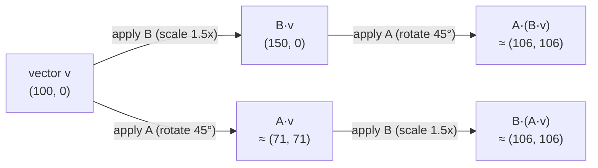

import LevelIntro from "../../../components/LevelIntro.astro";
import Checkpoint from "../../../components/Checkpoint.astro";

L1 named the engineer's bug — rotating then scaling gave a different
result than scaling then rotating — without explaining the mechanism.
L2 pins down exactly what a matrix does to a vector, and exactly why
combining two matrices is order-sensitive.

<LevelIntro
  items={[
    "How matrix-vector multiplication actually computes",
    "Why matrix multiplication isn't commutative",
    "Rotation and scale as concrete 2×2 matrices",
  ]}
/>

## What multiplying a vector by a matrix actually does

**A vector `(x, y)` and a 2×2 matrix — what does "multiply them" even
mean as an arithmetic operation, not just a picture?** Write the matrix
as four numbers arranged in a 2×2 grid, and the vector as a column:

```text
[ a  b ] [ x ]   [ a·x + b·y ]
[ c  d ] [ y ] = [ c·x + d·y ]
```

Each **row** of the matrix produces one dot product with the vector:
the top row `(a, b)` dotted with `(x, y)` gives the new x-coordinate;
the bottom row `(c, d)` dotted with `(x, y)` gives the new
y-coordinate. This is the same dot product from L1 — "multiply matching
components, add the results" — run once per row.

Concretely, doubling both coordinates uses the matrix
`[[2, 0], [0, 2]]`:

```text
[ 2  0 ] [ x ]   [ 2x + 0y ]   [ 2x ]
[ 0  2 ] [ y ] = [ 0x + 2y ] = [ 2y ]
```

## Rotation and scale as real 2×2 matrices

**The engineer's animation rotated 45° and scaled 1.5× — what do
"rotate" and "scale" actually look like as the `a, b, c, d` numbers
above?**

| Transform             | Matrix                              | What it does                           |
| --------------------- | ----------------------------------- | -------------------------------------- |
| Scale by `s`          | `[[s, 0], [0, s]]`                  | Multiplies both coordinates by `s`     |
| Rotate by angle `θ`   | `[[cos θ, −sin θ], [sin θ, cos θ]]` | Turns the vector `θ` around the origin |
| Identity (do nothing) | `[[1, 0], [0, 1]]`                  | Returns the same vector unchanged      |

The rotation matrix comes straight from the geometry of rotating a
point on a circle by angle `θ` — you don't need to derive it to use it,
but it's worth noticing it's built from exactly the sines and cosines
you'd expect from turning something.

<Checkpoint question="Using the identity matrix [[1,0],[0,1]] on a vector (7, 3), what should the matrix-vector multiplication produce, and does that match what 'identity' should mean?">

`[1·7 + 0·3, 0·7 + 1·3] = (7, 3)` — the exact same vector back out.
That's the point of calling it the identity: multiplying by it changes
nothing, the same role the number `1` plays in ordinary multiplication.

</Checkpoint>

## Combining two transforms: multiply the matrices, in order

**The animation needed both rotate _and_ scale — how do two separate
matrices become "do both, in this order"?** Combining transforms is
matrix **multiplication**: applying matrix `B` first, then matrix `A`,
to a vector `v` is written `A·B·v`, and — critically — `A·B` can itself
be computed as a single combined matrix ahead of time, then applied
once.



Wait — in this particular example the two end points land in the same
place. That's not a coincidence to generalize from: it happens here
only because scaling uniformly and rotating around the same origin
happen to commute. The next section shows a pair of transforms where
order genuinely changes the destination — which is what actually broke
the engineer's animation, since a real icon hover typically scales
around its own center, not the origin, making the combined operation
order-sensitive.

## Why order matters: matrix multiplication is not commutative

**For ordinary numbers, `3 × 5` equals `5 × 3`. Does `A·B` always equal
`B·A` for matrices too?** No — and this is the precise fact behind "the
teammate reordered two lines and the icon landed somewhere else."

Take a **rotate by 90°** matrix `R = [[0, −1], [1, 0]]` and a
**translate right by 10** operation. (Pure 2×2 matrices can't represent
"move" on their own — L3 shows the real fix, adding a third coordinate
— but the order-sensitivity shows up just as clearly using rotate
combined with a non-uniform scale `S = [[2, 0], [0, 1]]`, which stretches
only the x-axis.)

Starting from `v = (0, 1)`:

- **Scale then rotate** (`R·S·v`): scale first gives `(0, 1)`
  (unchanged, since `x = 0`), then rotate 90° gives `(−1, 0)`.
- **Rotate then scale** (`S·R·v`): rotate first gives `(−1, 0)`, then
  scale gives `(−2, 0)`.

`(−1, 0)` and `(−2, 0)` are different vectors — same two operations,
same starting vector, different order, different answer. `R·S ≠ S·R`
in general, even though both are built from the exact same two
matrices.

<Checkpoint question="Given that R·S ≠ S·R in general, was the teammate's 'harmless' refactor (swapping the order of rotate and scale in the animation code) actually harmless?">

No — reordering two matrix-representable transforms is only safe when
those specific two matrices happen to commute (as the uniform
scale-and-rotate-around-the-origin case above did, by coincidence of
that particular example). In general, and in the engineer's real
animation — which scaled around the icon's own center rather than the
origin — `A·B ≠ B·A`, so swapping the order is a real, silent change in
behavior, not a no-op refactor.

</Checkpoint>

## The generalizable lesson

Matrix multiplication encodes "do this, then that" precisely enough
that the order is baked into the arithmetic itself, not left to
convention or comment. Any time a system combines more than one
transformation — graphics pipelines, coordinate-frame conversions,
successive ML layers — asking "does this actually commute, or am I
relying on a coincidence" is a real, answerable question once the
operations are written as matrices instead of ad hoc formulas.
