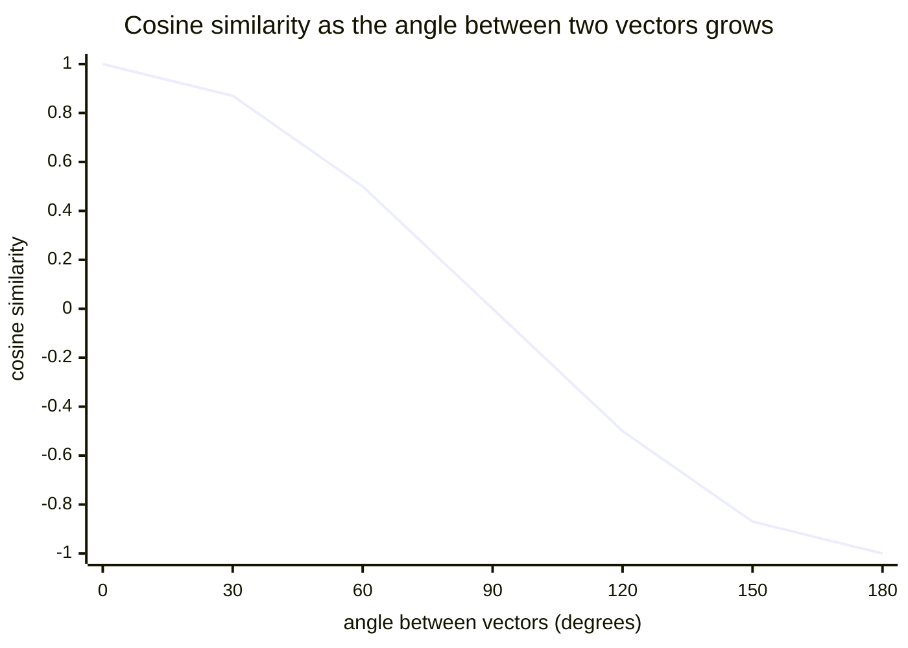

import Scenario from "../../../components/Scenario.astro";
import LevelIntro from "../../../components/LevelIntro.astro";
import Checkpoint from "../../../components/Checkpoint.astro";

<Scenario label="Fixing the animation for real">
  <Fragment slot="facts">
    <div class="not-prose flex flex-col gap-2 text-sm text-slate-700 dark:text-slate-300">
      <div class="flex items-center gap-1.5"><span>📍</span> <strong>Icon center offset</strong> — 40px right, 20px up from the hover pivot</div>
      <div class="flex items-center gap-1.5"><span>🌀</span> <strong>Hover transform</strong> — rotate 45° then scale 1.4×, around the icon's own center</div>
      <div class="flex items-center gap-1.5"><span>🎯</span> <strong>Goal</strong> — one matrix that does move + rotate + scale together, so order can't be silently swapped by accident</div>
    </div>
  </Fragment>

L2 proved rotate-then-scale and scale-then-rotate can land in different
places. **Before writing any code, what would actually stop a future
teammate from reordering two operations by accident the way the
original engineer's teammate did?**

</Scenario>

<LevelIntro
  items={[
    "A real vector/matrix toolkit (add, scale, dot, multiply)",
    "Combining move + rotate + scale into one matrix",
    "Cosine similarity for a recommendation-style comparison",
  ]}
/>

## Reading the code without already being a programmer

| Code piece                            | Plain meaning                                                                            |
| ------------------------------------- | ---------------------------------------------------------------------------------------- |
| `{ x: 1, y: 2 }`                      | A vector, stored as an object with two numbers                                           |
| `function addVectors(a, b)`           | A machine that takes two vectors and returns a new one                                   |
| `Math.cos(angle)` / `Math.sin(angle)` | Built-in trig functions, in radians, not degrees                                         |
| `angleDeg * Math.PI / 180`            | Converting degrees (what humans think in) to radians (what `Math.cos`/`Math.sin` expect) |
| `[[a, b], [c, d]]`                    | A 2×2 matrix, written as an array of two row-arrays                                      |

## A real 2D vector toolkit

These three functions are L1's vector addition, scalar multiplication,
and dot product, made runnable and testable:

```js
function addVectors(a, b) {
  return { x: a.x + b.x, y: a.y + b.y };
}

function scaleVector(v, s) {
  return { x: v.x * s, y: v.y * s };
}

function dotProduct(a, b) {
  return a.x * b.x + a.y * b.y;
}

function magnitude(v) {
  return Math.sqrt(dotProduct(v, v));
}
```

```js
console.log(addVectors({ x: 40, y: -20 }, { x: 10, y: 5 })); // { x: 50, y: -15 }
console.log(scaleVector({ x: 40, y: -20 }, 1.4)); // { x: 56, y: -28 }
console.log(dotProduct({ x: 3, y: 4 }, { x: 3, y: 4 })); // 25
console.log(magnitude({ x: 3, y: 4 })); // 5
```

`magnitude` is the dot product of a vector with itself, square-rooted —
this is exactly the Pythagorean theorem, expressed with the L1/L2 dot
product instead of a special-case formula.

## Matrix-vector multiplication, made runnable

L2's row-by-row dot product, as code — a 2×2 matrix is an array of two
row-arrays, each row a 2-element array:

```js
function applyMatrix(matrix, v) {
  const [row1, row2] = matrix;
  return {
    x: row1[0] * v.x + row1[1] * v.y,
    y: row2[0] * v.x + row2[1] * v.y,
  };
}

function rotationMatrix(angleDeg) {
  const rad = (angleDeg * Math.PI) / 180;
  return [
    [Math.cos(rad), -Math.sin(rad)],
    [Math.sin(rad), Math.cos(rad)],
  ];
}

function scaleMatrix(s) {
  return [
    [s, 0],
    [0, s],
  ];
}
```

```js
console.log(applyMatrix(scaleMatrix(2), { x: 3, y: 4 })); // { x: 6, y: 8 }
console.log(applyMatrix(rotationMatrix(90), { x: 1, y: 0 })); // { x: ~0, y: 1 }
```

## Combining matrices: multiply them, then apply once

`multiplyMatrices` combines two 2×2 matrices into one, using the same
row/column dot products, so a whole pipeline of transforms collapses
into a single matrix applied once — the fix the scenario asked for,
since the combined matrix bakes in a specific order that can no longer
be silently swapped by reordering two separate function calls:

```js
function multiplyMatrices(a, b) {
  return [
    [
      a[0][0] * b[0][0] + a[0][1] * b[1][0],
      a[0][0] * b[0][1] + a[0][1] * b[1][1],
    ],
    [
      a[1][0] * b[0][0] + a[1][1] * b[1][0],
      a[1][0] * b[0][1] + a[1][1] * b[1][1],
    ],
  ];
}
```

```js
const rotateThenScale = multiplyMatrices(scaleMatrix(1.4), rotationMatrix(45));
const scaleThenRotate = multiplyMatrices(rotationMatrix(45), scaleMatrix(1.4));

console.log(applyMatrix(rotateThenScale, { x: 40, y: -20 }));
// { x: ≈59.4, y: ≈19.8 } — rotate first, then scale
console.log(applyMatrix(scaleThenRotate, { x: 40, y: -20 }));
// { x: ≈59.4, y: ≈19.8 } — same result here too, because uniform scale
// (scaleMatrix always has equal, zero-off-diagonal entries) commutes with
// any rotation; swap scaleMatrix(1.4) for a non-uniform matrix like
// [[1.4, 0], [0, 1]] and the two results diverge, reproducing L2's
// R·S ≠ S·R directly.
```

<Checkpoint question="multiplyMatrices(A, B) followed by applyMatrix(result, v) — does this apply A first or B first to v?">

`B` first. `A·B·v` means `A·(B·v)` — the matrix closest to the vector
is applied first, then its result is transformed by the next matrix
out. `multiplyMatrices(a, b)` computes `A·B` as a single matrix; when
that combined matrix is later applied to `v`, the arithmetic works out
to exactly the same numbers as applying `B` to `v` first and then `A`
to that result. That's why `rotateThenScale` passes `scaleMatrix` as
`a` and `rotationMatrix` as `b` — `b` (rotation) is the one actually
applied first, matching the variable's name.

</Checkpoint>

## The same idea in real transform code

This isn't a toy abstraction — a CSS `matrix()` transform and a canvas
2D context both take the exact same six numbers (a 2×3 affine matrix:
the 2×2 rotation/scale part above, plus a translation column):

```js
function toCssMatrix(matrix2x2, translation) {
  const [[a, c], [b, d]] = matrix2x2;
  // CSS matrix(a, b, c, d, tx, ty) — note CSS's own argument order
  return `matrix(${a}, ${b}, ${c}, ${d}, ${translation.x}, ${translation.y})`;
}

console.log(toCssMatrix(rotateThenScale, { x: 40, y: -20 }));
// "matrix(0.99, 0.99, -0.99, 0.99, 40, -20)" — pasteable into a real
// CSS transform: property, produced by the exact matrix math above
```

## Where linear algebra shows up in ML: cosine similarity

**A recommendation system compares two users' ratings vectors — but
"similar" can't just mean "small difference," because one enthusiastic
user might rate everything higher across the board. What does "point
in the same direction" (not "close in magnitude") actually measure?**
Cosine similarity — the dot product, normalized by both vectors'
magnitudes, from L1's dot product and this level's `magnitude`:

```js
function cosineSimilarity(a, b) {
  const denom = magnitude(a) * magnitude(b);
  if (denom === 0) return 0;
  return dotProduct(a, b) / denom;
}
```

```js
const userA = { x: 5, y: 4 }; // rates action=5, comedy=4
const userB = { x: 4, y: 3.2 }; // same taste, rates everything ~20% lower
const userC = { x: 1, y: 5 }; // opposite taste: low action, high comedy

console.log(cosineSimilarity(userA, userB).toFixed(3)); // 1.000 — same direction
console.log(cosineSimilarity(userA, userC).toFixed(3)); // 0.766 — noticeably less aligned
```

`userA` and `userB` score a perfect `1.000` even though their raw
numbers differ, because cosine similarity only measures direction, not
length — exactly the property a "same taste, different enthusiasm"
comparison needs, which plain distance would have missed.



## Extend it: what if the comparison were 3D, or the metric weren't cosine?

**Everything above compared two 2-number vectors. What would need to
change — and what wouldn't — to compare two 3-feature vectors (say,
action, comedy, and runtime-preference), or to use plain Euclidean
distance instead of cosine similarity?** `dotProduct`, `magnitude`, and
`cosineSimilarity` above only ever access `.x` and `.y` two components
at a time — extending them to a third `.z` component (or, more
generally, an array of any length with a loop instead of named fields)
is a small, mechanical change to the same formulas, not a new idea.
Euclidean distance, by contrast, is a genuinely different question —
"how far apart are the two points" instead of "how aligned are the two
directions" — and would use `magnitude(addVectors(a, scaleVector(b, -1)))`
(the length of `a − b`) rather than the normalized dot product; try
computing it for `userA` and `userC` above and compare which one that
metric says is "more different."

## Failure modes

| Failure mode                                                                      | What it gets wrong                                                                                                                                              |
| --------------------------------------------------------------------------------- | --------------------------------------------------------------------------------------------------------------------------------------------------------------- |
| Reordering two chained transforms assuming it's a harmless refactor               | Matrix multiplication is non-commutative in general — L2's `A·B ≠ B·A` — reordering is only safe when the specific matrices happen to commute                   |
| Using raw distance to measure "similarity" between differently-scaled vectors     | Distance conflates magnitude and direction; cosine similarity isolates direction, which is usually what "similar taste" means                                   |
| Applying several ad hoc formulas instead of combining matrices first              | Combining into one matrix (`multiplyMatrices`) bakes the order into the arithmetic itself, instead of leaving it to be silently broken by a later reorder       |
| Forgetting the degrees-to-radians conversion before calling `Math.cos`/`Math.sin` | `Math.cos`/`Math.sin` take radians; passing a raw degree value silently produces a wrong, non-error-throwing result                                             |
| Assuming a 2×2 matrix alone can represent "move" (translation)                    | Pure linear transforms can't shift the origin — real transform pipelines add a translation column, exactly what `toCssMatrix` does separately from the 2×2 part |
