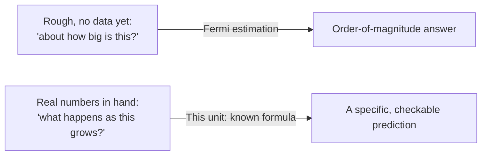

import Scenario from "../../../components/Scenario.astro";

<Scenario>
  <Fragment slot="facts">
    

      
✅ <strong>Tests / type checker</strong> — 100% pass, before launch

      
📈 <strong>Traffic growth</strong> — +50% planned over two quarters

      
🧮 <strong>Team's read</strong> — "we're at 60% utilization, 90% is tight but survivable"

      
⏱️ <strong>What the formula actually says</strong> — wait time at 90% is ~9x the baseline, not ~1.5x

    

  </Fragment>

A service passes every unit test and type-checks cleanly the morning it
ships. Six months later, a 50% traffic increase — nothing dramatic, nothing
untested — pushes it past its latency SLO and pages the on-call team at 2am.

Nothing in the test suite was wrong. The tests were never asking the
question that mattered.

| What was checked                         | What actually broke                                      |
| ---------------------------------------- | -------------------------------------------------------- |
| "Does this code do what it claims?"      | Not this — every test passed                             |
| "Will this hold up at 50% more traffic?" | **Never asked** — nobody ran this number before shipping |

**The team had a passing test suite and a production incident on the exact same code. What kind of question does a test suite never ask, and what tool actually answers it?**

</Scenario>

- A compiler/type checker/test suite verifies a program is _internally consistent_ — it can't tell you whether the system will hold up under 10x traffic, how many servers you actually need, or whether a "small" error rate compounds into a real problem at scale. That's a different kind of question, and it needs a different tool: math as **prediction**, not correctness.
- Correctness math asks "does this code do what it claims to do." Predictive math asks "given what I know now, what should I expect to happen under conditions I haven't observed yet" — capacity at 10x load, failure probability over a year, whether a cost curve is linear or compounding.
- This is not about doing complex proofs — it's mostly arithmetic and a handful of durable, reusable relationships (a rate times a duration, a probability compounding over many trials, an exponential vs. a linear growth curve) applied deliberately instead of guessed at.
- **Fermi estimation** (covered in depth in `logic/fermi-estimation`) and this unit are closely related but distinct: Fermi estimation is about getting a rough order-of-magnitude answer fast with almost no data; this unit is about using a known mathematical relationship (a formula, not a guess) once you do have some real numbers to plug in.

- A recurring engineering failure this unit targets directly: **linear intuition applied to non-linear reality** — assuming "twice the users means twice the load" when the actual relationship is quadratic (every user talking to every other user) or exponential (compounding retries, cascading failures), and getting badly blindsided by how fast the wrong assumption breaks down. The scenario above is exactly this mistake: a 1.5x traffic change was assumed to produce a roughly 1.5x wait-time change, when the real relationship (covered in L2/L3) produces something much steeper near capacity.
- The practical skill: before building or scaling something, write down the actual mathematical relationship connecting the inputs you control to the outcome you care about — even a rough one — instead of relying on intuition that was calibrated on a much smaller scale than the one you're now reasoning about.
