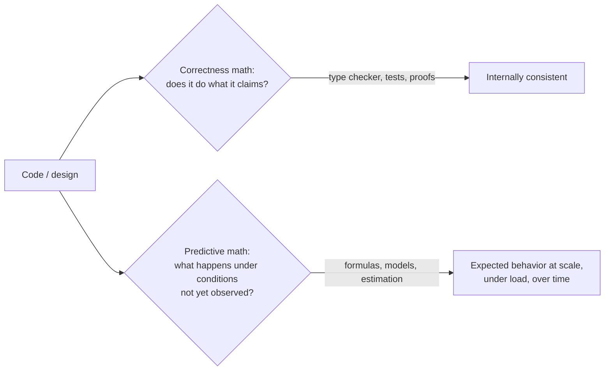
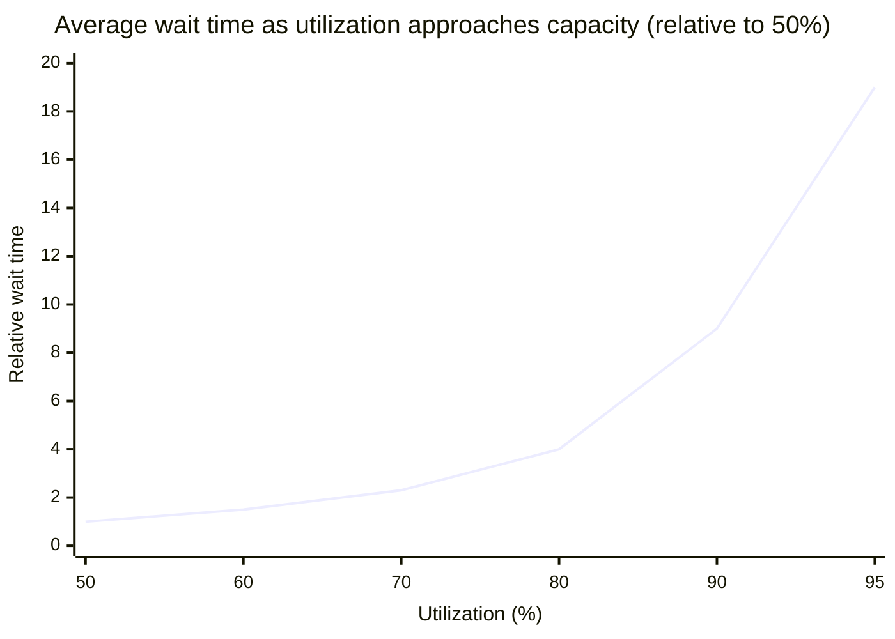

## Two different questions that use the word "math"



A system can be 100% verified-correct by the first branch and still fall over under load nobody predicted, because the second branch was never asked. They're genuinely separate questions requiring separate tools — this unit is entirely about the right branch.

## Little's Law: a small, durable, widely-applicable relationship

**L = λW** — the average number of items in a system (L) equals the average arrival rate (λ) times the average time each item spends in the system (W). It holds for _any_ stable queueing system — a web server's request queue, a support ticket backlog, items on a factory line — regardless of the arrival pattern's specific shape, which is what makes it so reusable.

```python
function estimate_concurrent_requests(requests_per_second, avg_time_in_system_seconds):
    # Little's Law: L = λW
    return requests_per_second * avg_time_in_system_seconds

# A service handling 200 req/s, each taking 150ms end-to-end on average:
estimate_concurrent_requests(200, 0.15)  # => 30 concurrent requests, on average
```

This single line answers a question that's easy to get badly wrong by intuition alone: "how many concurrent requests should this server be provisioned to handle?" Guessing from "200 requests per second sounds like a lot" gives no usable number; plugging the same two known quantities into the actual relationship gives a concrete, defensible one — 30, not 200, because most requests finish in a small fraction of a second.

## Where linear intuition breaks: latency going up, not just load

The dangerous part of L = λW is what happens as a system approaches saturation: **W (average time in system) isn't constant** — it grows as the system gets busier, often sharply, not linearly. A system near its capacity limit doesn't degrade gracefully in proportion to extra load; queueing delay tends to blow up non-linearly as utilization approaches 100%, because a busy server queues _new_ arrivals behind an already-growing backlog, not just behind the average case.



Going from 50% to 80% utilization looks like "more load, somewhat more wait" — going from 90% to 95% alone very nearly doubles it, and pushing further toward 99% is where the curve goes almost vertical. A capacity plan built on "we're at 60% today, we can probably handle 90%" is exactly the linear-intuition mistake this unit warns about: the same-sized jump in utilization produces a wildly different-sized jump in wait time depending on where you start. (These values come from a standard queueing approximation, reproduced and verified with real code in L3.)

## The general pattern this unit is teaching

Little's Law is one specific instance of a broader habit: identify the actual mathematical relationship connecting a few measurable quantities, write it down explicitly, and use it to predict an unmeasured fourth quantity — instead of eyeballing a percentage change and assuming the relationship it applies to is linear by default. The specific formula changes per problem (queueing uses L=λW; growth-curve problems use exponential/compound formulas; reliability problems use probability multiplication) — the discipline of reaching for the actual relationship, not intuition, is the transferable part.
