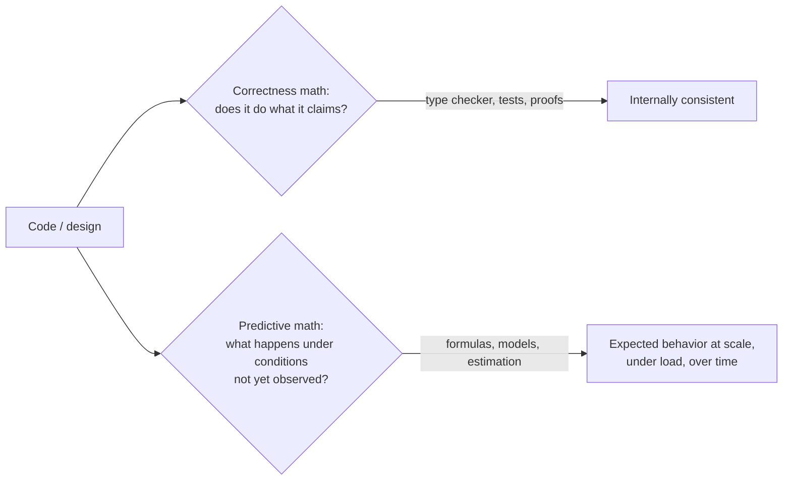
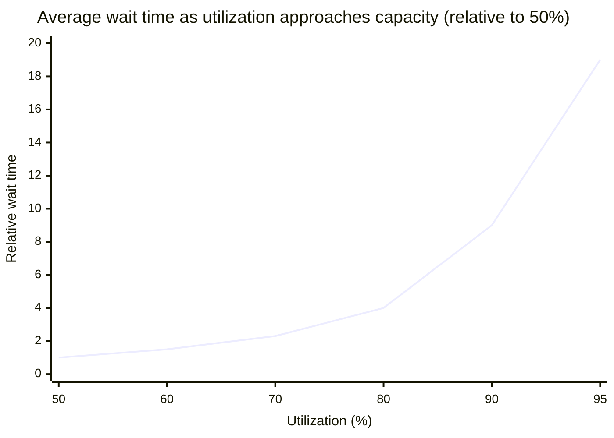

## A system passes every test and still falls over — what got skipped?



A system can be 100% verified-correct by the first branch and still fall over under load nobody predicted, because the second branch was never asked. They're genuinely separate questions requiring separate tools — this unit is entirely about the right branch.

## How many concurrent requests should a service actually be provisioned for?

Guessing from "200 requests per second sounds like a lot" gives no usable number. There's an exact answer, and it comes from one small, durable relationship: **Little's Law**.

**L = λW** — the average number of items in a system (L) equals the average arrival rate (λ) times the average time each item spends in the system (W). It holds for _any_ stable queueing system — a web server's request queue, a support ticket backlog, items on a factory line — regardless of the arrival pattern's specific shape, which is what makes it so reusable.

Read the symbols as ordinary school arithmetic first:

| Symbol | Plain-language meaning                       | In the example below                |
| ------ | -------------------------------------------- | ----------------------------------- |
| `L`    | how many things are inside, on average       | concurrent requests                 |
| `λ`    | how many things arrive per unit of time      | `200` requests each second          |
| `W`    | how long each thing stays inside, on average | `150ms = 0.150` seconds per request |

So the sentence is simply: **things inside = things arriving each second × seconds each thing stays**. The units do the checking for you: `requests/second × seconds = requests`.

```python
function estimate_concurrent_requests(requests_per_second, avg_time_in_system_seconds):
    # Little's Law: L = λW
    return requests_per_second * avg_time_in_system_seconds

# A service handling 200 req/s, each taking 150ms end-to-end on average:
estimate_concurrent_requests(200, 0.15)  # => 30 concurrent requests, on average
```

This single line answers a question that's easy to get badly wrong by intuition alone: "how many concurrent requests should this server be provisioned to handle?" Guessing from "200 requests per second sounds like a lot" gives no usable number; plugging the same two known quantities into the actual relationship gives a concrete, defensible one — 30, not 200, because most requests finish in a small fraction of a second.

## If utilization goes from 60% to 90%, does wait time go up by about the same 1.5x?

The dangerous part of L = λW is what happens as a system approaches saturation: **W (average time in system) isn't constant** — it grows as the system gets busier, often sharply, not linearly. A system near its capacity limit doesn't degrade gracefully in proportion to extra load; queueing delay tends to blow up non-linearly as utilization approaches 100%, because a busy server queues _new_ arrivals behind an already-growing backlog, not just behind the average case.

The arithmetic reason is small but brutal: the wait curve divides by the room left before 100% busy. At 50% busy, the remaining room is `1 - 0.50 = 0.50`; at 90% busy, it is only `1 - 0.90 = 0.10`. Dividing by a shrinking leftover makes the result grow faster than the original percentage change.

| Utilization `ρ` | Leftover room `1 - ρ` | `ρ / (1 - ρ)` |
| --------------- | --------------------- | ------------- |
| 0.50            | 0.50                  | 1             |
| 0.90            | 0.10                  | 9             |
| 0.95            | 0.05                  | 19            |



Going from 50% to 80% utilization looks like "more load, somewhat more wait" — going from 90% to 95% alone very nearly doubles it, and pushing further toward 99% is where the curve goes almost vertical. A capacity plan built on "we're at 60% today, we can probably handle 90%" is exactly the linear-intuition mistake this unit warns about: the same-sized jump in utilization produces a wildly different-sized jump in wait time depending on where you start. (These values come from a standard queueing approximation, reproduced and verified with real code in L3.)

## Is Little's Law the actual lesson here, or just one example of it?

Just one example. Little's Law is one specific instance of a broader habit: identify the actual mathematical relationship connecting a few measurable quantities, write it down explicitly, and use it to predict an unmeasured fourth quantity — instead of eyeballing a percentage change and assuming the relationship it applies to is linear by default. The specific formula changes per problem (queueing uses L=λW; growth-curve problems use exponential/compound formulas; reliability problems use probability multiplication) — the discipline of reaching for the actual relationship, not intuition, is the transferable part.

| Problem shape                                 | Formula family                   | What it predicts                           |
| --------------------------------------------- | -------------------------------- | ------------------------------------------ |
| Queueing (requests, tickets, jobs)            | Little's Law, ρ/(1−ρ) wait curve | Concurrency, wait time near saturation     |
| Growth over time (users, data, cost)          | Exponential / compound growth    | Whether "steady growth" is actually linear |
| Repeated independent risk (retries, failures) | Probability compounding          | Failure rate over many trials, not one     |

Try dragging the utilization slider yourself in "Try it" below — the point isn't to memorize the 9x figure, it's to feel how fast an average-case formula stops looking average as it approaches its own limit.
