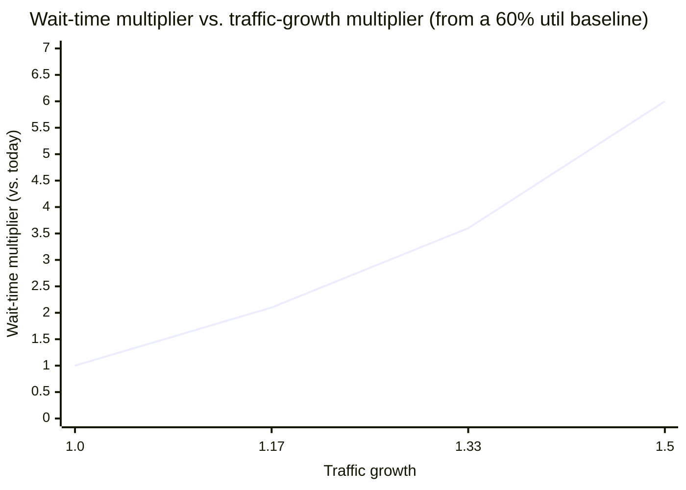

import Scenario from "../../../components/Scenario.astro";
import LevelIntro from "../../../components/LevelIntro.astro";
import Checkpoint from "../../../components/Checkpoint.astro";

<Scenario label="The near-miss">
  <Fragment slot="facts">
    <div class="not-prose flex flex-col gap-2 text-sm text-slate-700 dark:text-slate-300">
      <div class="flex items-center gap-1.5"><span>📊</span> <strong>Today</strong> — 60% utilization, normal day, no complaints</div>
      <div class="flex items-center gap-1.5"><span>📈</span> <strong>Growth forecast</strong> — +50% traffic over 2 quarters</div>
      <div class="flex items-center gap-1.5"><span>🧮</span> <strong>Linear read</strong> — "60% → 90%, tight but survivable"</div>
      <div class="flex items-center gap-1.5"><span>⏱️</span> <strong>Actual formula</strong> — relative wait time 1.5x → 9x, a 6x jump from a 1.5x traffic jump</div>
    </div>
  </Fragment>

A team's service runs at 60% average utilization and handles a normal day
fine. Growth projections call for 50% more traffic over the next two
quarters. The naive read: "50% more traffic on a system at 60%
utilization — we'll be at maybe 90%, tight but survivable, we'll add
capacity next year."

**Is that a reasonable plan, or does it undercount something the formula
already knows?**

</Scenario>

<LevelIntro
  items={[
    "The ρ/(1−ρ) wait curve, in real code",
    "Working the near-miss with real numbers",
    "Failure modes of treating a formula as ground truth",
  ]}
/>

## The queueing approximation, implemented and verified

The relative-wait-time curve from L2 comes from a standard queueing-theory approximation for a single-server queue: mean wait time scales with **ρ / (1 − ρ)**, where ρ (rho) is utilization, a number between 0 and 1. This is real, checkable math — implementing it directly reproduces the exact numbers claimed in L2:

Before the code, read the formula without programming: `ρ` is "how busy the server is," and `1 - ρ` is "how much breathing room remains." The computer below is only repeating the same division for several busy-ness levels. If `ρ = 0.9`, then `ρ / (1 - ρ) = 0.9 / 0.1 = 9`; if `ρ = 0.95`, then `0.95 / 0.05 = 19`. The code is a calculator trace, not a new prerequisite idea.

```js
// wait-time.mjs — mean wait time scales with ρ / (1 - ρ) as utilization
// (ρ) approaches 1 (100% busy). This blows up as ρ → 1 because a busy
// server queues new arrivals behind an already-growing backlog, not
// just behind "the average case."
function relativeWaitTime(utilization) {
  if (utilization <= 0 || utilization >= 1) {
    throw new RangeError("utilization must be strictly between 0 and 1");
  }
  return utilization / (1 - utilization);
}

const baseline = relativeWaitTime(0.5); // reference point: 50% utilization

for (const util of [0.5, 0.6, 0.7, 0.8, 0.9, 0.95]) {
  const relative = relativeWaitTime(util) / baseline;
  console.log(
    `${util * 100}% utilization -> ${relative.toFixed(1)}x the wait at 50%`,
  );
}
// 50% utilization -> 1.0x the wait at 50%
// 60% utilization -> 1.5x the wait at 50%
// 70% utilization -> 2.3x the wait at 50%
// 80% utilization -> 4.0x the wait at 50%
// 90% utilization -> 9.0x the wait at 50%
// 95% utilization -> 19.0x the wait at 50%
```

Every one of these numbers matches L2's chart exactly, because they were generated by the same formula — this is the entire point of predictive math: the claim isn't a vibe about "things get worse near capacity," it's a specific, checkable number that a team can plan against (e.g. "don't run this service above 80% utilization, because past that the wait-time cost of each additional point of utilization roughly doubles").

<Checkpoint question="If relativeWaitTime(0.8) returns 4.0 and the 50%-utilization baseline is 1.0, roughly how many times worse is wait time at 80% utilization than at 50% — and does that match L2's chart?">

About 4x worse — and yes, that's exactly the value L2's chart showed at 80% utilization. The code isn't introducing a new number; it's reproducing the same `ρ / (1 − ρ)` relationship with real, runnable arithmetic instead of a chart someone has to trust on faith.

</Checkpoint>

## Running the near-miss numbers for real

**Does "60% → 90% utilization" actually mean "somewhat worse than 60%," or does the curve say something sharper?**

```js
// capacity-plan.mjs — the same near-miss the Scenario above describes,
// worked with real numbers instead of a gut-feel read of the percentages.
function relativeWaitTime(utilization) {
  return utilization / (1 - utilization);
}

const baselineUtil = 0.5;
const currentUtil = 0.6;
const trafficGrowth = 1.5; // +50% traffic over two quarters
// Assumption worth flagging explicitly (see failure modes below):
// projected utilization assumes service time per request stays constant.
const projectedUtil = currentUtil * trafficGrowth; // 0.9

const baseline = relativeWaitTime(baselineUtil);
const currentRelative = relativeWaitTime(currentUtil) / baseline;
const projectedRelative = relativeWaitTime(projectedUtil) / baseline;
const waitTimeMultiplier = projectedRelative / currentRelative;

console.log(`Traffic growth: ${trafficGrowth}x`);
console.log(`Utilization: ${currentUtil} -> ${projectedUtil}`);
console.log(
  `Relative wait time: ${currentRelative.toFixed(1)}x -> ${projectedRelative.toFixed(1)}x baseline`,
);
console.log(
  `Wait time itself grows ${waitTimeMultiplier.toFixed(1)}x, from a ${trafficGrowth}x traffic increase`,
);
// Traffic growth: 1.5x
// Utilization: 0.6 -> 0.9
// Relative wait time: 1.5x -> 9.0x baseline
// Wait time itself grows 6.0x, from a 1.5x traffic increase
```

60% utilization scaled by 1.5x traffic lands at **90% utilization** — the linear read of the percentages was correct that far. But the wait-time consequence isn't linear: relative wait time goes from **1.5x** to **9x** the 50%-baseline, a **6x** jump in wait time from a 1.5x jump in traffic. "Tight but survivable" was a linear read of a non-linear relationship; the actual prediction shows the service would very plausibly breach latency SLOs well before the full 50% traffic growth materialized, not just get "a bit slower."



The x-axis is what the team was budgeting for (a 1.5x traffic increase, planned gradually); the y-axis is what actually happens to wait time. The line isn't straight — it's exactly the gap between "we planned for 1.5x more traffic" and "we got 6x more wait time," and it's what the linear read missed.

Caught early via this calculation, the team moved capacity work from "next year" to "before the next major traffic milestone" — a decision the linear intuition never would have produced, because it undercounted how much wait time changes near saturation.

<Checkpoint question="The near-miss calculation projects utilization from 0.6 to 0.9 by multiplying by the 1.5x traffic growth. What real-world change in per-request behavior would break that projection's accuracy, even if the traffic-growth number itself is correct?">

Any change in how long each request takes to service. `projectedUtil = currentUtil * trafficGrowth` implicitly assumes service time per request stays constant as load increases — if contention (lock waiting, CPU scheduling, GC pauses) makes each request slower under heavier load, the real utilization at 1.5x traffic would land higher than 0.9, and the wait-time consequence would be worse than the calculation shows. This is exactly the "assuming service time stays constant" failure mode below.

</Checkpoint>

## Failure modes

- **Treating an average-case formula as a worst-case guarantee.** L=λW and the utilization curve both describe _averages_ — real traffic has variance (bursts, retries, correlated failures), and a system planned to the average will still see individual periods far worse than the average predicts. Predictive math narrows uncertainty, it doesn't eliminate the need for headroom.
- **Assuming service time stays constant as load increases.** The near-miss calculation above assumed per-request service time doesn't change with load — in reality, contention (lock waiting, CPU scheduling, GC pauses under memory pressure) often makes service time itself increase under load, compounding the utilization effect rather than acting independently of it. A more careful prediction would measure this rather than assume it away.
- **Applying a steady-state formula to a system that never reaches steady state.** Little's Law and the utilization curve both assume the system has settled into a stable average — a system with a sharp traffic spike (a flash sale, a viral post) is, for that window, not in the steady state the formula describes, and needs burst-capacity planning as a separate concern, not just a higher average-utilization target.
- **Using the existence of a formula as an excuse to stop measuring reality.** The formula predicts what _should_ happen given clean assumptions — real systems have real deviations from those assumptions (non-uniform request costs, non-random arrival patterns). The correct use of predictive math is to generate a specific, falsifiable expectation and then check it against real measurements, not to treat the formula's output as ground truth on its own.

For the neighboring tools behind those failure modes, continue with `applied-math/queueing-theory-basics` for queues, `applied-math/probability-distributions-uniform` for probability and spread, `applied-math/statistics` for variance and averages, and `applied-math/orders-magnitude` for rough checks before exact prediction.

## Extend the worked example

The `capacity-plan.mjs` script above is one case — a single service, a smooth 50% growth forecast, a service-time assumption held constant. It's not the whole territory. Two questions worth actually working through, not just reading:

- **What changes if the growth doesn't arrive smoothly over two quarters, but as a single traffic spike** (a launch, a viral post) that hits in one day? Which of the four failure modes above applies directly, and does `relativeWaitTime` still mean anything for that window?
- **What if the service's own dependency — a database, a downstream API — has a _lower_ saturation point** than the service itself, so it hits its own 90%-utilization cliff first? Sketch how you'd adapt `capacity-plan.mjs` to track two independent utilization curves instead of one, and what number you'd actually alert on.
