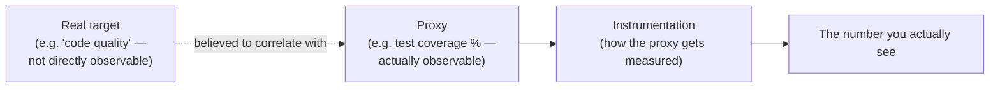
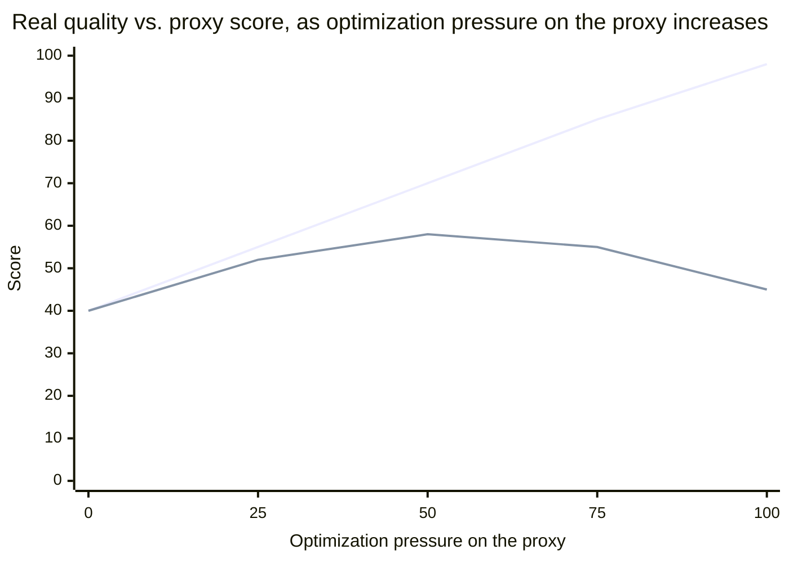

## The measurement chain

The dotted line is the load-bearing, and most fragile, part of this whole chain — everything downstream of it (instrumentation accuracy, sampling error) is a solvable engineering problem; whether the proxy actually correlates with the target is a separate, often-unchecked assumption that the rest of the chain quietly inherits.

## Validity and reliability, as independent axes

|                   | Low reliability                                                                     | High reliability                                                   |
| ----------------- | ----------------------------------------------------------------------------------- | ------------------------------------------------------------------ |
| **Low validity**  | Random AND wrong (e.g. a badly miscalibrated, noisy sensor)                         | Consistently wrong (e.g. a scale reliably reading 5 lbs too heavy) |
| **High validity** | Correct on average but noisy per-reading (e.g. a good scale on an unstable surface) | Correct and consistent (the actual goal)                           |

A measurement can be reliable (consistent) without being valid (correct), and this combination is specifically dangerous because consistency _feels_ like trustworthiness — a proxy that reliably produces the same wrong answer every time is easy to mistake for a good measurement, precisely because it never visibly contradicts itself.

## Goodhart's/Campbell's Law: what happens when a proxy becomes the target

At low optimization pressure, the proxy and the real target move together — this is exactly why the proxy seemed reasonable to adopt in the first place, and why it's easy to miss the divergence starting. As pressure specifically on the proxy increases (a team starts optimizing _for coverage percentage_ rather than for quality that coverage was supposed to indicate — padding tests that assert nothing meaningful just to hit a number), the proxy keeps climbing while the real target plateaus and then declines, because effort that used to correlate with real quality improvement is now spent purely on the number itself. This is the formal content of "when a measure becomes a target, it ceases to be a good measure" — the correlation the proxy was chosen for was real, but it was never guaranteed to survive someone optimizing directly for the proxy instead of the underlying target.

## Instrumentation cost, and why measuring changes what's measured

Adding logging, tracing, or metrics collection to a running system has a real, non-zero cost — CPU/memory overhead, storage, and in latency-sensitive systems, sometimes enough overhead to measurably change the very timing being measured (an informal but real version of an observer-effect problem). This means an instrumentation decision is itself a small trade-off calculation: the value of the data collected has to exceed its collection cost, and over-instrumenting "just in case" has a real, ongoing price, not a free one.
