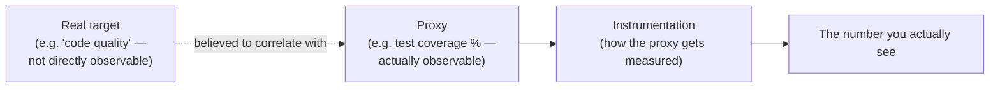
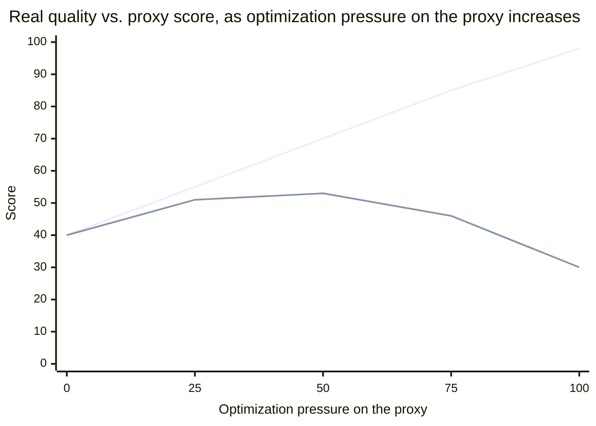

## What actually connects "code quality" to a number on a dashboard?

Team A and Team B from L1 both watched the same coverage percentage climb. Before looking at the diagram: what has to be true for a rising proxy to actually mean a rising target?

The dotted line is the load-bearing, and most fragile, part of this whole chain — everything downstream of it (instrumentation accuracy, sampling error) is a solvable engineering problem; whether the proxy actually correlates with the target is a separate, often-unchecked assumption that the rest of the chain quietly inherits. Team B's coverage number was never disconnected from the chain — it just stopped being connected to anything real once the correlation itself broke down.

"Instrumentation" just means the instrument plus the method. In a classroom lab it might be "measure the desk with this ruler, from this edge, three times, in centimeters." In a software system it might be "record one trace for 1% of requests, store duration in milliseconds, and compute p99 every minute." The form changes; the measurement chain is the same.

## Can a measurement be trustworthy and still be wrong?

A scale that reads 5 pounds heavy, every single time, never once contradicts itself — so what makes it dangerous instead of merely imprecise?

|                   | Low reliability                                                                     | High reliability                                                   |
| ----------------- | ----------------------------------------------------------------------------------- | ------------------------------------------------------------------ |
| **Low validity**  | Random AND wrong (e.g. a badly miscalibrated, noisy sensor)                         | Consistently wrong (e.g. a scale reliably reading 5 lbs too heavy) |
| **High validity** | Correct on average but noisy per-reading (e.g. a good scale on an unstable surface) | Correct and consistent (the actual goal)                           |

A measurement can be reliable (consistent) without being valid (correct), and this combination is specifically dangerous because consistency _feels_ like trustworthiness — a proxy that reliably produces the same wrong answer every time is easy to mistake for a good measurement, precisely because it never visibly contradicts itself. Team B's coverage number was, in this sense, perfectly reliable the whole time — it just stopped being valid once the tests being added stopped exercising real behavior.

For a beginner, keep these three ideas separate:

| Word                    | Question it answers                      | Example failure                         |
| ----------------------- | ---------------------------------------- | --------------------------------------- |
| Precision / reliability | Do repeated readings come out close?     | The same wrong value appears every time |
| Accuracy / validity     | Is the reading close to the real target? | The scale is calm but miscalibrated     |
| Bias                    | Is the method tilted in one direction?   | Measuring only the fastest requests     |

The danger case is not only "random noise." A very stable, very polished dashboard can still be invalid if it measures a convenient proxy instead of the target the team actually cares about.

## Why does a proxy that used to track the target eventually stop?

The chart below is the same shape as L1's table, generalized: what happens to the real target as pressure on the proxy keeps increasing, for a weak vs. a strong proxy?

At low optimization pressure, the proxy and the real target move together — this is exactly why the proxy seemed reasonable to adopt in the first place, and why it's easy to miss the divergence starting. As pressure specifically on the proxy increases (a team starts optimizing _for coverage percentage_ rather than for quality that coverage was supposed to indicate — padding tests that assert nothing meaningful just to hit a number), the proxy keeps climbing while the real target plateaus and then declines, because effort that used to correlate with real quality improvement is now spent purely on the number itself. This is the formal content of "when a measure becomes a target, it ceases to be a good measure" — the correlation the proxy was chosen for was real, but it was never guaranteed to survive someone optimizing directly for the proxy instead of the underlying target. Team A avoided this because their correlation stayed strong even under pressure — the "Try it" demo below lets you drag that correlation directly and watch where the curve starts to bend.

A non-technical version: if a school rewards only test scores, students may learn the subject, or they may memorize answer patterns while understanding less. The score still rises, but the target — real learning — may stop rising with it. That is the same proxy/target break as meaningless tests raising coverage without raising quality.

## Does measuring something ever change the thing being measured?

Adding logging, tracing, or metrics collection to a running system has a real, non-zero cost — CPU/memory overhead, storage, and in latency-sensitive systems, sometimes enough overhead to measurably change the very timing being measured (an informal but real version of an observer-effect problem). This means an instrumentation decision is itself a small trade-off calculation: the value of the data collected has to exceed its collection cost, and over-instrumenting "just in case" has a real, ongoing price, not a free one.

| Instrumentation choice                | Value of the data                        | Ongoing cost                                                         |
| ------------------------------------- | ---------------------------------------- | -------------------------------------------------------------------- |
| No instrumentation                    | None — flying blind                      | None                                                                 |
| Sampled tracing (e.g. 1% of requests) | Enough to catch trends and most outliers | Small, roughly proportional to sample rate                           |
| Full tracing, every request           | Complete picture, no sampling error      | Real CPU/storage cost, can itself become the bottleneck at high load |

The right amount of instrumentation isn't "as much as possible" — it's the point where the next unit of data stops being worth its collection cost, which is a genuinely different amount for a low-traffic internal tool than for a production system at scale.
