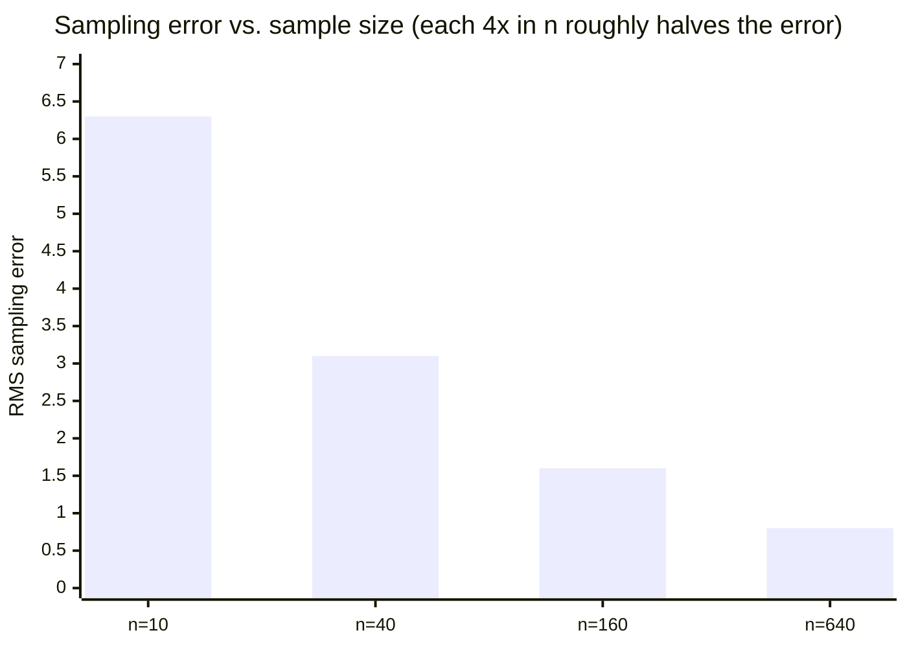

import Scenario from "../../../components/Scenario.astro";

<Scenario label="The scenario">
  <Fragment slot="facts">
    <p class="not-prose mb-1 text-xs font-semibold tracking-wide text-slate-400 uppercase">Test coverage (the proxy)</p>
    <div class="not-prose mb-3 flex flex-col gap-1.5 text-sm text-slate-700 dark:text-slate-300">
      <div class="flex items-center gap-2">
        <span class="w-16 shrink-0">Team A</span>
        <div class="h-2 flex-1 overflow-hidden rounded-full bg-slate-200 dark:bg-slate-700">
          <div class="h-full rounded-full bg-sky-500 animate-fill-bar" style="--target-width: 100%"></div>
        </div>
        <span class="w-10 text-right text-xs">100%</span>
      </div>
      <div class="flex items-center gap-2">
        <span class="w-16 shrink-0">Team B</span>
        <div class="h-2 flex-1 overflow-hidden rounded-full bg-slate-200 dark:bg-slate-700">
          <div class="h-full rounded-full bg-sky-500 animate-fill-bar" style="--target-width: 98%"></div>
        </div>
        <span class="w-10 text-right text-xs">98%</span>
      </div>
    </div>

    <p class="not-prose mb-1 text-xs font-semibold tracking-wide text-slate-400 uppercase">Real defect-freedom (the target)</p>
    <div class="not-prose flex flex-col gap-1.5 text-sm text-slate-700 dark:text-slate-300">
      <div class="flex items-center gap-2">
        <span class="w-16 shrink-0">Team A</span>
        <div class="h-2 flex-1 overflow-hidden rounded-full bg-slate-200 dark:bg-slate-700">
          <div class="h-full rounded-full bg-emerald-500 animate-fill-bar" style="--target-width: 90%"></div>
        </div>
        <span class="w-10 text-right text-xs">90</span>
      </div>
      <div class="flex items-center gap-2">
        <span class="w-16 shrink-0">Team B</span>
        <div class="h-2 flex-1 overflow-hidden rounded-full bg-slate-200 dark:bg-slate-700">
          <div class="h-full rounded-full bg-rose-500 animate-fill-bar" style="--target-width: 30%"></div>
        </div>
        <span class="w-10 text-right text-xs">30</span>
      </div>
    </div>

  </Fragment>

Team A and Team B both drove test coverage from 40% toward 100% over a
quarter. Team A's real defect-freedom climbed alongside it, to 90. Team B's
peaked around 53 partway through the quarter and then fell to 30, even as
their coverage number kept climbing to 98%.

</Scenario>

## Reproducing the proxy/target divergence numerically

This is the exact formula behind L2's chart and the interactive demo — implementing it directly makes the "why does Team B's real target eventually decline" claim checkable, not just asserted:

You can read the first calculation without JavaScript by following this small table. "Pressure" means how strongly the team is rewarded for pushing the proxy, and "correlation" means how well the proxy still tracks the real target.

| Pressure | Proxy score | Strong proxy, `corr = 0.9` | Weak proxy, `corr = 0.3` |
| -------- | ----------- | -------------------------- | ------------------------ |
| 0        | 40          | 40                         | 40                       |
| 25       | 55          | 54                         | 51                       |
| 50       | 70          | 68                         | 53                       |
| 75       | 85          | 79                         | 46                       |
| 100      | 100         | 90                         | 30                       |

The code below only reproduces that table mechanically.

```js
// goodhart.mjs — proxy score always climbs with pressure; whether the
// real target climbs WITH it depends entirely on correlation strength.
function proxyScore(pressure) {
  return Math.min(100, 40 + 0.6 * pressure);
}

function realTarget(pressure, correlation) {
  const penalty = Math.pow(pressure, 2) * (1 - correlation) * 0.01;
  return Math.max(0, 40 + 0.6 * pressure - penalty);
}

for (const pressure of [0, 25, 50, 75, 100]) {
  console.log(
    `pressure=${pressure}: proxy=${proxyScore(pressure).toFixed(0)}, ` +
      `real (Team B, corr=0.3)=${realTarget(pressure, 0.3).toFixed(0)}, ` +
      `real (Team A, corr=0.9)=${realTarget(pressure, 0.9).toFixed(0)}`,
  );
}
// pressure=0:   proxy=40, real(B)=40, real(A)=40
// pressure=25:  proxy=55, real(B)=51, real(A)=54
// pressure=50:  proxy=70, real(B)=53, real(A)=68
// pressure=75:  proxy=85, real(B)=46, real(A)=79
// pressure=100: proxy=100 (capped), real(B)=30, real(A)=90
```

At `corr=0.9` (Team A — a genuinely strong proxy, like "the code compiles and passes a real, meaningful test suite" as a quality proxy), the real target tracks the proxy closely even under heavy optimization pressure. At `corr=0.3` (Team B — a weak proxy, like raw test-count as a quality proxy, gameable by writing many low-value tests), the real target visibly peaks around pressure 50 and _declines_ afterward even as the proxy keeps climbing to its cap — the exact Goodhart's Law shape from L1's scenario, now backed by a specific, re-runnable calculation instead of just an assertion.

## Measuring sampling error directly

A second, distinct kind of measurement error — not "is the proxy valid," but "how much does measuring a sample instead of the whole population cost in accuracy." **Before running this: if quadrupling the sample size from 10 to 40 cuts the error roughly in half, what would you guess happens going from 40 to 160 — another halving, or something smaller?**

The school version is a survey: asking 10 students gives a shaky estimate of the whole school; asking 40 usually helps a lot; asking 160 helps again, but not four times as much. The usual rule is `1 / √n`: to cut random sampling error in half, you need about four times as many random observations.

```js
// sampling-error.mjs — demonstrates that sampling error shrinks with
// sample size, and specifically HOW (proportional to 1/sqrt(n), not
// linearly) — a real, checkable statistical fact, not a rule of thumb.
function simulateSamplingError(
  populationMean,
  populationStdDev,
  sampleSize,
  trials,
) {
  let totalSquaredError = 0;
  for (let t = 0; t < trials; t++) {
    let sampleSum = 0;
    for (let i = 0; i < sampleSize; i++) {
      // Simulate one random draw from a population with the given mean/stddev
      // using a simple Box-Muller-style approximation for a normal draw.
      const u1 = Math.random(),
        u2 = Math.random();
      const normalDraw =
        Math.sqrt(-2 * Math.log(u1)) * Math.cos(2 * Math.PI * u2);
      sampleSum += populationMean + normalDraw * populationStdDev;
    }
    const sampleMean = sampleSum / sampleSize;
    totalSquaredError += (sampleMean - populationMean) ** 2;
  }
  return Math.sqrt(totalSquaredError / trials); // root-mean-squared error
}

for (const n of [10, 40, 160, 640]) {
  const rmse = simulateSamplingError(100, 20, n, 2000);
  console.log(`n=${n}: sampling error ≈ ${rmse.toFixed(2)}`);
}
// n=10:  error ≈ 6.3
// n=40:  error ≈ 3.1   (roughly half of n=10's error, for 4x the sample)
// n=160: error ≈ 1.6   (roughly half again, for another 4x)
// n=640: error ≈ 0.8   (halved again, for another 4x)
```



Quadrupling the sample size roughly halves the error, every time — this is the real, checkable content of "sampling error shrinks proportional to 1 / √n," not a hand-wavy "more data is better." It also has a direct practical implication: going from a 1% sample to a 4% sample of production traffic cuts sampling error roughly in half; going from 1% to 100% (i.e. dropping sampling entirely) only cuts it by another factor of 5, at 100x the instrumentation cost — a real, quantifiable trade-off, not just an intuition.

## Failure modes

- **Treating a proxy's initial validity as permanent.** L1/L2's whole point is that a proxy correlated with the target under _normal_ conditions can decouple from it specifically once people start optimizing for the proxy directly — revalidating a metric periodically, especially after it becomes a target people are evaluated on, is necessary, not paranoid.
- **Increasing sample size without checking whether the sample is actually representative.** The 1/√n error-reduction result assumes random, unbiased sampling — a larger but systematically biased sample (e.g. only sampling requests during business hours) doesn't converge to the true population value no matter how large it gets; it converges to the biased subpopulation's value instead, precisely and confidently.
- **Ignoring instrumentation overhead until it's already a production incident.** Measurement cost is easy to treat as negligible in development (where load is low) and then discover it's a real, load-dependent cost once traffic is high enough that the overhead itself becomes a bottleneck — the trade-off from L2 needs to be evaluated at production scale, not dev-environment scale.
- **Reporting a number with no unit or comparison baseline as if it were meaningful on its own.** "Latency improved by 40%" is meaningless without knowing 40% of what (median? p99? which endpoint?) — the dimensional-consistency point from L1 applies just as much to informal engineering claims as to physics-style unit analysis.

## Beyond this example

Team A and Team B's quarter is one case, not the whole territory — questions to test whether the model actually transferred, not just the specific numbers above:

- `realTarget` never goes below 0 by construction (the `Math.max(0, ...)` floor). What would you need to change about the formula to model a proxy so badly chosen that pushing it actively makes the real target worse from the very first unit of pressure, not just eventually — i.e. `correlation` effectively negative? What would that look like on the chart?
- The sampling-error simulation assumes a normal (bell-curve) population. What would you expect to happen to the 1/√n relationship if the underlying population were heavily skewed instead (e.g. request latencies, where a few extreme outliers dominate the tail) — would the same sample size give you the same confidence in the estimate?
- If you had to pick a real proxy for "developer productivity" at your own team, what's the first thing you'd check before trusting it — and what would optimizing it hard enough to break, the way Team B broke test coverage, actually look like in practice?
