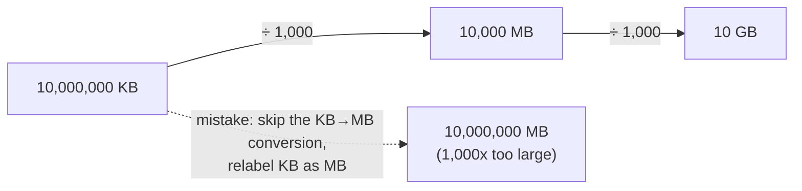
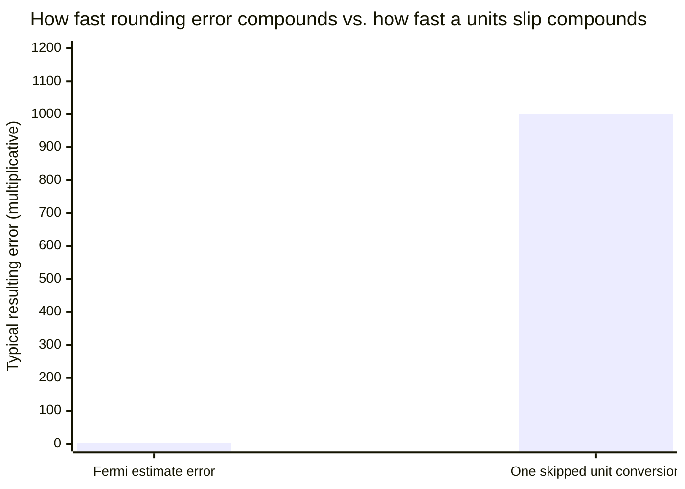

## Units cancel exactly like algebraic variables

**Why does `2,000,000 records × 5 KB/record` produce a result measured in KB, and not
something else?** Treat units as algebraic terms that multiply, divide, and cancel exactly
like variables in an equation:

```text
2,000,000 records × 5 (KB / record)
= 2,000,000 × 5 × records × (KB / record)
= 10,000,000 × KB × (records / record)
= 10,000,000 KB          <- "records" cancels against "record," leaving KB
```

The `records` in the numerator cancels the `record` in the denominator, exactly the way
`x × (y/x)` simplifies to `y`. What's left over — `KB` — is not a label chosen after the
fact; it's _derived_ from the units that were multiplied. The incident's mistake wasn't
skipping a step of arithmetic — it was mentally discarding this derivation and writing
"MB" out of habit or haste instead of what the algebra actually produced.

If the algebra notation feels abstract, read it as labels on objects: "records" appears
once as the thing being counted and once as "per record," so those labels cancel. "KB" has
no matching opposite label, so it remains. That is why the result is `10,000,000 KB`
before any storage-unit conversion happens.

## Converting units is multiplying by a disguised 1

**How does `10,000,000 KB` actually become GB, correctly?** A unit conversion factor —
like `1 MB / 1,000 KB` — is a fraction that equals exactly 1 (since 1 MB and 1,000 KB are
the same amount of data), so multiplying by it changes the units without changing the
quantity:

```text
10,000,000 KB × (1 MB / 1,000 KB) × (1 GB / 1,000 MB)
= 10,000,000 / 1,000 / 1,000 GB     <- KB cancels, then MB cancels
= 10 GB
```

**Skipping this conversion — using the `10,000,000` figure directly as if it were already
in MB — is precisely the incident's error.** A correct conversion preserves the real
quantity, but the written number changes because the unit changed: `10,000,000 KB` is the
same amount of data as `10 GB`. Forgetting the conversion factor leaves the right raw
number attached to the wrong _unit_, inflating the apparent value by whatever factor was
skipped (1,000x here).



## Fermi estimation: getting the right order of magnitude fast, without exact arithmetic

**If exact arithmetic can still produce a wrong-by-1,000x answer through a units slip, what
catches it?** A **Fermi estimate** — named after physicist Enrico Fermi, known for
quick, rough physical estimates — rewrites each factor as a small front number times a
power of 10, then multiplies the small front numbers and adds the exponents. A more
aggressive version rounds the front numbers away too; here we keep them because `2 × 5`
is still easy arithmetic:

```text
2,000,000 records  ≈ 2 × 10⁶
5 KB/record         ≈ 5 × 10³ bytes/record   (5 KB = 5,000 bytes)

Rough product: (2 × 5) × 10^(6+3) = 10 × 10⁹ = 10¹⁰ bytes ≈ 10 GB
```

This rough estimate — done in seconds, with no precise multiplication — lands on the
correct order of magnitude (~10 GB), immediately flagging the reported "10 TB" figure as
three orders of magnitude too high, without needing to find the specific error in the
original calculation first. **The value of a Fermi estimate isn't precision — it's speed
and independence**: it doesn't rely on the same calculation (and therefore the same
mistake) as the number being checked.



A Fermi estimate's rounding and simplification typically introduce
at most a few-fold error — nowhere near enough to hide a 1,000x mistake. This is exactly
why a rough, fast, independent estimate is a strong sanity check: its own error margin is
far smaller than the class of error (a skipped or doubled conversion factor) it's meant to
catch.

## The two-part discipline this unit builds

1. **Track units through every step algebraically** — treat them as canceling terms, not
   labels attached at the end from memory.
2. **Cross-check the final number's order of magnitude with an independent, rough
   estimate** — not by redoing the same calculation, but by estimating from scratch with
   rounded figures, so the same mistake can't silently survive both checks.
