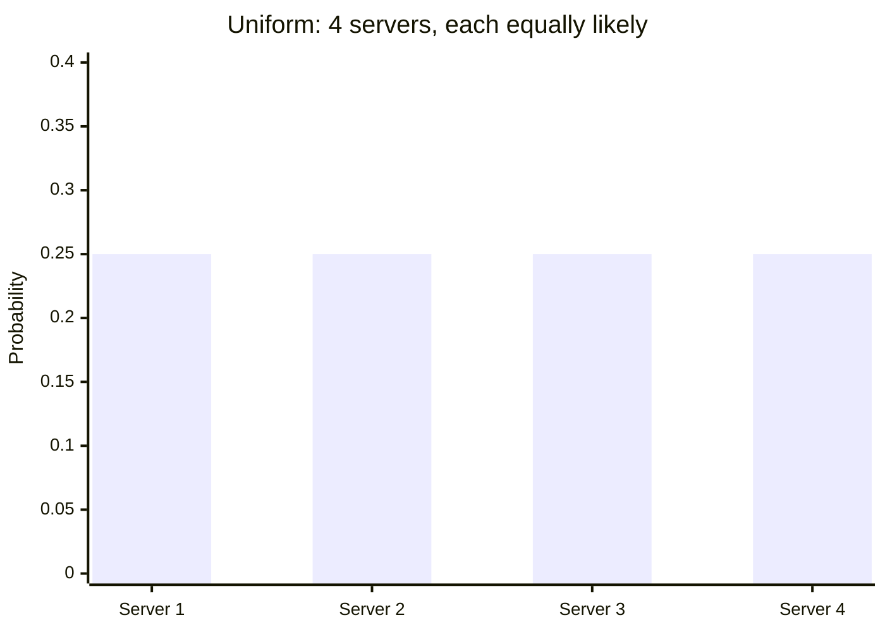
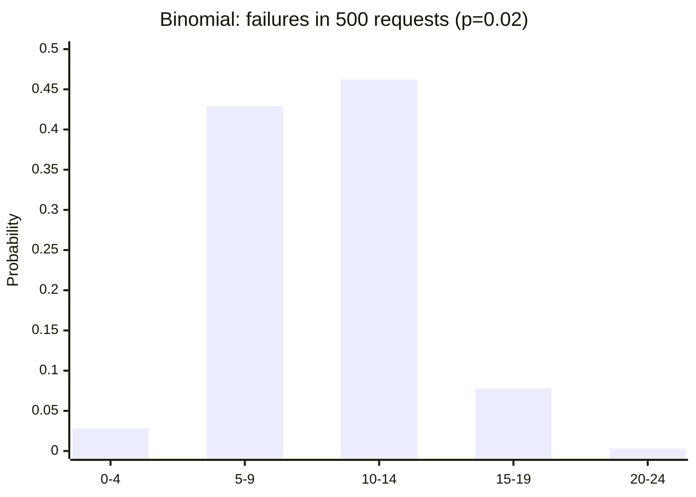
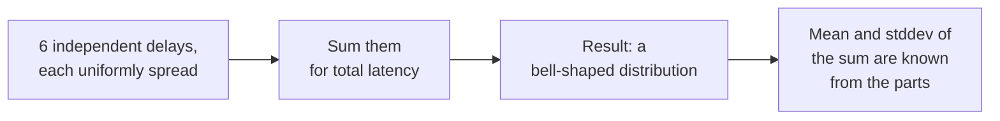

import LevelIntro from "../../../components/LevelIntro.astro";
import Checkpoint from "../../../components/Checkpoint.astro";

L1 named the three distributions and left the load balancer's 32%-vs-25% gap
unresolved — "expected doesn't mean guaranteed," but no way yet to say how
much of a gap is normal. This level builds the actual shape and formulas
behind uniform, binomial, and normal so that gap can be measured, not just
eyeballed.

<LevelIntro
  items={[
    "Discrete vs. continuous uniform distributions",
    "Binomial mean, variance, and standard deviation",
    "The Central Limit Theorem, via summed independent delays",
  ]}
/>

## Uniform: every outcome equally likely

**If a load balancer picks 1 of 4 servers uniformly at random, what's
the actual chance any single server gets picked?** Exactly `1/4 =
25%` — every outcome in the set is equally likely, by definition. The
mean number of hits after `n` requests is `n × p` (here, `n × 0.25`),
and the spread around that mean follows directly from the same
`n`/`p`.

This is a **discrete uniform** distribution: the outcomes are separate labels
you can count. A fair die has 6 labels, so each face has `1/6`; the load
balancer has 4 server labels, so each server has `1/4`. A bar chart is the
right picture because each outcome gets its own bar.

There is also a **continuous uniform** distribution, where the outcome can be
any point inside an interval, like a simulated delay anywhere from 1ms to 5ms.
There the graph is a flat rectangle, and probability is area: the interval
from 2ms to 4ms is length 2 inside a total length 4, so its probability is
`2 / 4 = 50%`. The probability of "exactly 3.000000...ms" is not the useful
question; the probability of an interval is.

| Uniform type | Outcome example         | How probability is read               |
| ------------ | ----------------------- | ------------------------------------- |
| Discrete     | server 1, 2, 3, or 4    | each listed outcome gets equal bar    |
| Continuous   | any delay from 1 to 5ms | equal-length intervals get equal area |

<Checkpoint question="A simulated delay is continuous uniform between 1ms and 5ms. What's the probability it lands between 1ms and 2ms?">

25%. The total interval is 4ms wide (5 − 1), and the interval from 1ms
to 2ms is 1ms wide, so its share of the total is `1 / 4 = 25%`. This
is the same "length of the piece over length of the whole" rule used
for 2ms–4ms above — it doesn't matter which sub-interval is picked or
where inside the range it sits, only how long it is relative to the
full span.

</Checkpoint>

## Binomial: counting successes across independent trials

**If a downstream dependency fails independently 2% of the time, how
many failures should show up in the next 500 requests — and how many
would be alarming?** This is what the binomial distribution answers:
given `n` independent trials each with success probability `p`, it
describes how many successes to expect and how much that count
naturally varies.

The connection from uniform to binomial is: once you choose one server to
watch, each request becomes a yes/no trial for that server. "Did this request
go to server 3?" has probability `p = 1/4`; after 200 requests, the binomial
distribution describes how many yes answers are normal.

| Quantity              | Formula           | For n=500, p=0.02 |
| --------------------- | ----------------- | ----------------- |
| Mean (expected count) | `n × p`           | 10 failures       |
| Variance              | `n × p × (1 − p)` | 9.8               |
| Standard deviation    | `√variance`       | ≈ 3.13 failures   |

A count that lands within one or two standard deviations of the mean
(here, roughly 4 to 16 failures) is unremarkable — it's what
independent chance produces on its own. An alert threshold set well
past that spread (say, 20+ failures, which this data shows happens
under 0.4% of the time by chance alone) is what actually distinguishes
"the dependency is having a bad batch of luck" from "something is
genuinely wrong."

<Checkpoint question="For n=500, p=0.02, the mean is 10 failures and the standard deviation is about 3.13. Is seeing 15 failures in the next 500 requests, by itself, a strong signal something's wrong?">

Not on its own. 15 failures is about 1.6 standard deviations above the
mean of 10 (`(15 − 10) / 3.13 ≈ 1.6`) — noticeably above average, but
still inside the range a perfectly healthy 2%-failure dependency
produces routinely just from chance. It's worth a glance, not a page.
The same logic used for the load balancer's 2.3-standard-deviation gap
applies here: "above expected" only becomes a strong signal once the
gap is several standard deviations wide, not the first time it's
nonzero.

</Checkpoint>

## Normal: what sums of small independent effects look like

**If end-to-end request latency is the sum of six independent
delays — DNS, TCP handshake, three network hops, and server
processing — and none of those six delays is individually
bell-shaped, why does the total latency usually still come out looking
like a bell curve?** This is the **Central Limit Theorem**: the sum of
many independent random effects tends toward a normal distribution,
regardless of the shape of each individual effect. This is why normal
distributions show up constantly in systems work even when no single
underlying cause is "naturally" bell-shaped.

For a sum of independent quantities, the means add directly and the
variances add directly (not the standard deviations) — this is what
lets `p50`/`p99` latency targets be reasoned about from the pieces
that make up a request, rather than only measured after the fact.

If variance is still new, treat it as "spread before taking the square root."
Standard deviation is in the original unit (failures, milliseconds), so it is
easier to read; variance is the bookkeeping quantity that adds cleanly when
independent random pieces are summed. `applied-math/statistics` expands that
language, and `applied-math/measurement-theory` explains why intervals and
units matter when the values being measured are continuous.

## Picking the right tool for the question

| Question shape                                                              | Distribution     | Systems example                                                  |
| --------------------------------------------------------------------------- | ---------------- | ---------------------------------------------------------------- |
| "Which of these equally-likely outcomes will happen?"                       | Uniform          | Random server selection, hash bucket assignment, A/B bucketing   |
| "How many times will this independent yes/no event happen across N trials?" | Binomial         | Request failures, retry outcomes, flaky test flakiness rates     |
| "What does the total of many small independent effects look like?"          | Normal (via CLT) | End-to-end latency, aggregated queueing delay, noise in a metric |

The three aren't competing models of the same thing — they answer
different shapes of question, and picking the wrong one produces a
confident-looking answer to a question nobody actually asked.
