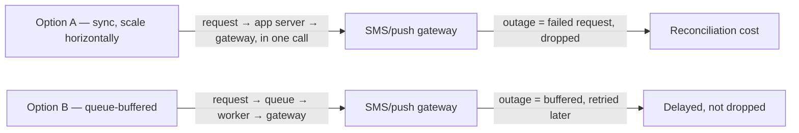

import Scenario from "../../../components/Scenario.astro";
import LevelIntro from "../../../components/LevelIntro.astro";

<Scenario label="Two staff engineers, two strong opinions, zero numbers">
  <Fragment slot="facts">
    

      
📈 <strong>Current volume</strong> — 15M notifications/month, growing to 45M by year end

      
🅰️ <strong>Option A (Marcus)</strong> — keep sync delivery, just add servers as traffic grows. Ships this week, $0 build cost

      
🅱️ <strong>Option B (Priya)</strong> — add a queue between ingestion and delivery. ~2.5 eng-weeks, ~$18,000 build cost

      
💥 <strong>Downstream gateway</strong> — 2 outages/year historically, ~45 min each

      
🧮 <strong>What the model found</strong> — B costs ~$36,900 less over year 1, despite the $18,000 build cost

    

  </Fragment>

NotifyCo's notification-delivery service sends 15 million
notifications a month, and that number is projected to roughly
triple to 45 million by year end. Two staff engineers are arguing
about how to handle the growth. Marcus wants to keep the current
design — a synchronous request/response pipeline — and just add more
app servers as traffic climbs: "It's simpler, it ships this week,
and we don't need infra we don't have proven we need yet." Priya
wants to insert a message queue between ingestion and delivery so
the system can absorb bursts and buffer through outages: "It's more
resilient, obviously — sync delivery falls over the moment the SMS
gateway hiccups." Both engineers are experienced. Both arguments
sound reasonable. Neither one has run a single number.

<strong>
  The design doc is due Friday. "Simpler" and "more resilient" are both true
  statements and neither one, by itself, tells you which option actually costs
  less, survives an outage more cheaply, or holds up as the product scales — so
  what would actually settle this?
</strong>

</Scenario>

Not a vote, and not whoever argues more persuasively in the design
review — a model. The same three ingredients this project has
already built separately (a cost model, a capacity model, a risk
model) combined into one number that says, explicitly, what each
option costs given the traffic this service actually expects to see.

<LevelIntro
  items={[
    "Why 'my gut says X' isn't a defensible design-doc argument",
    "The three inputs a real trade-off model needs: cost, capacity/latency, risk",
    "How this unit reuses expected value, unit economics, and capacity planning to build one",
  ]}
/>

## What "quantitative modeling for a design decision" means

A **quantitative model for a design decision** takes two or more
architecture options and, for each one, computes a single comparable
number — usually a cost, sometimes a latency or a risk-adjusted cost
— from the same set of real inputs (expected traffic, known unit
costs, known failure rates). The point isn't to remove judgment from
the decision. It's to make the judgment that remains — which
assumptions to trust, how much margin of safety to build in — an
explicit, arguable part of the doc, instead of leaving the entire
decision hiding inside a word like "simpler" or "more resilient."

**Neither of those words is wrong.** Option A genuinely is simpler
to build. Option B genuinely is more resilient to a downstream
outage. The model doesn't contradict either engineer — it answers a
question neither of them actually asked out loud: simpler and more
resilient _than what, by how much, and is that gap still true once
the traffic triples?_

## The three ingredients a real model needs

Three earlier units in this track each solved one piece of this
problem in isolation. A design-decision model is what happens when
all three get combined into one comparison instead of staying three
separate spreadsheets nobody connects:

| Ingredient                   | Question it answers                                                                                                                                 | Built in                 |
| ---------------------------- | --------------------------------------------------------------------------------------------------------------------------------------------------- | ------------------------ |
| **Cost model**               | What does each option cost, in dollars, at a given volume — fixed cost, variable cost, and any one-time build cost amortized over time?             | `unit-economics`         |
| **Capacity / latency model** | What does each option need to _provision_ to survive real (not average) traffic, and does that requirement scale linearly or worse as volume grows? | `capacity-planning-math` |
| **Risk model**               | What's the expected cost of the rare-but-real bad outcome (an outage, a data-loss incident) — probability × cost, not just "could happen"?          | `expected-value`         |

The diagram is the whole shape of the disagreement in one picture:
Option A's request path touches the gateway directly, so a gateway
outage is _this request's_ problem right now. Option B's request
path stops at a queue — the gateway's problem becomes the queue's
backlog, not an immediate failure. That's genuinely a resilience
advantage. Whether it's worth $18,000 and 2.5 weeks of engineering
time is exactly the question a number, not an adjective, has to
answer.

## Key terms

- **Fixed cost / variable cost / amortization** — carried over from
  `unit-economics`: a one-time build cost (like Option B's $18,000)
  gets spread across the months it should reasonably be charged
  against, so month 1 isn't unfairly stuck with the entire bill.
- **Peak-to-average ratio / headroom** — carried over from
  `capacity-planning-math`: the reason a synchronous, "just add
  servers" architecture tends to need _disproportionately_ more
  capacity as it grows, not just proportionally more.
- **Expected value (EV) of a risk** — carried over from
  `expected-value`: multiplying how often a bad outcome happens by
  what it costs when it does, so a rare outage's cost is a real
  number in the model instead of an unweighted "but what if."
- **Crossover point** — the traffic volume (or point in time) at
  which the cheaper option flips from one architecture to the other.
  Below it, one option wins; above it, the other does. A model that
  only checks _today's_ volume misses this entirely if the service is
  growing.

## What this unit covers

L2 builds the actual model structure — how the cost, capacity, and
risk pieces combine into one comparable number per option, and where
a crossover point comes from. L3 writes it as real, runnable code: a
cost function per option, an expected-outage-cost function reusing
`expected-value`'s EV formula, and a full year-one comparison that
produces the exact number in this level's opening callout — $36,900.
