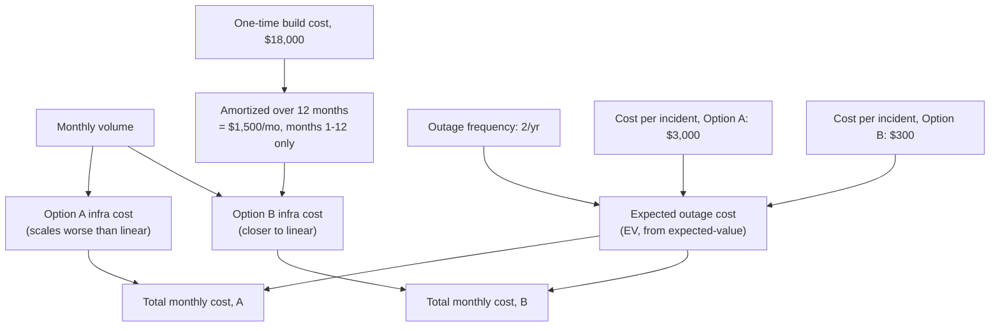
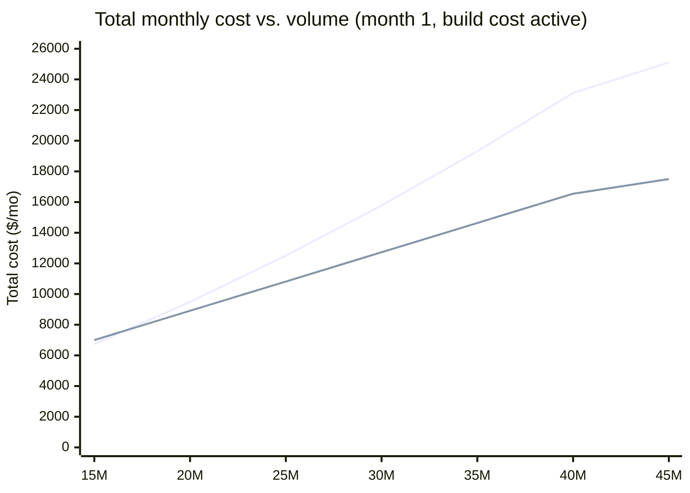

import LevelIntro from "../../../components/LevelIntro.astro";
import Checkpoint from "../../../components/Checkpoint.astro";

L1 named three ingredients — cost, capacity/latency, risk — and
asserted they combine into one comparable number per option. This
level covers how that combination actually works: what goes into
each option's cost function, why Option A's cost doesn't just scale
proportionally with traffic, and how a rare outage's expected cost
gets added on top instead of ignored.

<LevelIntro
  items={[
    "Why 'add servers' scales worse than proportionally with traffic",
    "How a one-time build cost and a recurring risk cost both fold into the same monthly number",
    "Where a crossover point comes from, and why it matters for a growing service",
  ]}
/>

## Why Option A's cost doesn't scale proportionally

**If traffic triples, does a synchronous, "just add servers"
architecture's cost also just triple?** Not usually — it tends to get
_worse_ than proportional, and the reason is exactly the
`capacity-planning-math` distinction between average and peak
traffic. A synchronous architecture has to be provisioned for
**peak** load with real headroom, because every request is answered
immediately or it fails. As a notification service grows, its
traffic doesn't just get bigger — it tends to get _spikier_: bigger
marketing sends, more simultaneous digest deliveries, a wider range
of user time zones concentrating around specific send windows. The
peak-to-average ratio itself tends to climb, not just the average.

A queue-buffered architecture (Option B) doesn't have this problem
the same way. A backlog forming during a burst isn't a failure — the
queue absorbs it and workers drain it over the following minutes.
Workers can run close to their real average throughput instead of
being sized for the worst five minutes of the month. That's the
entire mechanical reason Option B's cost curve bends _less_ steeply
than Option A's as volume grows: it isn't buying extra resilience for
free, it's trading upfront build cost for a genuinely different (and
cheaper, at scale) capacity requirement.

<Checkpoint question="A teammate says 'Option A's cost model should just be a flat $X per 1,000 notifications, same as Option B — why are you making it grow faster than volume?' What's the actual justification for letting Option A's per-unit cost increase as volume grows?">

Because Option A has to be provisioned for **peak** traffic with
enough headroom to survive it synchronously, and the peak-to-average
ratio itself tends to worsen as the service scales — the same
`capacity-planning-math` distinction between average, peak, and
provisioned capacity. A flat per-unit rate would be modeling Option A
as if it only ever had to handle its _average_ load, which is exactly
the mistake StreamCast made when it sized its chat backend off "600
on paper" instead of its real peak. Option B's per-unit cost stays
closer to flat because the queue absorbs bursts instead of requiring
the fleet itself to be sized for them.

</Checkpoint>

## Combining cost, amortized build cost, and risk into one monthly number

**Once each option has an infrastructure cost function, is that the
whole model?** Not quite — two more pieces still have to fold in
before the numbers are actually comparable:

- **Amortized build cost** — Option B's $18,000 build cost isn't
  free money spent once and forgotten; it's a real cost that has to
  land _somewhere_ in the monthly comparison, or the model is quietly
  pretending engineering time is free. Spreading it over the first 12
  months (the same amortization idea from `unit-economics`) means
  Option B's early months carry an extra $1,500/mo that disappears
  once the build cost is paid off.
- **Expected outage cost** — reusing `expected-value`'s exact formula:
  `outages/year × cost per incident`, converted to a monthly figure.
  Option A's $3,000-per-incident cost is higher than Option B's $300
  because a synchronous failure drops requests that then need manual
  reconciliation, while a buffered failure just delays delivery.

| Component                                        | Option A      | Option B      |
| ------------------------------------------------ | ------------- | ------------- |
| Infra cost at 15M/mo                             | $6,234.38     | $5,250.00     |
| Amortized build cost (months 1–12)               | $0            | $1,500.00     |
| Fixed queue overhead                             | $0            | $200.00       |
| Expected outage cost (2/yr × cost/incident ÷ 12) | $500.00       | $50.00        |
| **Total, month 1**                               | **$6,734.38** | **$7,000.00** |

At today's volume, in month 1, Option A is actually **cheaper** —
$265.62 cheaper. Marcus's instinct isn't wrong at today's traffic.
The question the model still has to answer is whether that stays
true as volume triples over the year.

## The crossover point

**If Option A is cheaper today, when — if ever — does that flip?**
Plot both total-cost functions against volume, and the answer is a
specific number, not a vague "eventually":

The two lines cross between 15M and 20M/month — right around
**16.9M**. NotifyCo's traffic is already at 15M and growing toward
45M within the year, so this isn't a hypothetical crossover far off
in some future scenario: at the service's current growth rate, it
happens within the first two months. Past that point, every
additional month makes Option A's disadvantage bigger, not smaller —
by month 12, at 45M/month, Option A costs $25,109.37 against Option
B's $17,500.00.

<Checkpoint question="Given the crossover happens around 16.9M/month and NotifyCo is already at 15M growing toward 45M within the year, does 'Option A is cheaper today' settle the design-doc debate in Marcus's favor?">

No — and this is the entire reason a design decision needs the model
to run _forward_, not just check today's number. "Cheaper today" is
true and also nearly irrelevant here, because today's volume is
already within a couple million of the crossover point, and the
service's own growth projection carries it past that point within
roughly a month or two. A model built only around today's traffic
would hand Marcus a technically-correct number that becomes wrong
almost immediately — which is exactly the kind of mistake a
one-point-in-time cost comparison makes, and exactly why the model
needs the growth trajectory as an input, not just the current
snapshot.

</Checkpoint>

## What the model doesn't decide for you

**Does the model settle the debate by itself?** It settles the
arithmetic — it doesn't settle which assumptions are trustworthy, and
that's still a judgment call the doc has to state explicitly, not
hide inside the model's output:

| Assumption in this model                                             | What happens if it's wrong                                                                                                                                                                    |
| -------------------------------------------------------------------- | --------------------------------------------------------------------------------------------------------------------------------------------------------------------------------------------- |
| Outage frequency stays at 2/year                                     | Fewer outages narrows Option B's advantage slightly; more outages widens it — Option A's cost-per-incident is 10× Option B's, so this assumption matters more to Option A                     |
| Growth reaches 45M/month by year end                                 | Slower growth delays the crossover; faster growth pulls it earlier — either way, the model should be re-run against the _actual_ trajectory, not treated as a one-time answer                 |
| Diseconomy-of-scale reference volume (80M) is realistic for Option A | A worse (lower) reference number would move the crossover earlier and strengthen the case for B; this is the single most arguable number in the whole model, and the design doc should say so |

A model that hides its assumptions is just an opinion wearing a
spreadsheet. A model that states them is something a reviewer can
actually push back on — which is the entire point of putting numbers
in a design doc instead of adjectives.

## Failure modes at this level

- **Modeling Option A's cost as flat per-unit, ignoring the
  peak-driven headroom requirement.** This is the exact mistake that
  makes "just add servers" look artificially cheap at scale — the
  same trap StreamCast fell into by sizing against a guessed
  per-server number instead of real peak traffic.
- **Charging Option B's entire $18,000 build cost to month 1, or
  never charging it at all.** Either one distorts the comparison —
  amortize it across the months it should reasonably cover, the same
  way `unit-economics` amortizes any lump-sum cost over time.
- **Comparing options only at today's volume.** A model that ignores
  the growth trajectory can hand back a technically correct answer
  that's already wrong by the time the design ships.
