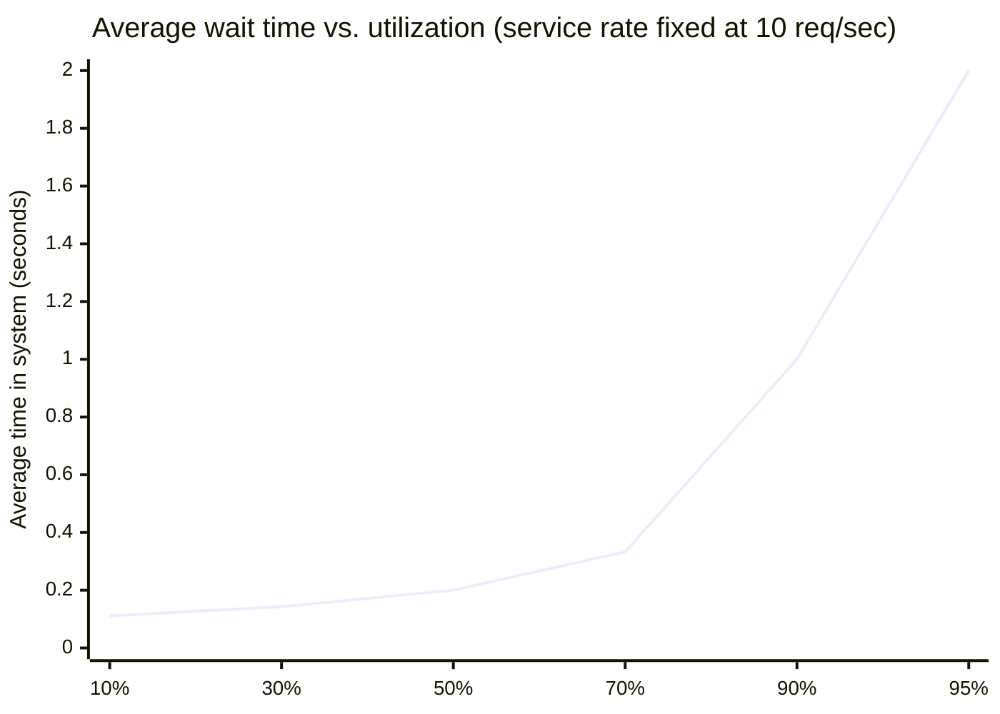
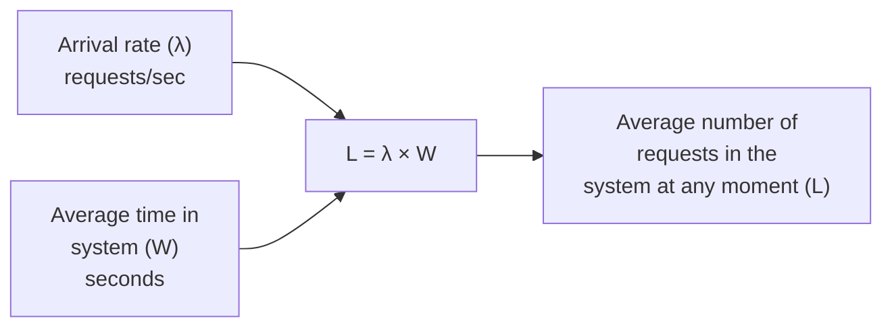

## The curve behind the checkout service's cliff

**If traffic only grew 50% but wait time grew 4x, what shape of
relationship produces that?** Not a straight line — a curve that
stays nearly flat through most of its range and then rises sharply as
utilization approaches 100%:

Notice how gentle the curve is from 10% to 50% utilization — wait
time barely moves. Then from 70% to 95%, it climbs from a third of a
second to two full seconds. **A load test run at 60% utilization sits
entirely in the flat region of this curve — it has no way to reveal
what happens in the steep region**, because the two regions don't
look anything alike.

## Why the curve bends: the server never catches up

**What's actually happening, mechanically, as utilization approaches
100%?** At low utilization, the server finishes each request with
capacity to spare before the next one arrives — a request rarely
waits behind another. As utilization climbs, requests increasingly
arrive while the server is still busy with the previous one, so they
queue up. Right at 100% utilization, the server is _exactly_ keeping
pace on average — but any brief burst of arrivals (which happens
constantly in real traffic) has no slack to absorb, so the queue
that forms during a burst never fully drains before the next one
hits. The math reflects this: wait time scales with `1 / (1 - ρ)`,
and that expression grows without bound as ρ approaches 1 — it's not
a special case, it's the direct consequence of a server with less and
less spare capacity to absorb any variation in arrivals.

There are two closely related ways to read the formula:

| Formula       | What it says in plain language                                |
| ------------- | ------------------------------------------------------------- |
| `1 / (1 - ρ)` | relative shape: divide by the fraction of capacity still free |
| `1 / (μ - λ)` | actual average time when you know service speed and arrivals  |

If `μ = 10` requests/second and `λ = 6`, then `1 / (10 - 6) = 0.25`
seconds. If arrivals rise to `λ = 9`, then `1 / (10 - 9) = 1`
second. The traffic rose 1.5x, but the spare capacity fell from 4
requests/second to 1 request/second.

## Little's Law: a relationship that doesn't care about the details

**Does the sharp-curve behavior depend on assuming a very specific
kind of system?** No — but a separate, simpler relationship holds
regardless of the specific arrival pattern, service pattern, or even
whether the curve above bends sharply or not:

**Little's Law (`L = λW`)** says the average number of requests
sitting in a system at any given moment equals the arrival rate times
the average time each request spends there. It holds for almost any
stable queueing system — this is what makes it useful as a sanity
check: if you know two of the three numbers (say, arrival rate and
observed average latency), you can compute the third (how many
requests are "in flight" at once) without needing to know anything
about the specific distribution of arrival or service times.

This connects directly to `applied-math/statistics`: the law uses
averages, not worst cases. A queue can satisfy the average relationship
while still having bursts, outliers, and peak-hour behavior that need
separate measurement.

## Throughput and latency are related, but not interchangeable

**If a system is handling more requests per second than ever, does
that mean it's performing well?** Not necessarily — throughput
(requests completed per second) and latency (time per individual
request) can move in opposite directions. A system pushed close to
its capacity limit can sustain high throughput while individual
requests wait far longer than they used to — the checkout service in
the opening scenario didn't lose throughput at 90% utilization, it
lost latency. Optimizing for one without watching the other is how a
system can look "fine" on a dashboard tracking requests-per-second
while users are experiencing multi-second waits.

## Failure modes at this level

- **Load-testing only up to a "reasonable" utilization level.** If
  the test never approaches the steep part of the curve, it can't
  reveal what happens there — the flat region gives false confidence
  about the steep one.
- **Assuming utilization headroom scales linearly with latency
  headroom.** Going from 60% to 90% utilization isn't "50% more load"
  in terms of user-facing impact — per the curve, it can be several
  times worse in wait time.
- **Watching throughput dashboards without watching latency.** A
  system can sustain its requests-per-second numbers right up to the
  point where latency has already become unacceptable to users —
  throughput staying flat doesn't mean nothing is wrong.
