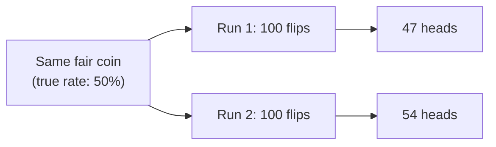

## Why the same fair coin gives different-looking results

**If a coin is genuinely fair, would two separate runs of 100 flips
each give exactly 50 heads every time?** No — each run is a sample,
and samples vary by chance even when the underlying process never
changes:

Neither 47 nor 54 means the coin changed — both are just what random
sampling produces from a genuinely fixed 50% rate. The gap between
them is **noise**, not evidence of a real difference. The same logic
applies to an A/B test: two groups seeing the exact same button could
still convert at slightly different rates purely from which visitors
happened to land in each group.

## What a confidence interval actually represents

**If the true conversion rate is unknown, what does a "12% ± 6%"
confidence interval actually claim?** It's a range, built from the
sample size and variability observed, that's likely to contain the
true underlying rate — not a claim that the true rate is exactly 12%.
A smaller sample produces a wider interval (more uncertainty about
where the true rate actually is); a larger sample narrows it:

| Sample size | Observed rate | Approximate 95% interval | What this says                                                 |
| ----------- | ------------- | ------------------------ | -------------------------------------------------------------- |
| 100         | 12%           | roughly 6% – 18%         | True rate could plausibly be almost anywhere in this wide band |
| 10,000      | 12%           | roughly 11.4% – 12.6%    | True rate is very tightly pinned down                          |

**Does a wide confidence interval mean the measurement was done
wrong?** No — it means the sample size wasn't large enough to pin the
true value down tightly. The interval is being honest about how much
uncertainty the data actually supports, which is exactly the point.

## What "statistically significant" is actually claiming

**Does "significant" mean the difference is large, important, or
surprising?** No — in this specific technical sense, it means
something narrower: the observed difference is unlikely enough to
have come from random noise alone (below a chosen threshold,
commonly 5%) that treating it as a real effect is reasonable. A tiny,
practically meaningless difference can be "significant" with enough
data; a huge-looking difference can fail to be significant with too
little data.

**Is a bigger observed difference always more trustworthy than a
smaller one?** Not by itself — trustworthiness depends on the
combination of the difference's size _and_ the amount of data behind
it. A 50% relative lift from 100 visitors can be less trustworthy
than a 5% relative lift from 50,000 visitors, because the smaller
sample leaves far more room for the gap to be pure noise.

## Failure modes at this level

- **Treating "bigger difference" as automatically "more real."** Size
  alone says nothing about noise — the sample size behind the
  measurement matters just as much.
- **Reading a wide confidence interval as a measurement mistake.** A
  wide interval is the data honestly reporting how little it actually
  knows yet, not a sign something was computed incorrectly.
- **Calling something "significant" based on a gut sense that it
  looks big.** Significance is a specific, checkable claim about the
  chance of noise producing this result — not a vibe.
