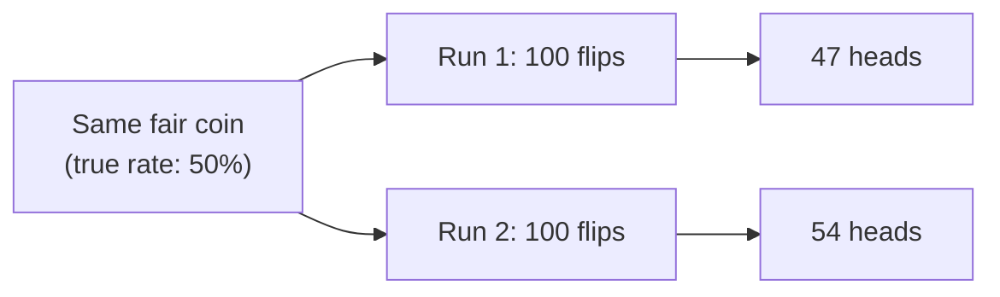

import LevelIntro from "../../../components/LevelIntro.astro";
import Checkpoint from "../../../components/Checkpoint.astro";

L1 measured a 6-point gap — 18% versus 12% — from only 100 visitors per
side. This level works out what that gap can and can't tell you: why
small samples wobble on their own, what a confidence interval actually
promises, and what "significant" means as a specific, checkable claim
rather than a gut reaction to a big-looking number.

<LevelIntro
  items={[
    "Standard deviation vs. standard error",
    "How confidence intervals narrow with more data",
    'What "statistically significant" actually claims',
  ]}
/>

## Why the same fair coin gives different-looking results

**If a coin is genuinely fair, would two separate runs of 100 flips
each give exactly 50 heads every time?** No — each run is a sample,
and samples vary by chance even when the underlying process never
changes:

Neither 47 nor 54 means the coin changed — both are just what random
sampling produces from a genuinely fixed 50% rate. The gap between
them is **noise**, not evidence of a real difference. The same logic
applies to an A/B test: two groups seeing the exact same button could
still convert at slightly different rates purely from which visitors
happened to land in each group.

The hidden distinction is individual spread vs. measurement spread:

| Term               | What varies                                     | Example                                   |
| ------------------ | ----------------------------------------------- | ----------------------------------------- |
| Standard deviation | individual observations around their average    | daily signups vary around 5               |
| Standard error     | the estimate you got from one sample to another | a 100-person conversion rate moves around |

More data does not make people stop varying. It makes the **measured average**
less jumpy from sample to sample, which is why confidence intervals narrow as
sample size grows.

<Checkpoint question="A coworker re-runs the same 100-visitor A/B test tomorrow and gets 15% instead of today's 18% for the new button — same button, same underlying rate. Does that mean today's 18% measurement was wrong?">

No. Standard deviation describes how individual visitors vary; standard
error describes how the _measured average itself_ moves from one sample
to the next. A 100-visitor sample has a wide standard error, so getting
15% one day and 18% the next is exactly the kind of wobble a fixed true
rate produces on small samples — neither number is "wrong," they're both
noisy estimates of the same underlying rate. This is also why the next
section's confidence interval is built to be wide enough to cover that
wobble rather than pretending one sample nails the true value exactly.

</Checkpoint>

## What a confidence interval actually represents

**If the true conversion rate is unknown, what does a "12% ± 6%"
confidence interval actually claim?** It's a range, built from the
sample size and variability observed, that's likely to contain the
true underlying rate — not a claim that the true rate is exactly 12%.
A smaller sample produces a wider interval (more uncertainty about
where the true rate actually is); a larger sample narrows it:

| Sample size | Observed rate | Approximate 95% interval | What this says                                                 |
| ----------- | ------------- | ------------------------ | -------------------------------------------------------------- |
| 100         | 12%           | roughly 6% – 18%         | True rate could plausibly be almost anywhere in this wide band |
| 10,000      | 12%           | roughly 11.4% – 12.6%    | True rate is very tightly pinned down                          |

**Does a wide confidence interval mean the measurement was done
wrong?** No — it means the sample size wasn't large enough to pin the
true value down tightly. The interval is being honest about how much
uncertainty the data actually supports, which is exactly the point.

The common 95% language is a convention, not a magic guarantee. It means the
method is designed so that, across many repeated samples, intervals built this
way would contain the true rate about 95% of the time. One interval from one
experiment is still a careful estimate, not certainty.

<Checkpoint question="The 100-visitor confidence interval for the new button is roughly 10%–26% (wide). Does that wide interval mean the significance test in the next section is likely to call the 12% vs. 18% gap significant, or not?">

Not likely — a wide confidence interval is a sign that the sample is too
small to pin the true rate down tightly, and that same lack of data is
exactly what makes it hard for a significance test to distinguish a real
effect from noise. The two are two views of the same underlying fact
(100 visitors isn't much data), so a wide interval here is a preview that
the significance test coming up is probably going to come back
inconclusive rather than a confident "yes, real effect."

</Checkpoint>

## What "statistically significant" is actually claiming

**Does "significant" mean the difference is large, important, or
surprising?** No — in this specific technical sense, it means
something narrower: the observed difference is unlikely enough to
have come from random noise alone (below a chosen threshold,
commonly 5%) that treating it as a real effect is reasonable. A tiny,
practically meaningless difference can be "significant" with enough
data; a huge-looking difference can fail to be significant with too
little data.

In L3, the formal test starts from a plain assumption: **suppose the button
made no real difference**. Under that assumption, both groups are samples
from one shared conversion rate. The z-test then asks how surprising the
observed gap would be if that assumption were true.

**Is a bigger observed difference always more trustworthy than a
smaller one?** Not by itself — trustworthiness depends on the
combination of the difference's size _and_ the amount of data behind
it. A 50% relative lift from 100 visitors can be less trustworthy
than a 5% relative lift from 50,000 visitors, because the smaller
sample leaves far more room for the gap to be pure noise.

## Failure modes at this level

- **Treating "bigger difference" as automatically "more real."** Size
  alone says nothing about noise — the sample size behind the
  measurement matters just as much.
- **Reading a wide confidence interval as a measurement mistake.** A
  wide interval is the data honestly reporting how little it actually
  knows yet, not a sign something was computed incorrectly.
- **Calling something "significant" based on a gut sense that it
  looks big.** Significance is a specific, checkable claim about the
  chance of noise producing this result — not a vibe.
