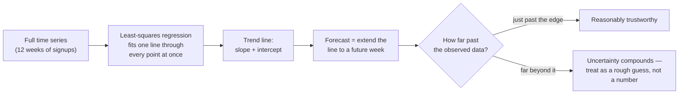

import LevelIntro from "../../../components/LevelIntro.astro";
import Checkpoint from "../../../components/Checkpoint.astro";

L1 named the pieces — trend, noise, extrapolation, least squares — from the
signups Scenario. This level works through why fitting a line to all twelve
weeks actually beats reading a trend off the last two points, and why even
a full regression can still be misled by a couple of unusual weeks.

<LevelIntro
  items={[
    "Why two points aren't a trend",
    "Fitting one line with least squares",
    "Leverage and extrapolation risk",
  ]}
/>

## What the naive forecast actually computed

**The Scenario's forecast used week 11 and week 12: 80 and 120
signups. Is "the difference between the two most recent points" the
same thing as "the trend"?** Not necessarily — with only two points,
there is no way to distinguish a real change in direction from a
single noisy week. The full twelve weeks of data:

| Week    | 1   | 2   | 3   | 4   | 5   | 6   | 7   | 8   | 9   | 10  | 11  | 12  |
| ------- | --- | --- | --- | --- | --- | --- | --- | --- | --- | --- | --- | --- |
| Signups | 30  | 33  | 35  | 38  | 36  | 41  | 44  | 42  | 47  | 50  | 80  | 120 |

Weeks 1 through 10 climb steadily by roughly 2 signups a week. Weeks
11 and 12 jump far above that pattern — consistent with the
Scenario's detail that a post about the product went viral right
before the forecast was made. The naive forecast treated that spike
as if it were the new normal weekly growth rate, rather than a
one-off event layered on top of a much gentler underlying trend.

## Fitting one line through all the data: least squares

**If two points aren't enough, what does using all twelve points
actually do differently?** Least-squares linear regression fits a
single straight line `y = slope × x + intercept` by choosing the
slope and intercept that minimize the total squared vertical distance
between the line and every one of the twelve points — not just the
last two.

In this unit, read that line as:

| Piece       | Meaning here                                     |
| ----------- | ------------------------------------------------ |
| `x`         | week number                                      |
| `y`         | predicted signups for that week                  |
| `slope`     | how many signups the line adds per week          |
| `intercept` | where the line would start if extended to week 0 |

If a line predicts 42 signups and the real value was 47, its vertical error is
`47 - 42 = 5`. Least squares compares many candidate lines by adding up those
errors after squaring them.

Squaring the distances (rather than, say, just averaging them) means
points far from the line count more heavily than points close to it —
which matters for what comes next.

Tiny manual example: an error of `2` contributes `2² = 4`; an error of `10`
contributes `10² = 100`. The large miss counts 25 times as much, not 5 times
as much. That is why a very unusual week can pull the fitted line strongly,
especially when it sits near the edge of the observed range.

<Checkpoint question="Two candidate lines both miss a given week's data point — one by 2 signups, the other by 10 signups. How much more heavily does least squares penalize the 10-signup miss compared to the 2-signup miss?">

25 times as much, not 5 times as much — least squares compares errors after
squaring them, and `10² = 100` versus `2² = 4` is a 25x gap. That's exactly
why a single unusual week can pull a fitted line much harder than its "one
week out of twelve" share would suggest, which is the mechanism the next
section (leverage) depends on.

</Checkpoint>

## Even a full regression can be fooled by one point

**So does running regression on all twelve weeks fix the Scenario's
problem?** Only partially. Fitting a line to all twelve weeks
produces a real, defensible slope — but weeks 11 and 12 sit right at
the edge of a fairly small dataset, and squaring distances means those
two outlying points pull the fitted line toward themselves more than
an ordinary week would. A regression fit on just the first ten
(pre-spike) weeks tells a noticeably different, much steadier story
than a regression fit on all twelve — L3 verifies both fits directly
and compares how well each line actually matches its data.

**Does that mean the spike should just be thrown out?** Not
necessarily — a real spike might signal something worth
investigating (did a marketing campaign work? is it one-time press
coverage?). The point isn't "delete the outlier," it's that a single
recent point — whether examined alone, as the naive forecast did, or
folded into a regression at the edge of the data — can carry far more
influence over a forecast than its status as "one week out of twelve"
would suggest.

That edge influence is called **leverage**. A point near the end of the time
range can rotate the future part of the line more dramatically than a point
near the middle, because forecasts are made by extending the line beyond that
edge.

<Checkpoint question="Why does a point near the edge of the observed weeks (like week 11 or 12) have more leverage over a forecast than an equally unusual point sitting in the middle of the range?">

Because a forecast is made by extending the fitted line beyond the edge of
the data. Rotating the line around a point near the end swings the projected
future further than rotating it around a point in the middle would, since
the middle point is anchored by data on both sides. This is why weeks 11-12's
spike matters more to the week-52 forecast than an equally sized spike in,
say, week 5 or 6 would.

</Checkpoint>

## Extrapolation gets riskier the further out you go

**Once a trend line is fit, is projecting it forward to any future
week equally safe?** No — every fitted line is only verified against
the range of data actually observed (here, weeks 1–12). Projecting to
week 13 or 14 stays close to that verified range; projecting to week
52 assumes the same trend holds for forty more weeks nothing in the
data has confirmed — new competitors, seasonality, market saturation,
or simply the trend changing are all invisible to a straight line fit
on the past.

## Failure modes at this level

- **Treating two points as a trend.** Any two points define a
  perfectly straight line by definition — that says nothing about
  whether the data actually behaves that way.
- **Trusting a regression's fit without checking it.** A line can be
  fit through any data; whether it's a _good_ fit (how close the
  points actually sit to the line) is a separate question, covered in
  L3.
- **Extrapolating arbitrarily far with the same confidence as
  interpolating.** A forecast just past the observed range and one
  forty weeks out do not carry the same risk, even from the same
  fitted line.
