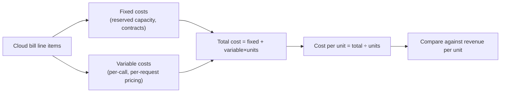
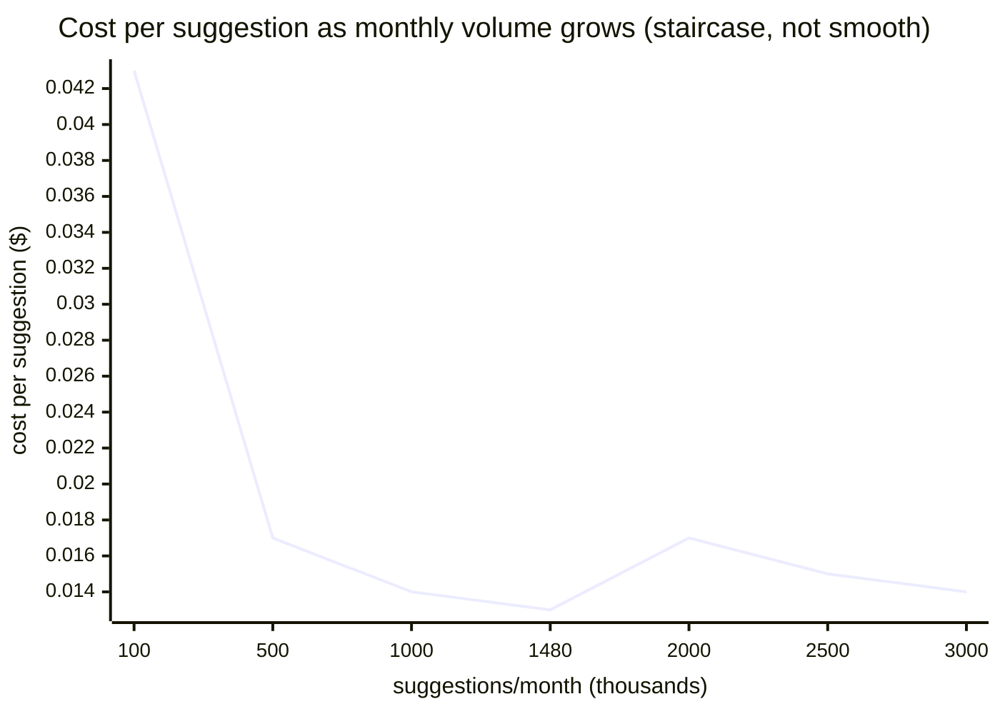

import Scenario from "../../../components/Scenario.astro";
import LevelIntro from "../../../components/LevelIntro.astro";
import Checkpoint from "../../../components/Checkpoint.astro";

L1 named the reply-suggestions feature's numbers: $3,200 fixed, $0.011/suggestion variable, two very different user segments. This level builds the actual model behind those numbers — how a cost flows from "line items on a cloud invoice" down to "dollars per unit," and how that model exposes what a single blended average hides.

<LevelIntro
  items={[
    "How fixed and variable cost combine into a per-unit figure",
    "Allocation: why *how* you spread fixed cost changes what a segment looks like",
    "Break-even and margin as a chart, not just a formula",
  ]}
/>

## How does a cloud bill become a cost-per-user number?

<Scenario label="Same feature, one more angle">

Finance doesn't see "reply suggestions cost $19,480 this month." They see one line for the GPU reservation and one line for API calls to the suggestion model, mixed in with every other feature's usage of the same infrastructure. Turning that raw bill into "this feature costs $X per user" requires deliberately separating what's fixed from what's variable, then deciding how to spread the fixed piece — and that last decision is where blended averages quietly lie.

<Fragment slot="facts">

**From bill to per-unit cost**

1. Split the bill: fixed line items vs. variable line items
2. Total cost = fixed + (variable rate × volume)
3. Cost per unit = total cost ÷ units — but "units" needs a definition (per user? per segment?)

</Fragment>

</Scenario>

The flow from raw infrastructure spend to a defensible "$X per user" number always passes through the same three stages:



The formula for cost per unit is short, but every term in it hides a decision:

```
costPerUnit = fixedCost / totalUnits + variableCostPerUnit
```

- `fixedCost` — is this month's reservation, or a slice of a longer contract? (This is what amortization answers, below.)
- `totalUnits` — units of _what_? All 48,000 users, or just the 40,000 in the segment you're actually asking about?
- `variableCostPerUnit` — usually the easy part; it's on the vendor's price sheet.

## Allocation: the decision that changes the story

<Checkpoint question="The $3,200 fixed cost is allocated evenly across all 48,000 users (both tiers) instead of being isolated per segment. Does that even split make the free tier's unit economics look better or worse than what's actually happening?">

Better than reality — and that's the trap. An even split hands the free tier only $3,200 × (40,000/48,000) ≈ $2,667 of fixed cost, plus its own variable usage (40,000 × 25 × $0.011 = $11,000), for a blended free-tier cost of about $13,667 against $0 revenue. That's already a loss — but a single company-wide "cost per user" figure (≈$0.41) would report as a small, unremarkable number, because it's diluted by averaging in the much lower-usage-relative-to-fixed-cost paid segment. The moment you ask "cost per user, **within** the free tier specifically," the loss becomes visible; the moment you blend segments, it disappears into a rounding-error-looking average. Unit economics only tells the truth at the grain you compute it at — and "per user, company-wide" is often too coarse a grain to catch a segment-specific problem.

</Checkpoint>

The lesson generalizes: **always compute cost-per-unit per segment first**, then blend if you need a company-wide number — never the other way around. A segment with disproportionate usage (many free users, each using the feature moderately) can hide inside a healthy-looking average the same way a slow database query hides inside a healthy-looking p50 latency.

## Economies of scale — and where they stop

Because fixed cost gets divided by more units as volume grows, cost-per-unit falls as a feature scales — this is the textbook "economies of scale" effect, and it's real. But it isn't infinite: at some point volume outgrows what the current fixed-cost tier can serve (the GPU pool saturates, a new reservation tier kicks in), and cost-per-unit jumps back up before resuming its decline at the new, larger fixed cost. Modeling a feature's cost as a smooth curve when it's actually a **staircase** is a second common guessing mistake, distinct from the blended-average mistake above.



Reading the chart: at 100K suggestions/month, the $3,200 fixed cost dominates (32¢ of it per thousand suggestions), so cost-per-unit is high. By 1,480K (today's actual volume), the fixed cost has been spread thin enough that cost-per-unit is close to the raw $0.011 variable rate. The bump around 2,000K represents a second GPU reservation kicking in to handle the higher volume — cost-per-unit rises before falling again as _that_ fixed cost, too, gets amortized over more units.

## Amortization: spreading a lump sum over time

<Checkpoint question="A one-time $9,600 migration to the new suggestion-model vendor is paid upfront in month 1, but the contract covers 12 months of service. If this month's report just expenses the full $9,600 in month 1, what does that do to month 1's unit economics compared to months 2–12?">

It makes month 1 look catastrophically worse than every other month, for a cost that actually belongs equally to all twelve — a one-time snapshot would show month 1's cost-per-suggestion spiking, then months 2–12 looking artificially cheap by comparison, even though nothing about the feature's real efficiency changed. Amortization fixes this by spreading the $9,600 evenly (straight-line: $800/month) across the 12 months it actually covers, so each month's unit economics reflect the ongoing cost of running the feature rather than the accounting quirk of _when_ the invoice happened to be paid.

</Checkpoint>

Straight-line amortization — the simplest and most common form — is just:

```
monthlyAmortizedCost = totalCost / numberOfMonths
```

A full amortization _schedule_ tracks this month by month: the amount recognized that month, the cumulative amount recognized so far, and the remaining balance. That's mechanical enough to be worth writing as a real function rather than re-deriving by hand every time — L3 has one.

## Break-even and margin, visually

Cost-per-unit and revenue-per-unit together answer the two questions that actually matter to a team deciding whether a feature is sustainable:

| Metric              | Formula                              | What it tells you                                                               |
| ------------------- | ------------------------------------ | ------------------------------------------------------------------------------- |
| Contribution margin | `pricePerUnit - variableCostPerUnit` | Revenue left per unit after variable cost, before fixed cost is even considered |
| Break-even units    | `fixedCost / contributionMargin`     | Volume at which total revenue = total cost                                      |
| Margin %            | `(revenue - cost) / revenue × 100`   | Profitability as a percentage, comparable across segments of different size     |

For the paid tier: contribution margin per user = $12 − ($0.011 × 60) = $11.34. Break-even users = $3,200 / $11.34 ≈ 282 paid users — the paid tier crossed break-even long ago, at 8,000 users. For the free tier, contribution margin per user is negative from the start ($0 − $0.011 × 25 = −$0.275): there is no break-even volume, because a free user never generates revenue to catch up to cost. No amount of "just get more free users" fixes that — it makes the loss bigger, not smaller.

L3 turns every formula on this page into a real, tested function, and works through the full reply-suggestions numbers end to end.
