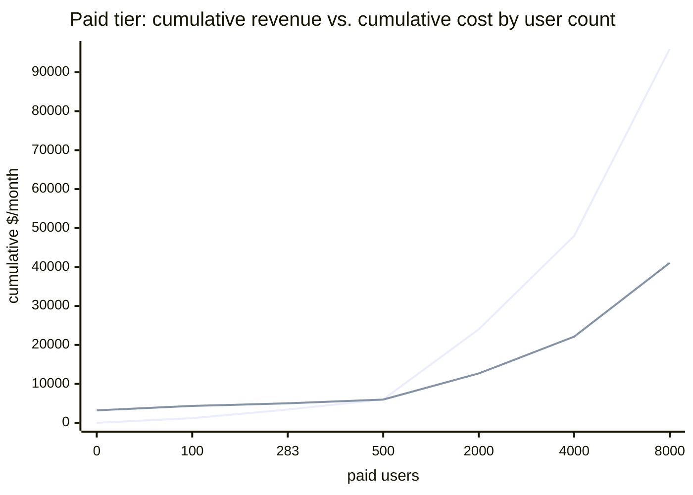

import Scenario from "../../../components/Scenario.astro";
import LevelIntro from "../../../components/LevelIntro.astro";
import Checkpoint from "../../../components/Checkpoint.astro";

<Scenario label="Turning the model into code">

L2 left the reply-suggestions numbers as hand-worked arithmetic: a $3,200 fixed cost, an $11.34 contribution margin for paid users, a break-even of ~282 paid users. That's fine for one calculation, but a real team re-runs this analysis every time pricing, volume, or vendor rates change — and hand arithmetic is exactly where a sign error or a forgotten segment split creeps back in. This level turns every L2 formula into a small, tested TypeScript module, then runs the full reply-suggestions numbers through it end to end.

<Fragment slot="facts">

**What gets built**

- `costPerUnit()` — fixed + variable → a per-unit figure
- `amortizationSchedule()` — spread a lump sum over months
- `breakEvenUnits()` / `marginPercent()` — the two sustainability questions
- A worked run against the real reply-suggestions numbers from L1/L2

</Fragment>

</Scenario>

<LevelIntro
  items={[
    "A cost-per-unit calculator that separates fixed, variable, and segment volume",
    "An amortization schedule function, month by month",
    "Break-even and margin functions, run against the real reply-suggestions numbers",
  ]}
/>

## Cost per unit, as a function

The formula from L2 — `fixed / units + variable` — is one line, but a real calculator needs to handle the case that broke the reply-suggestions estimate: **segment-specific volume**, not a single company-wide user count.

```typescript
interface CostInputs {
  fixedCostPerMonth: number;
  variableCostPerUnit: number;
  unitsThisSegment: number;
}

function costPerUnit(inputs: CostInputs): number {
  const { fixedCostPerMonth, variableCostPerUnit, unitsThisSegment } = inputs;
  if (unitsThisSegment <= 0) {
    throw new Error(
      "unitsThisSegment must be positive — cost is undefined for zero volume",
    );
  }
  return fixedCostPerMonth / unitsThisSegment + variableCostPerUnit;
}

function totalSegmentCost(
  fixedCostShare: number,
  variableCostPerUnit: number,
  unitsThisSegment: number,
): number {
  return fixedCostShare + variableCostPerUnit * unitsThisSegment;
}

// Split a shared fixed cost across segments proportional to their user count —
// the "even split" allocation from L2's checkpoint. Other allocation
// strategies (e.g. by usage share) are valid too; this is the simplest one,
// and worth naming explicitly since the allocation choice changes the story.
function allocateFixedCostByUsers(
  fixedCostPerMonth: number,
  segmentUsers: number,
  totalUsers: number,
): number {
  return fixedCostPerMonth * (segmentUsers / totalUsers);
}
```

Notice the guard clause: dividing by zero units is a real failure mode (a brand-new segment with no users yet), not an edge case to skip. A cost-per-unit function that silently returns `Infinity` or `NaN` will corrupt every calculation built on top of it.

<Checkpoint question="Two engineers each write a break-even calculator. One uses `fixedCost / (price - variableCost)`, the other uses `fixedCost / (variableCost - price)` by a sign slip. For the free tier (price $0, variableCost $0.011), what does the second (wrong) version return, and why is that a useful tell that something's broken?">

The wrong version returns a **negative** break-even count: `3200 / (0.011 - 0) = 290,909`, but with the denominator's sign flipped the whole expression comes out negative once contribution margin is genuinely negative in the correct formula (price below variable cost). A negative number of "units to break even" is nonsensical — you can't reach negative users — so a negative result is a strong signal to check the formula's sign convention rather than to report "-290,909 users to break even" as if it meant something. In production code this is exactly the kind of thing worth asserting on: a break-even function should probably throw or return `null`/`Infinity` for a segment with non-positive contribution margin, rather than return a number that happens to be negative and easy to eyeball-mistake as a small positive one, especially if a further calculation squares or absolute-values it downstream and quietly loses the sign entirely.

</Checkpoint>

## Amortization schedule

The $9,600 / 12-month migration cost from L2 needs a real month-by-month breakdown, not just the $800/month monthly figure — a schedule is what a finance review actually asks for.

```typescript
interface AmortizationRow {
  month: number;
  amount: number;
  cumulative: number;
  remaining: number;
}

function amortizationSchedule(
  totalCost: number,
  months: number,
): AmortizationRow[] {
  if (months <= 0) throw new Error("months must be positive");

  const monthlyAmount = Math.round((totalCost / months) * 100) / 100;
  const schedule: AmortizationRow[] = [];
  let cumulative = 0;

  for (let month = 1; month <= months; month++) {
    // Last month absorbs any rounding remainder so the schedule sums exactly
    // to totalCost instead of drifting a few cents short or over.
    const amount =
      month === months
        ? Math.round((totalCost - cumulative) * 100) / 100
        : monthlyAmount;
    cumulative = Math.round((cumulative + amount) * 100) / 100;
    schedule.push({
      month,
      amount,
      cumulative,
      remaining: Math.round((totalCost - cumulative) * 100) / 100,
    });
  }

  return schedule;
}
```

Running `amortizationSchedule(9600, 12)` produces twelve $800 rows, cumulative climbing from $800 to $9,600, remaining falling from $8,800 to $0 — exactly the shape that turns "month 1 looks catastrophic" (L2's checkpoint) into "every month looks the same, because the cost genuinely is the same every month."

| month | amount | cumulative | remaining |
| ----- | ------ | ---------- | --------- |
| 1     | $800   | $800       | $8,800    |
| 2     | $800   | $1,600     | $8,000    |
| ...   | ...    | ...        | ...       |
| 12    | $800   | $9,600     | $0        |

## Break-even and margin, as functions

```typescript
function contributionMargin(
  pricePerUnit: number,
  variableCostPerUnit: number,
): number {
  return pricePerUnit - variableCostPerUnit;
}

// Returns Infinity when a unit's contribution margin is zero or negative —
// there is no finite volume at which revenue catches up to cost, which is
// exactly the free tier's situation and needs to be representable, not
// thrown away as an error.
function breakEvenUnits(
  fixedCostPerMonth: number,
  pricePerUnit: number,
  variableCostPerUnit: number,
): number {
  const margin = contributionMargin(pricePerUnit, variableCostPerUnit);
  if (margin <= 0) return Infinity;
  return fixedCostPerMonth / margin;
}

function marginPercent(revenue: number, cost: number): number {
  if (revenue === 0) return revenue === cost ? 0 : -Infinity;
  return ((revenue - cost) / revenue) * 100;
}
```

## Worked example: the full reply-suggestions numbers

Putting all four functions together against the real scenario numbers:

```typescript
const FIXED_COST = 3200;
const VARIABLE_RATE = 0.011;

const freeUsers = 40000;
const freeGenerationsPerUser = 25;
const paidUsers = 8000;
const paidGenerationsPerUser = 60;
const paidPrice = 12;

const totalUsers = freeUsers + paidUsers;

const freeFixedShare = allocateFixedCostByUsers(
  FIXED_COST,
  freeUsers,
  totalUsers,
);
const paidFixedShare = allocateFixedCostByUsers(
  FIXED_COST,
  paidUsers,
  totalUsers,
);

const freeSegmentCost = totalSegmentCost(
  freeFixedShare,
  VARIABLE_RATE,
  freeUsers * freeGenerationsPerUser,
);
const paidSegmentCost = totalSegmentCost(
  paidFixedShare,
  VARIABLE_RATE,
  paidUsers * paidGenerationsPerUser,
);

const paidRevenue = paidUsers * paidPrice;

console.log("Free-tier cost:", freeSegmentCost.toFixed(2)); // "13666.67"
console.log("Free-tier margin %:", marginPercent(0, freeSegmentCost)); // -Infinity
console.log("Paid-tier cost:", paidSegmentCost.toFixed(2)); // "5813.33"
console.log(
  "Paid-tier margin %:",
  marginPercent(paidRevenue, paidSegmentCost).toFixed(1),
); // "93.9"
console.log(
  "Paid break-even users:",
  Math.ceil(
    breakEvenUnits(
      FIXED_COST,
      paidPrice,
      VARIABLE_RATE * paidGenerationsPerUser,
    ),
  ),
); // 283 (per paid user, using their monthly generation volume folded into an effective per-user variable cost)
```

The chart below shows why 8,000 paid users is comfortably past break-even, while the free tier's cost line never meets a revenue line at all — there's nothing to plot, because free-tier revenue is a flat $0 regardless of volume.



Break-even lands at 283 paid users, right where the revenue line crosses the cost line — everything to the right of that crossing point is the feature's actual profit.

<Checkpoint question="If the reply-suggestions team's actual fix was 'cap free-tier generations at 5/month instead of 25,' what does that do to the free-tier numbers above — does it fix the loss, or just shrink it?">

It shrinks the loss without eliminating it — free-tier revenue is still $0 regardless of volume, so contribution margin per free user stays negative (`0 - 0.011 × 5 = -$0.055` instead of `-$0.275`), meaning break-even is still infinite for that segment; there is no volume of free usage that turns $0 revenue into a profitable line. Capping usage reduces the _variable_ portion of the loss (roughly 5× smaller, from $11,000 to $2,200 for the free tier's generation cost) but does nothing about the segment's ~$2,667 share of fixed cost, which it still absorbs regardless of how many suggestions get generated. A usage cap is a mitigation for a segment with negative contribution margin, not a cure — the only real fixes are raising price above variable cost (make the tier non-free, or add a paid add-on) or removing the feature from that segment entirely.

</Checkpoint>

**Extend it yourself:** the worked example above assumes fixed cost is allocated by _user count_. What changes if you allocate it by _usage share_ instead (each segment pays a fraction of the $3,200 proportional to its share of total generations, not its share of total users)? Recompute the free tier's cost under that allocation — does the free tier's loss get larger, smaller, or does the total company-wide cost stay the same either way? (It's worth actually running the numbers: free tier generates 1,000,000 of the 1,480,000 total monthly suggestions — a very different ratio from its 40,000-of-48,000 share of _users_.)

## A note on which language, and why

This unit uses TypeScript for the narrative code because the domain — money, schedules, percentages — benefits from the interfaces (`CostInputs`, `AmortizationRow`) documenting exactly what a real calculator expects and returns, the same way a finance-adjacent internal tool would in practice. The exercises below run as plain JavaScript in a sandboxed browser Worker (no Node globals, no imports) — the same functions, same logic, just without the type annotations a bundler would normally strip before shipping to a browser anyway.
