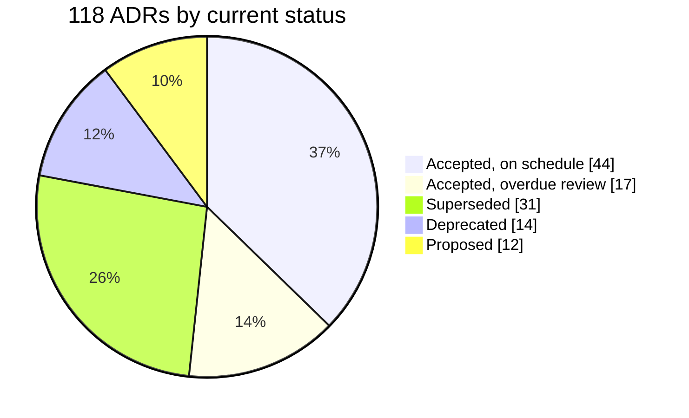

import Scenario from "../../../components/Scenario.astro";
import LevelIntro from "../../../components/LevelIntro.astro";

<Scenario>
  <Fragment slot="facts">
    

      
118 ADRs on record

      

        ✅ Accepted, reviewed on time
        44
      

      

        

      

      

        🧟 Accepted, overdue for review
        17
      

      

        

      

    

    
Symptoms this week

    

      
🔍 Nobody on the payments team can find ADR-042 in under ten minutes

      
🤷 Two other services already call the ledger synchronously, unnoticed

      
🔁 The "no synchronous calls" debate is happening again, from scratch

    

  </Fragment>

Someone on the payments team is about to add a synchronous HTTP call from the checkout service straight into the ledger service. A reviewer flags it: "didn't we decide against this?" A search turns up ADR-042, written fourteen months ago, status `accepted`, arguing for exactly the opposite — event-driven writes to the ledger, never a synchronous call in the request path. Nobody currently on the team was there when it was written. Two other services already violate it, quietly, and nobody noticed until now. The PR author isn't being reckless — they genuinely didn't know the decision existed.

**The org didn't lack a decision. It had one, in writing, accepted. So why is the exact same argument happening again as if from zero?**

</Scenario>

Because writing an ADR down once doesn't keep it alive, discoverable, or enforced — an org with dozens or hundreds of these documents needs a system that does that on purpose, or every decision quietly decays into this same scene.

<LevelIntro
  items={[
    "Why individual ADRs decay at organizational scale",
    "ADR lifecycle status and what each status means",
    "Architecture review boards and fitness functions, at a glance",
  ]}
/>

This unit assumes you already know what a single ADR is and how to write
one — see `systems/trade-off-documentation` for that. This unit is about a
different, harder problem: once an org has dozens or hundreds of these
documents, what keeps them from becoming a graveyard nobody trusts,
searches, or enforces?

- **The core problem isn't writing decisions down — it's keeping a growing pile of them trustworthy.** A single ADR is cheap to write and easy to reason about. A hundred of them, written by people who've since left, about systems that have since changed, is a different problem: which ones are still true? Which ones were quietly abandoned? Which one applies to the code you're about to write?
- **Three mechanisms cover most of what "ADR governance" means in practice:**
  - **ADR lifecycle status** — every ADR has a status (`proposed`, `accepted`, `superseded`, `deprecated`) that's actively maintained, not written once and frozen. A `superseded` ADR points to the ADR that replaced it, so nobody argues against a decision that's already been overturned.
  - **An architecture review board (ARB)** — a standing group (not necessarily large or formal) with actual authority to accept, reject, or reopen architecturally significant decisions, on a cadence, so "is this still current?" has an owner instead of being everyone's job and therefore nobody's.
  - **Fitness functions** — automated checks, usually running in CI, that continuously verify the codebase still honors a decision (e.g. "no import from `checkout/` into `ledger/` except through the published event contract") instead of relying on every future engineer having read and remembered the ADR.
- **What decays without these:** discoverability (nobody can find the decision that governs the code they're touching), enforcement (a decision with no automated check is only as durable as everyone's memory), and legitimacy (if reopening a decision is either impossible or trivially easy, both extremes destroy trust in the record).

| Status       | Meaning                                                                | Still governs new code? |
| ------------ | ---------------------------------------------------------------------- | ----------------------- |
| `proposed`   | Written, not yet ratified by the review body                           | No                      |
| `accepted`   | Ratified and currently in force                                        | Yes                     |
| `superseded` | Replaced by a newer ADR (which it links to)                            | No — follow the link    |
| `deprecated` | No longer applies (system removed, approach abandoned), no replacement | No                      |

A status field that nobody updates is worse than no status field — it
tells every future reader "trust me," with nothing behind that claim. The
rest of this unit is about the machinery that keeps that field honest:
who's allowed to change it, on what cadence, and what automatically
checks that reality still matches what it says.
