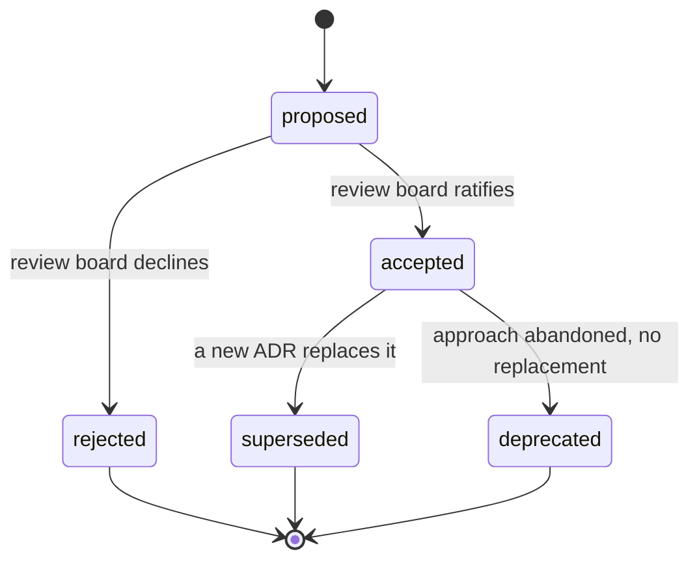
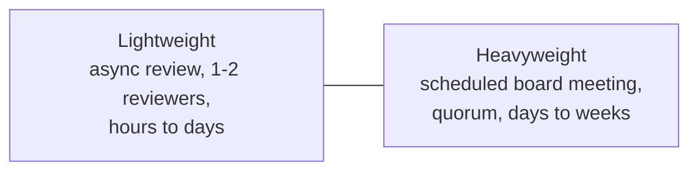
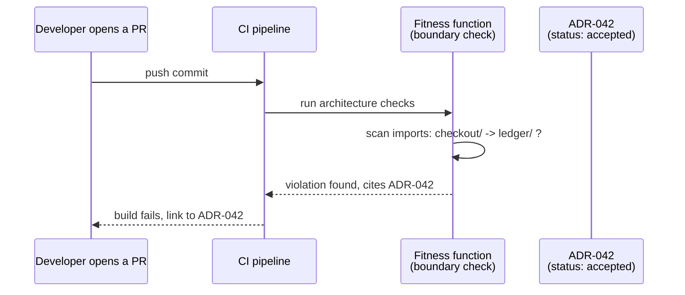

import Scenario from "../../../components/Scenario.astro";
import LevelIntro from "../../../components/LevelIntro.astro";
import Checkpoint from "../../../components/Checkpoint.astro";

**Who is actually allowed to change an ADR's status from `accepted` to `superseded`, and what stops that from happening by drive-by edit in a random PR?** L1 named the three mechanisms — lifecycle status, a review board, fitness functions — this section is about how they connect into one system, instead of three unrelated habits a team half-follows.

<LevelIntro
  items={[
    "The ADR status state machine and who moves it",
    "Review board cadence: lightweight vs. heavyweight",
    "How a fitness function turns a document into an enforced rule",
  ]}
/>

## The status field is a state machine, not free text

If `status: accepted` can be hand-edited to `status: deprecated` in any
PR, by anyone, the field means nothing — it's decoration. Treat it
instead as a small state machine with a fixed set of legal transitions,
each requiring a specific actor:

Two things this diagram makes explicit that a flat "status: string" field
doesn't: **every outgoing edge has an actor attached to it** (the review
board, not whoever's editing the file), and **there is no edge back into
`accepted` from anywhere** — an ADR that's superseded or deprecated
doesn't get quietly restored by editing its status; if the decision is
genuinely being reconsidered, that's a _new_ ADR, which the section below
explains why.

<Checkpoint question="A superseded ADR's status field gets hand-edited back to 'accepted' in a routine PR, with the commit message 'reverting an old decision.' Per the state machine above, what's actually wrong with that, beyond it being poor etiquette?">

There's no legal edge from `superseded` back to `accepted` in the state
machine — reviving an old decision isn't a status flip, it's a new
decision that happens to agree with an old one, and it needs to go
through the same ratification the original did (a new ADR, reviewed and
accepted on its own merits, that references the old one). Allowing a
plain status edit to do this silently defeats the entire reason a status
field exists: anyone reading `accepted` later has no way to know whether
that status was ratified by the review body or slipped in by whoever
happened to be editing the file that day.

</Checkpoint>

## Why "reopen it" is a new ADR, not an edit to the old one

<Scenario label="The re-litigation trap">
  <Fragment slot="facts">
    

      
📄 ADR-042: "no synchronous ledger calls" — accepted, 14 months ago

      
🗣️ New team member re-argues the same trade-off from scratch

      
❓ Nothing records that this exact argument already happened

    

  </Fragment>

A new engineer, unaware ADR-042 exists, opens a design doc arguing for
exactly the synchronous call it rejected. The reviewer who remembers
ADR-042 has two bad options: block the doc citing a document the author
has never seen and can't evaluate the reasoning behind, or let the
argument happen again from zero, wasting a day re-deriving the same
trade-off. **Is there a third option that doesn't require every reviewer
to have perfect memory of a document written over a year ago?**

</Scenario>

Yes — treat "propose reopening ADR-042" as its own lightweight, first-class action, not an ambush that only works if the right person happens to be in the room. A **new ADR that explicitly targets an existing one** ("ADR-089: revisit ADR-042's synchronous-call ban") does two things a re-argued design doc doesn't: it forces the new proposal to state what's changed since the original decision (new information, changed constraints — not just "I disagree"), and it becomes a permanent, searchable record that this exact question was reopened and re-decided, so the _next_ new engineer doesn't repeat the cycle a third time.

| Reopening path                                                         | What it produces                                                            |
| ---------------------------------------------------------------------- | --------------------------------------------------------------------------- |
| Re-argue in a design doc / Slack thread, ADR untouched                 | The same debate, unrecorded, ready to happen again next quarter             |
| New ADR explicitly superseding the old one, with "what changed" stated | A permanent record: decision, its replacement, and why — searchable forever |

<Checkpoint question="A team wants to revisit ADR-042 but nothing about the underlying constraints has actually changed since it was written — someone would just prefer the other approach. Does the 'new ADR that targets the old one' path still apply here?">

Yes, the mechanism is the same, but the new ADR's "what changed" section
would have to honestly say "nothing about the constraints changed; this
is a preference reversal" — which is a much harder case to win in
front of a review board than "the constraint that motivated ADR-042 no
longer holds." The path doesn't gatekeep _whether_ something can be
reopened; it gatekeeps _how honestly the reopening has to justify
itself_, which is exactly what stops the "endlessly re-litigated" failure
mode from L1 without also freezing every decision forever.

</Checkpoint>

## Review board cadence: the lever that trades review quality for speed

An architecture review board doesn't have to mean a monthly meeting with
a slide deck. The real design choice is a dial between two ends:

|                          | Lightweight (async, 1–2 reviewers)         | Heavyweight (scheduled board, quorum)                           |
| ------------------------ | ------------------------------------------ | --------------------------------------------------------------- |
| Turnaround               | Hours to a few days                        | Until the next meeting slot                                     |
| Best for                 | Most day-to-day ADRs, reversible decisions | Decisions expensive to reverse, or cross-team blast radius      |
| Failure mode if overused | Rubber-stamping — depth drops to keep pace | Backlog — decisions pile up faster than the board can hear them |

**Neither end is "correct" — the mistake is applying one cadence to every decision regardless of its actual reversal cost.** A naming convention and a decision to drop a database in favor of an event log don't deserve the same review depth; forcing the first through a heavyweight board wastes everyone's time, and letting the second through async review because "the board is backed up this month" is how organizations end up with foundational decisions nobody outside two people ever actually scrutinized. Most working setups tier by blast radius: async review by default, escalating to a scheduled board only when a decision crosses team boundaries or is expensive to reverse — see L3's interactive demo for what happens to the backlog specifically when _every_ decision routes through the slow path regardless of size.

## Fitness functions: turning "we decided X" into "the code still does X"

A status field and a review board both answer "is this decision still
current." Neither one, by itself, checks whether the _codebase_ still
matches it — that's what let two other services in L1's scenario violate
ADR-042 without anyone noticing until a third violation was already in
review.

A **fitness function** is an automated, repeatable check — usually
running in CI on every PR — that verifies a specific architectural rule
still holds, tied back to the ADR that established it:

The check doesn't need to understand _why_ ADR-042 says what it says —
it only needs to mechanically verify the observable consequence of that
decision (no direct import from `checkout/` into `ledger/`) and point
back to the ADR when it fails, so the developer gets the reasoning
exactly when they need it, not a cryptic lint error. L3 builds one of
these for real, plus a second fitness function that catches the other
half of governance decay: ADRs that are still `accepted` in name but
overdue for the review that would confirm they still make sense.
