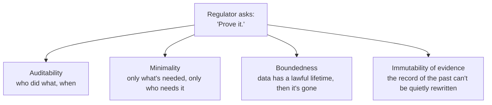
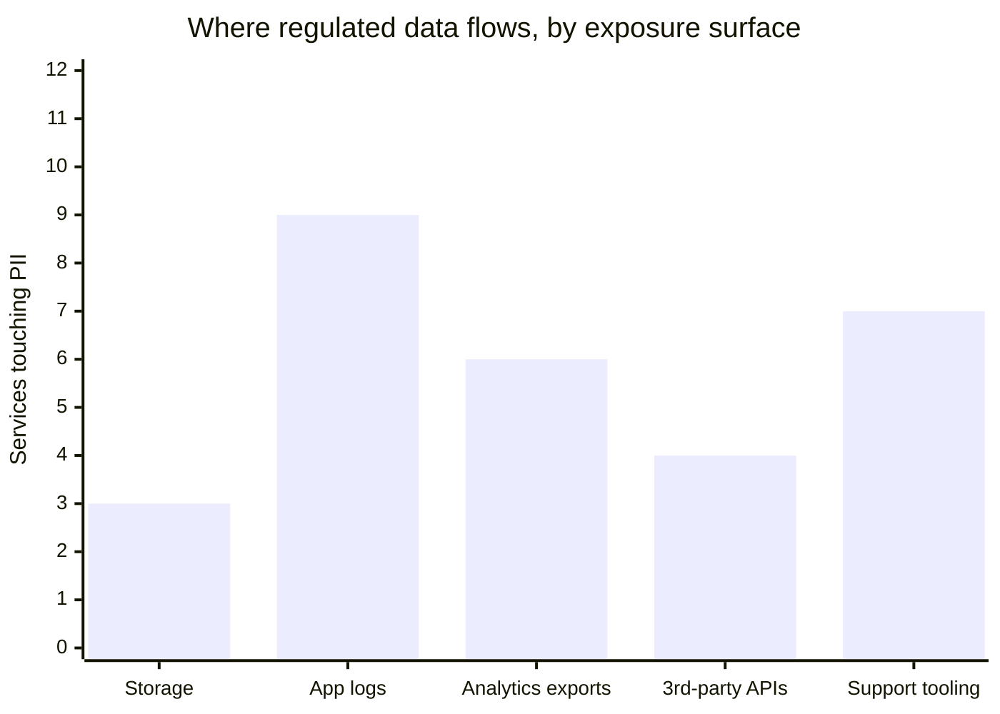

import Scenario from "../../../components/Scenario.astro";
import LevelIntro from "../../../components/LevelIntro.astro";

<Scenario>
  <Fragment slot="facts">
    

      
Auditor's request, day 1

      
📋 "Show every system that touched customer SSNs in the last 12 months"

      
⏱️ Answer due in 5 business days

    

    
What the team actually has

    

      
🗄️ Mutable rows, `UPDATE`d and `DELETE`d freely, no history kept

      
📜 App logs that rotate out and vanish after 30 days

      
🤷 No record of which service or person read which field, ever

    

  </Fragment>

A fast-growing fintech's platform team gets a message from Compliance: an
auditor wants proof of every system that touched customer Social Security
numbers over the past year, and who accessed them. The team is proud of
their architecture — it's fast, it scales, every service owns its data,
deploys ship multiple times a day. And they have almost nothing to show
the auditor. Rows get overwritten in place. Old values are gone the moment
a new value lands. Access logs rotate out after a month. Nobody can prove
what happened six months ago, because nothing was built to remember.

**The system works perfectly for the people who use it. It's the people
who never touch the product at all — the regulator, the auditor — who it
was never built to answer to. What does architecture look like when you
design for that audience from the start, instead of bolting it on after
the first audit fails?**

</Scenario>

It changes what "correct" even means. A user-facing system is judged by
whether it does the right thing right now. A regulator judges a system by
whether it can _prove_, later, on demand, that it did the right thing —
which means the architecture has to carry evidence forward through time,
not just current state.

<LevelIntro
  items={[
    "Who counts as a stakeholder in a regulated system, and what each one actually demands",
    "The four architectural properties regulators consistently ask for",
    "Where this shows up in real systems: audit logs, retention, and access control",
  ]}
/>

## A new kind of stakeholder, with a new kind of demand

Every architecture already balances stakeholders: users want speed, the
business wants low cost, on-call wants low toil. A regulator is a
stakeholder too, but an unusual one — they never call the API, never file
a support ticket, and mostly show up **after the fact**, asking the system
to prove something about its own past behavior.

| Stakeholder | Typical demand                            | When they show up                   |
| ----------- | ----------------------------------------- | ----------------------------------- |
| User        | "Do the thing I asked, fast"              | Every request                       |
| Business    | "Do it cheaply, ship it quickly"          | Every planning cycle                |
| Regulator   | "Prove, later, that it was done lawfully" | Audits, incidents, subject requests |

That last row is the whole unit. Proving something _later_ is a
fundamentally different engineering problem than doing something
_correctly right now_ — a system can be functionally flawless today and
still fail an audit next quarter, if nothing was designed to remember.

## The four properties a regulator actually asks for

Compliance regimes differ (GDPR, HIPAA, PCI-DSS, SOC 2, SOX), but in
practice their architectural asks converge on the same four properties:

- **Auditability** — every access and change to regulated data is
  recorded: who, what, when. Not "we could reconstruct this from logs if
  pressed" — a durable, queryable trail kept for as long as the
  regulation requires.
- **Minimality** — the system exposes the least data, to the fewest
  people and services, needed to do the job (data minimization, least
  privilege). Not "everyone can see everything, we trust the team."
- **Boundedness** — regulated data has a defined lawful lifetime. It
  gets deleted or anonymized on schedule, not kept forever because
  deleting things is scary.
- **Immutability of evidence** — the audit trail itself can't be
  quietly edited after the fact. If the record of what happened can be
  rewritten, it isn't evidence, it's a story.

**The chart above is the uncomfortable finding most teams get on their
first real inventory: the fewest services touch the actual database, and
the most touch logs, exports, and support tools nobody thought to scope**
— which is exactly why minimality has to be designed, not assumed.

## Why "we'll add compliance later" doesn't work

Auditability, minimality, boundedness, and immutability are all
properties of _how data flows and is stored_ — they're structural, not a
feature you toggle on. Retrofitting an audit trail onto a system that
overwrites rows in place means the history is already gone for every day
before the retrofit shipped; retrofitting field-level access control onto
a system where five services already read the raw PII table means
untangling five services' worth of assumptions, not writing one new
check. This is why the rest of this unit treats these four properties as
architecture decisions made early, not compliance paperwork added at the
end — L2 builds the shape these systems take, and L3 builds the actual
code: an audit log that can't be silently rewritten, a job that enforces
a deletion deadline, and a gate that keeps most services from ever
touching raw PII in the first place.
