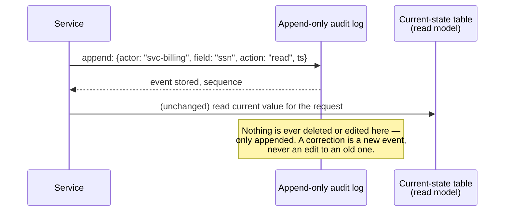
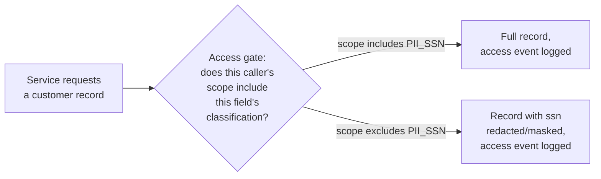
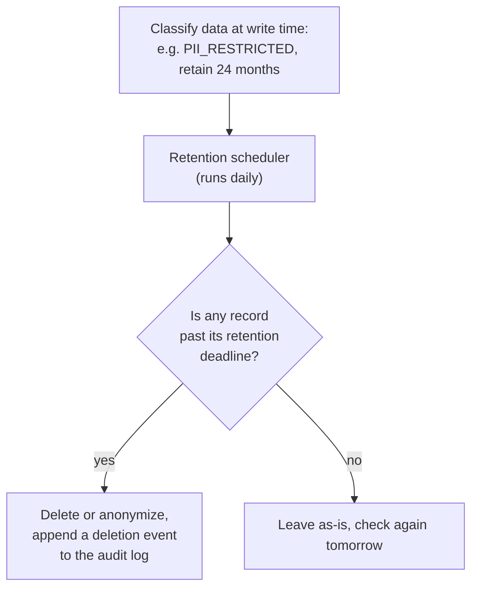

import Scenario from "../../../components/Scenario.astro";
import LevelIntro from "../../../components/LevelIntro.astro";
import Checkpoint from "../../../components/Checkpoint.astro";

**L1 named four properties regulators ask for — auditability, minimality,
boundedness, immutability of evidence. What do those actually look like
wired into a system, instead of listed on a slide?** Each one maps to a
specific architectural pattern, and the four patterns fit together into
one shape, not four unrelated add-ons.

<LevelIntro
  items={[
    "The append-only event log as the backbone of auditability",
    "Data classification and the access-gate pattern for minimality",
    "Retention as a first-class scheduled process, not a manual chore",
  ]}
/>

## Auditability: an append-only log, not an audit column

**If auditability just meant "log everything," wouldn't a `last_modified_by`
column on every table already satisfy it?** No — a single mutable column
only ever holds the _most recent_ change. The auditor's question was
"every system that touched this data over 12 months," and a
`last_modified_by` column has already forgotten everything before the
most recent write. Auditability requires keeping the _whole history_, not
just the latest fact.

The standard shape for this is an **append-only event log**: instead of
overwriting a row, the system appends a new, immutable record of what
happened, and current state is a read model built by folding the log
forward.

This is the same idea event sourcing uses for business state (see
`architecture/event-driven-architecture`), applied specifically to
_access and change events_ rather than domain state — the log doesn't
replace the operational database, it sits alongside it as the system's
memory of its own past.

<Checkpoint question="A team adds a 'reason' text field to their audit log so investigators can see why an access happened, and lets support staff edit that field later if the original reason was unclear. Does this break the append-only property, and does it matter?">

Yes, and yes. The moment any field on an already-written event can be
edited, the log stops being a reliable record of the past — an editable
"reason" field means a support agent (or an attacker with their
credentials) can rewrite the story after the fact, and nothing in the
system can tell a genuine correction from a cover-up. The fix isn't
"don't let anyone edit it, ever, no exceptions" — it's that a correction
must itself be a _new_ appended event ("event #4821's reason was updated
to X, by agent Y, at time Z"), never an in-place edit to #4821 itself.
The original event stays exactly as it was.

</Checkpoint>

## Minimality: classify data, then gate access to it

<Scenario label="The wiki page nobody reads">
  <Fragment slot="facts">
    

      
📄 Data-handling policy: "PII should only be accessed on a need-to-know basis"

      
🗄️ The `users` table: every service's DB credential can `SELECT *` from it

      
🤷 Nothing in code ever checks the policy against an actual query

    

  </Fragment>

A new analytics service is spun up. Nobody grants it special access to
`users.ssn` — it simply inherits the same database credential every
other internal service uses, which already includes every column. The
policy document says access should be need-to-know. **Is the policy
document doing any actual work here, or is it just something the team
can point to after the fact?**

</Scenario>

Just something to point to after the fact — and that's the whole
problem. Minimality can't live in a document that nothing consults at
request time. If every service can already read the `users` table,
"be careful" is not a control, it's a hope. Minimality has to be
enforced structurally: data gets classified, and access to each
classification is gated in code, not asked-for-nicely in a wiki page.

| Classification   | Example fields           | Default access                           |
| ---------------- | ------------------------ | ---------------------------------------- |
| `PUBLIC`         | display name, plan tier  | Any authenticated service                |
| `INTERNAL`       | email, signup date       | Services with a documented business need |
| `PII_RESTRICTED` | SSN, bank account number | Named services only, every access logged |

The gate does two things at once, and both matter: it decides _whether_
a caller sees a restricted field at all, and — regardless of the
answer — it appends an access event to the audit log from L1/above,
because "was this ever read" is itself something a regulator can ask
about a field that was never even returned.

<Checkpoint question="A new internal analytics service asks for read access to the customer table 'to build some dashboards' — no specific field list given. Per the classification table above, what should the access gate default to, and why?">

Default to the lowest classification that satisfies the request —
`PUBLIC` fields only, until the team names the specific `INTERNAL` or
`PII_RESTRICTED` fields they actually need and that need is reviewed.
"To build some dashboards" doesn't name a business need for SSNs or bank
account numbers, and minimality means the default posture is _exclusion_,
not "grant broad access and revoke it later if someone complains" —
revocation-after-the-fact is exactly the pattern that produces the
untracked exposure surface L1's chart showed in logs and exports.

</Checkpoint>

## Boundedness: retention as a scheduled process, not a hope

**If the access gate and the audit log are both working correctly, is the
system done?** Not quite — both of those govern data _while it exists_.
Neither one answers "how long should this data exist at all," which is
its own architectural decision, not a cleanup task someone gets to
eventually.

Boundedness needs a **retention policy attached to the data's
classification**, plus a process that actually enforces the deadline:

The deletion itself still gets logged — deleting regulated data isn't an
exemption from auditability, it's exactly the kind of event a regulator
asks about ("prove you actually deleted what you said you would, and
when"). L3 builds this scheduler for real, alongside the access gate and
the audit-log writer above, and works through what happens when
retention and a _legal hold_ (an order not to delete something you'd
otherwise be required to) collide.
