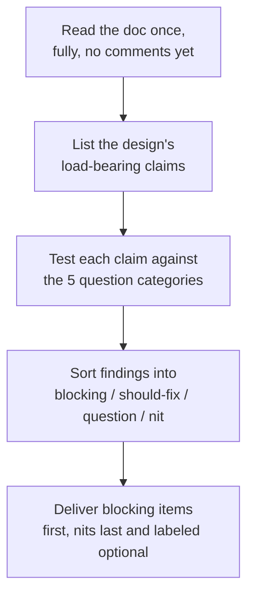
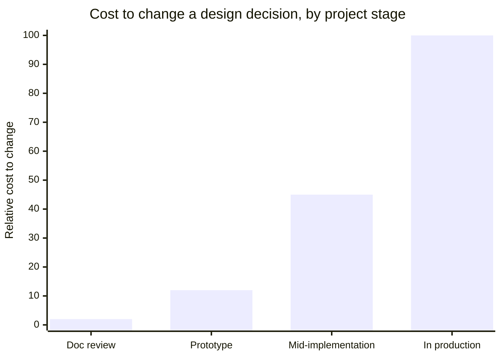

import LevelIntro from "../../../components/LevelIntro.astro";
import Checkpoint from "../../../components/Checkpoint.astro";

L1 named the two failure modes — approving without engaging, and engaging
with only the safe parts — and the five question categories and four
severities that keep a review out of both ditches. L2 works out how those
pieces fit into an actual flow, and why the same review, done a month
later, would already be too late to matter as much.

<LevelIntro
  items={[
    "The review flow, from reading a doc to delivering feedback",
    "Why review is cheapest early and gets more expensive fast",
    "The rigor/tone matrix — why a technically correct review can still fail",
  ]}
/>

## The flow, as a sequence of decisions

**Before writing a single comment — what order should a reviewer actually
work in?** Not "read top to bottom and react," which is how both
rubber-stamping (react too little) and nitpicking (react to the wrong
things) happen by default. A substantive review follows a deliberate
sequence:

The first step matters more than it looks: commenting while still reading
is exactly how nitpicking starts, because the easiest things to react to
mid-read are surface details, not the design's actual claims. Reading the
whole doc once before commenting forces the reviewer to form a real
opinion about the design as a whole before reacting to any one sentence.

<Checkpoint question="A reviewer reads a design doc and immediately leaves a comment on paragraph two questioning a naming choice, before reading the rest of the doc. Per the flow above, what's the specific risk in commenting this early, beyond it being 'premature'?">

The risk isn't just timing for its own sake — it's that commenting mid-read
locks the reviewer into reacting to whatever happens to be in front of
them, which is usually surface-level (naming, phrasing) because that's
what's cheap to notice on a first pass. The doc's actual load-bearing
claims — what happens under load, what the failure modes are — often don't
show up until later sections, or have to be inferred by reading the whole
thing. A reviewer who's already three comments deep into naming by
paragraph two has spent their attention budget before reaching the parts
that were worth spending it on.

</Checkpoint>

## Why review gets more expensive the later it happens

**If the design is wrong, does it matter whether that's caught in the doc
review or three sprints into implementation?** It matters enormously — not
because the flaw is different, but because the cost of fixing it grows
with how much has already been built around the wrong assumption.

At the doc stage, changing "event bus" to "keep it synchronous" is an
edit to a page. Mid-implementation, it's rewriting code that's already
been built against the wrong shape, plus whatever other work now depends
on it. In production, it's a migration with a rollback plan, at a time of
the team's choosing rather than the flaw's choosing. This is the entire
economic case for review existing at all: it is the cheapest point in the
whole lifecycle to be wrong at.

## The rigor/tone matrix

**Can a review ask exactly the right questions and still fail?** Yes — the
five categories from L1 test _what_ gets asked, but not _how_. Delivery
matters just as much, because a design review only works if the author can
actually hear the feedback and act on it.

|                        | Low rigor                                                          | High rigor                                                                                                                      |
| ---------------------- | ------------------------------------------------------------------ | ------------------------------------------------------------------------------------------------------------------------------- |
| **Collaborative tone** | Rubber-stamping — friendly, but nothing gets tested                | The target: real risks surfaced, author engaged and able to act on them                                                         |
| **Adversarial tone**   | Nitpicking dressed as toughness — volume of comments, no substance | Technically correct, practically ignored — author gets defensive, stops engaging, or leaves and never internalizes the feedback |

A reviewer who asks every right question from L1's five categories but
delivers them as "this whole approach is wrong" instead of "what happens
here if X fails?" can still fail the review's purpose — not because the
content was wrong, but because the author stopped being able to hear it.
Rigor gets the reviewer to the right questions; tone determines whether
those questions land.

<Checkpoint question="A reviewer identifies a genuine, blocking issue — the design has no plan for a poison-pill message stuck in the queue — but phrases it as 'I can't believe this wasn't considered, this is a basic requirement.' Using the matrix above, what specifically went wrong, given that the finding itself was correct?">

The rigor was right — this is a real blocking issue in the correct
category (failure modes & blast radius), not a nitpick. What went wrong is
tone: phrasing it as a judgment on the author ("I can't believe this
wasn't considered") rather than a question about the design ("what happens
if a message can't be processed and keeps getting retried?") turns a
fixable design gap into a personal criticism. The matrix's bottom-right
cell is exactly this case — high rigor, adversarial tone — and its outcome
isn't that the finding gets ignored on the merits, it's that the author
gets defensive and the review stops being a collaboration on the design
and starts being something to survive.

</Checkpoint>
