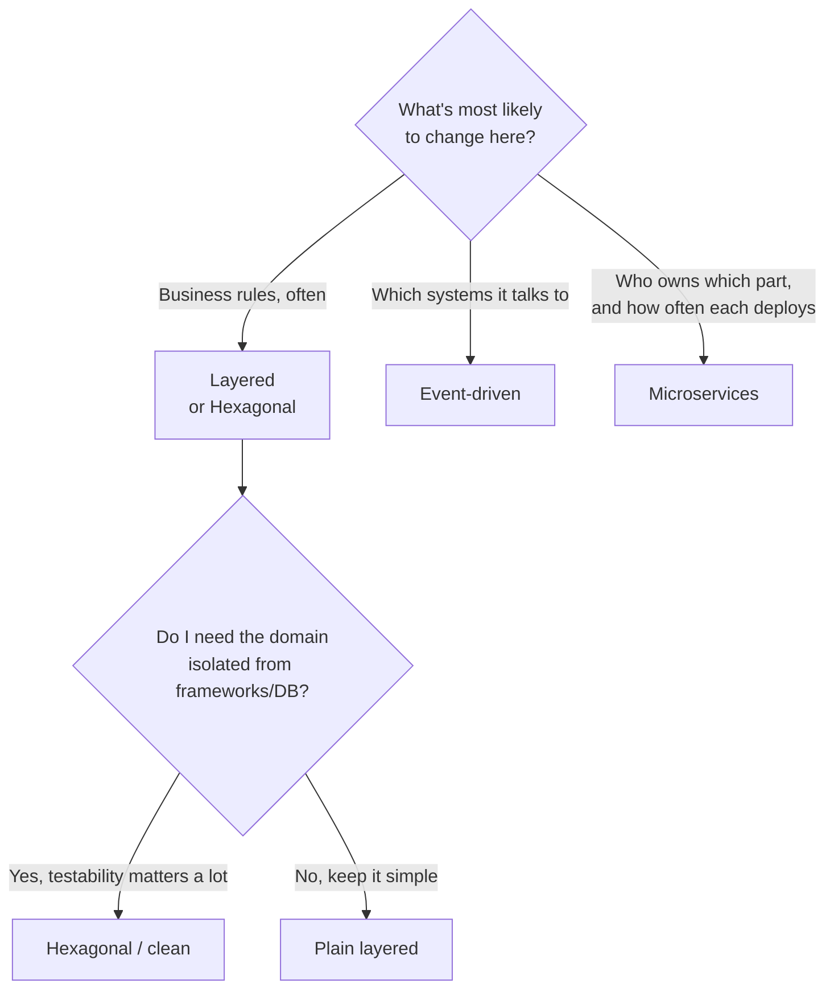

import Scenario from "../../../components/Scenario.astro";

<Scenario>
  <Fragment slot="facts">
    
The team

    

      
🧑‍💻 3 engineers, one codebase

      
📈 Pricing rules change weekly

      
🔌 One new integration: a loyalty-points partner

    

    
Two proposals

    

      
🧱 "Split into microservices now"

      
📦 "Just add another folder"

    

  </Fragment>

Three engineers own a checkout service. Pricing rules change most weeks —
marketing keeps inventing new discount conditions. A partner team wants to
award loyalty points whenever an order is priced, but their system is slow
and occasionally down. One engineer wants to "split this into microservices
now, before it's a mess." Another wants to "just add a new folder for the
loyalty logic and move on."

| Proposal                      | What it optimizes for             | What it risks                                            |
| ------------------------------ | ---------------------------------- | ---------------------------------------------------------- |
| Split into microservices now  | Independent deploys, team autonomy | Network calls, partial failure, three deploy pipelines for three people |
| Add another folder             | Speed today                        | The pricing logic and the loyalty-notification logic get welded together |

**Neither proposal names the actual problem first: what varies here — team size, how often the rules change, and how unreliable the loyalty partner is — and does either proposal actually respond to those, or just to a mood ("microservices are modern" / "we don't have time")?**

</Scenario>

An architectural style is a name for a *recurring shape* that solves a
recurring set of forces — not a badge. Four styles show up constantly in the
wild, and each earns its keep under specific conditions:

- **Layered (n-tier)** — code organized into horizontal layers (presentation
  → business logic → data access), each layer only calling the one below it.
  Cheapest to start, easiest to explain to a newcomer. Weak point: nothing
  stops the top layer from reaching straight into the bottom one if nobody's
  disciplined, and business rules quietly leak into the database layer.
- **Hexagonal / clean architecture** — the business logic sits in the
  center, knowing nothing about the outside world; everything external (a
  database, an HTTP framework, a message queue) plugs in through a "port"
  the domain defines. The dependency arrow always points *inward*, toward
  the domain. Buys testability and swappable infrastructure at the cost of
  more files and more indirection than a plain layered app.
- **Event-driven** — components communicate by publishing and reacting to
  events instead of calling each other directly. Buys loose coupling in time
  (a slow or down consumer doesn't block the producer) at the cost of
  eventual consistency and much harder debugging — a bug's trail is spread
  across a log of events, not a single call stack.
- **Microservices** — the *system* (not just the code) is split into
  independently deployable services, each owned by a team, each with its own
  data store. Buys independent deployment and team autonomy at the cost of
  network calls where function calls used to be, and real operational
  overhead: service discovery, retries, distributed tracing, multiple
  pipelines.

The four aren't ranked best-to-worst — they're different bets about which
axis of change (business rules, integrations, team boundaries, deploy
cadence) is going to hurt the most, made **before** the pain shows up.

A style becomes a buzzword exactly when it's picked for its name instead of
for the forces above — "we should use microservices" said before anyone has
named what's actually straining under the current shape. The tell: can you
finish the sentence *"we're choosing this because our X is going to
change/grow, and this style protects against that"* — if not, it's a
buzzword, not a decision.

Four questions that actually decide it, asked **before** any code:

1. **What changes most often here — the business rules, or the set of
   systems we talk to?** (favors layered/hexagonal vs. event-driven)
2. **How many people, and how many teams, will touch this code?** (a lone
   engineer gains nothing from microservices; three separate teams gain a
   lot from not blocking on each other's deploys)
3. **What does "coupled" cost us if we get it wrong?** A tightly coupled
   layered app is cheap to fix with a refactor; a tightly coupled set of
   *services* means a coordinated multi-team deploy.
4. **Can we afford eventual consistency?** If "the loyalty points must be
   correct the instant the order is placed" is a hard requirement, an
   event-driven design just bought you a bug, not a feature.
