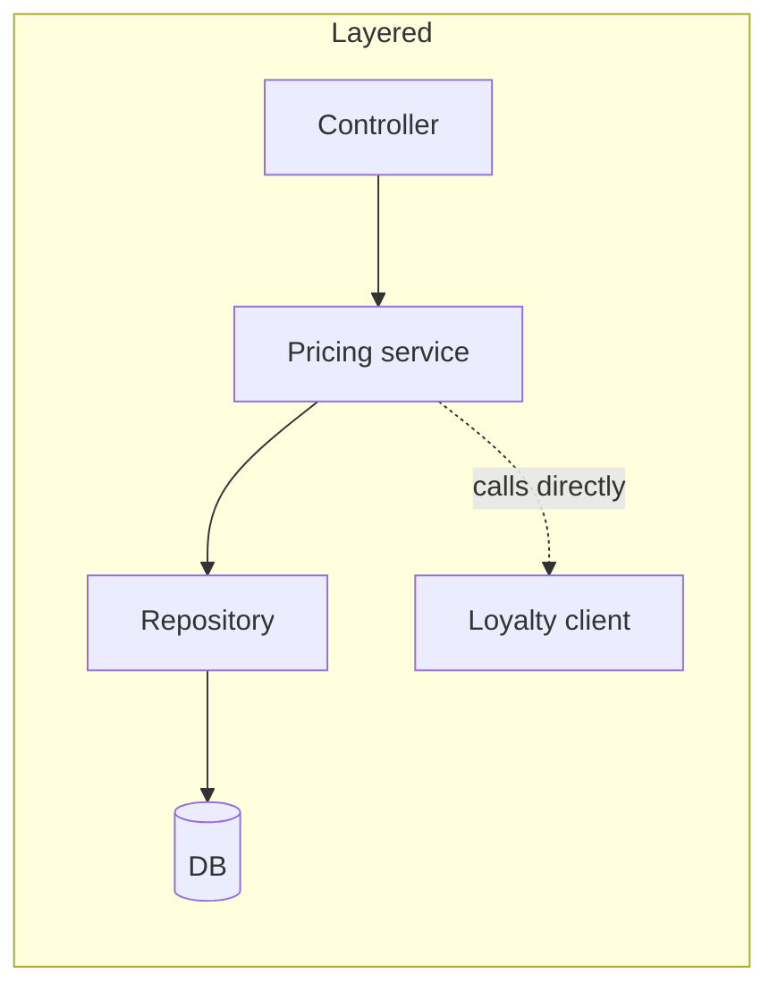
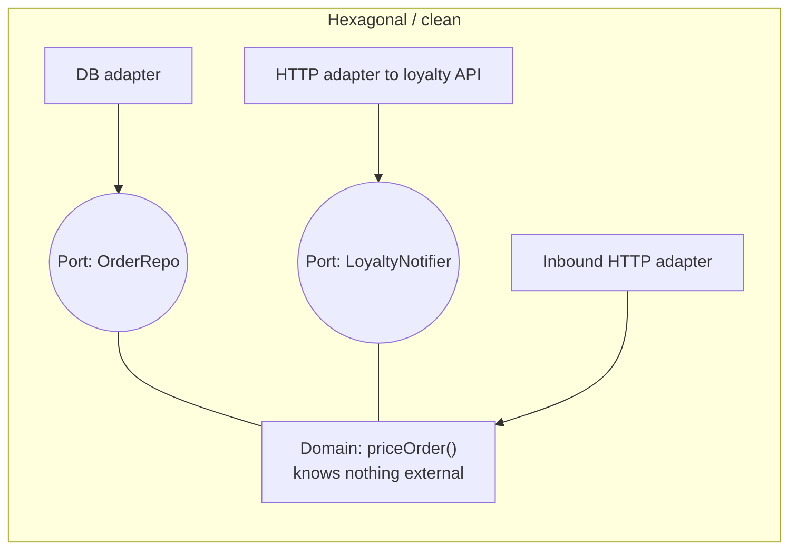
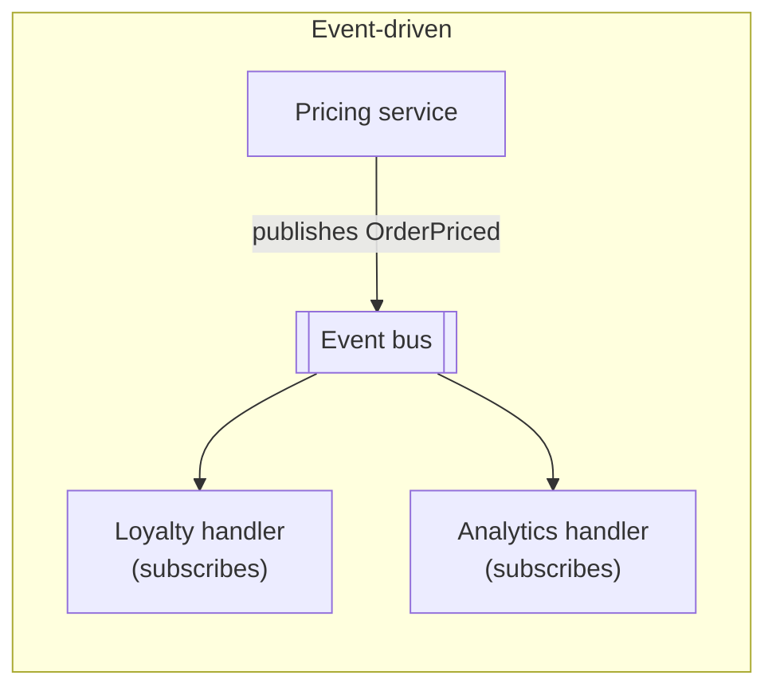
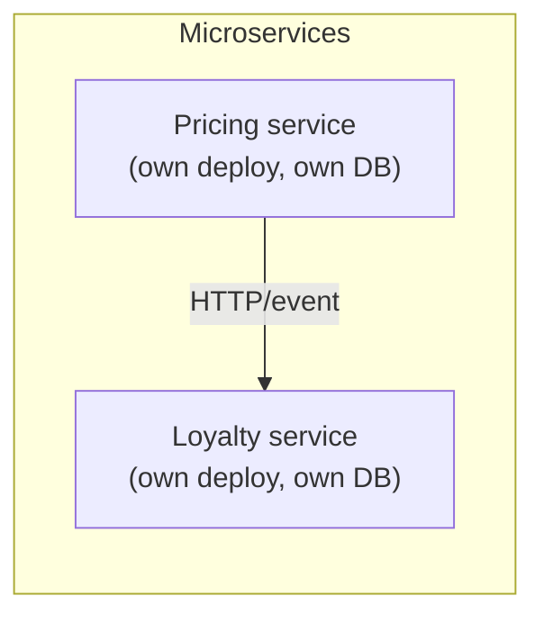
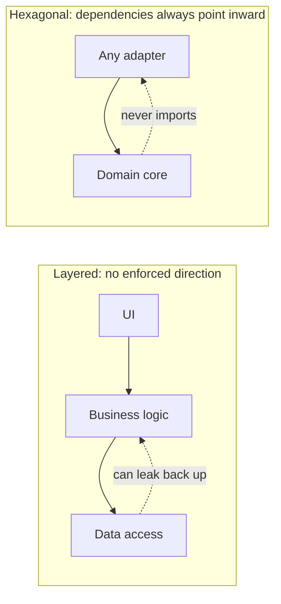
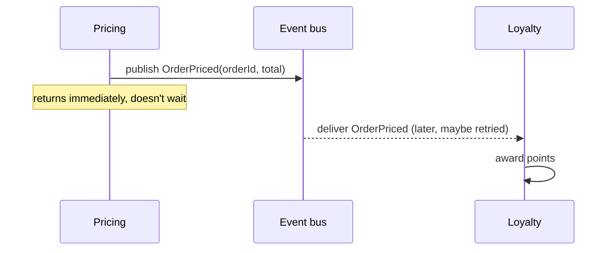
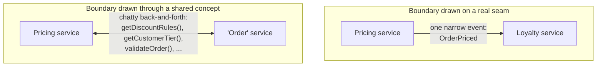
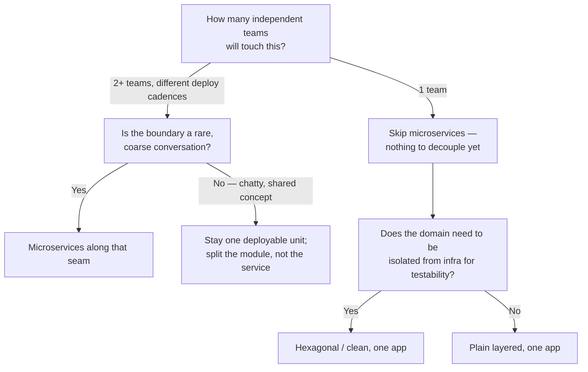

## The same feature, drawn four ways

Take the checkout service from L1: price an order, apply discounts, and
notify a loyalty-points partner. Before looking at the diagrams below — if
the loyalty partner's system goes down for ten minutes, which of the four
shapes below would you guess breaks checkout entirely, and which keeps
pricing orders regardless?









In the layered diagram, the pricing service calls the loyalty client
_directly_ — if that call is synchronous and the loyalty partner is down,
`priceOrder()` doesn't return, and checkout is broken by a dependency that
has nothing to do with pricing. In the event-driven diagram, pricing
publishes `OrderPriced` and returns immediately; the loyalty handler picks
the event up whenever it can. Same feature, opposite failure behavior —
that's not a coincidence, it's what each shape is _for_.

## What actually varies between the four

Before the table: hexagonal and layered both keep the code in one
deployable unit — so what's the actual difference between them, if it's not
"one has more services"?

| Style             | Unit of deployment             | Where the domain rules live                           | Coupling axis it optimizes             | Coupling axis it accepts                             |
| ----------------- | ------------------------------ | ----------------------------------------------------- | -------------------------------------- | ---------------------------------------------------- |
| Layered           | One app                        | Spread across layers, easy to leak into any of them   | Simplicity of the call graph           | Framework/DB details can leak into business logic    |
| Hexagonal / clean | One app                        | Isolated in the center, behind ports                  | Domain independent of infrastructure   | More files, more indirection, a learning curve       |
| Event-driven      | One app or many                | Wherever handlers live; logic is spread across events | Coupling _in time_ (producer/consumer) | Eventual consistency, harder-to-trace bugs           |
| Microservices     | Many, independently deployable | Split per service, each service owns its own rules    | Team/deploy independence               | Network calls, partial failure, operational overhead |

The row that trips people up most is "layered vs. hexagonal" — they look
almost the same on a whiteboard. The difference isn't visible in a folder
listing; it's in which direction an import statement is allowed to point.
Layered code _usually_ lets a lower layer import from a higher one by
accident (nothing stops it); hexagonal code makes that a structural
impossibility, because the domain layer never imports an adapter — adapters
import the domain's port interfaces, never the reverse.



**The dependency rule, restated as pseudocode** — this is the actual test
you can run over a codebase, not just eyeball on a diagram:

```
function isHexagonal(module):
  if module is domain:
    return not module.imports.any(isFrameworkOrAdapter)
  if module is adapter:
    return module.imports.contains(domainPortInterface)
  return true  # anything else is free to import what it needs
```

If a linter rule like this would fail on your "domain" folder today, the
codebase isn't hexagonal no matter what the folder is named — the label
means nothing without the enforced direction.

If "import" is new: importing is one file depending on another file's code.
The direction matters because a dependency is a kind of power line. If the
domain imports the database adapter, the domain now knows database details. If
the adapter imports the domain's port, the outside tool must adapt to the
domain instead.

## Event-driven: what does "loose coupling" actually buy, and cost?

Two services that communicate through events never call each other by
name — so what's the trade a team is actually making when they choose that
over a direct call?



The trade is explicit in the diagram: `Pricing` never learns whether
`Loyalty` succeeded, retried, or is three minutes behind. That's the whole
point — the producer's correctness no longer depends on the consumer's
uptime — but it means "did the customer get their points?" is no longer a
question a single stack trace can answer. Debugging shifts from "read the
call stack" to "read the event log and reconstruct the timeline," which is
a materially different skill and tooling investment.

## Microservices: the boundary is the whole decision

Splitting a monolith into two services is easy to draw and hard to get
right — what's the one property a good service boundary has that a bad one
doesn't?



A good boundary is drawn where the _conversation between two parts is
already naturally rare and coarse_ — pricing tells loyalty "an order was
priced," once, and moves on. A bad boundary is drawn through a concept two
parts both need constantly (like "what tier is this customer" or "is this
order valid") — splitting that apart doesn't remove the coupling, it just
turns free function calls into network calls that carry the exact same
coupling, plus latency and a new failure mode. Conway's Law is the blunt
version of this: your services will tend to mirror your team's
communication structure whether you plan it or not — so if pricing and
loyalty are the same two people, splitting them into two services buys
you two deploy pipelines to babysit and very little independence, because
the person making the change is the same person who'd have to coordinate
across both anyway.

Conway's Law in human terms: if two groups rarely talk clearly, the systems
they build will often communicate awkwardly too. A service boundary works best
when it matches a real ownership boundary and a naturally small conversation,
not just a folder someone wanted to rename into a service.

## The decision procedure

Given the four questions from L1, one of them tends to dominate the other
three in practice — which one, and why might that be the one worth asking
first, before "which style sounds most rigorous"?



Team count dominates because it's the one axis that changes the _cost of
being wrong_ by an order of magnitude: a bad layer boundary is a refactor
inside one repo; a bad service boundary is a multi-team, multi-deploy
migration. That's why "how many teams" is question two in L1's list, not an
afterthought — everything downstream of it (whether event-driven fits,
whether the boundary is coarse enough) only matters once there's a real
reason to consider splitting the deployment unit at all.

This is the same procedure L3 applies to one concrete service, structured
four different ways, with the actual code and config each shape produces —
not a different process per style, the same four questions applied to
different answers.

The "Try it" demo below counts possible coordination pairs with
`n × (n - 1) / 2`. It is not a law of nature or a prediction of exact meeting
time; it is a visualization of why person-to-person coordination gets crowded
fast as a single shared codebase grows.
