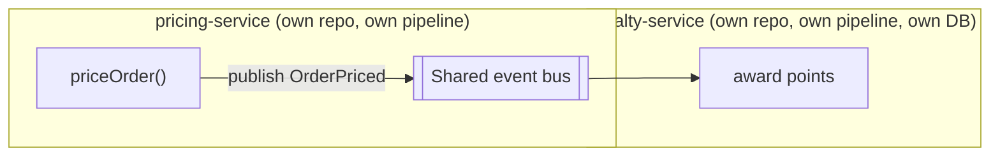

import Scenario from "../../../components/Scenario.astro";

<Scenario label="The scenario">
  <Fragment slot="facts">
    <p class="not-prose mb-1 text-xs font-semibold tracking-wide text-slate-400 uppercase">Requirement</p>
    <div class="not-prose flex flex-col gap-1 text-sm text-slate-700 dark:text-slate-300">
      <div class="flex items-center gap-1.5"><span>💵</span> priceOrder(order) → total after discounts</div>
      <div class="flex items-center gap-1.5"><span>🎯</span> Notify loyalty partner after every priced order</div>
      <div class="flex items-center gap-1.5"><span>🐢</span> Loyalty partner API is slow, occasionally down</div>
    </div>

    <p class="not-prose mt-3 mb-1 text-xs font-semibold tracking-wide text-slate-400 uppercase">Constraint</p>
    <div class="not-prose flex flex-col gap-1 text-sm text-slate-700 dark:text-slate-300">
      <div class="flex items-center gap-1.5"><span>🚫</span> Checkout must never fail because loyalty is down</div>
    </div>

  </Fragment>

You need `priceOrder(order)`: apply the customer's tier discount, apply any
active promotion, return the total, and notify a loyalty-points partner —
whose API is occasionally slow or down — that an order was priced.
Checkout must never fail because the loyalty partner is having a bad day.

</Scenario>

Same requirement, same discount math, built four times below. Watch what
changes in the code itself — not just the diagram — and, more importantly,
watch what happens to each version the moment the loyalty API goes down.

If JavaScript is not familiar yet, read each snippet as pseudocode:

| Syntax      | Meaning while reading this page                      |
| ----------- | ---------------------------------------------------- |
| `function`  | a named action the program can run                   |
| `{ ... }`   | a group of related values, like an order or customer |
| `return`    | the value sent back to whoever called the function   |
| `require()` | this file depends on code from another file          |
| callback    | a function saved to run later when an event arrives  |
| `catch`     | what happens if an attempted network call fails      |

The code is here to make the architecture visible. You do not need to memorize
the syntax to follow the comparison: look for where the loyalty call lives,
whether checkout waits for it, and which file or service owns each decision.

## Version 1: layered

The straightforward version — a controller calls a service, the service
calls a repository and a loyalty client directly.

```js
// pricingService.js — layered: service imports and calls infra directly
const db = require("./db");
const loyaltyClient = require("./loyaltyClient"); // HTTP client, real network call

function priceOrder(order) {
  const customer = db.getCustomer(order.customerId);
  const discountRate = tierDiscount(customer.tier);
  const promo = db.getActivePromotion(order.date);
  const total = applyDiscounts(order.subtotal, discountRate, promo);

  // Bug hiding in plain sight: this call is synchronous and unguarded.
  loyaltyClient.notify(order.customerId, total);

  db.saveOrder(order.id, total);
  return total;
}

function tierDiscount(tier) {
  return { gold: 0.15, silver: 0.08, bronze: 0 }[tier] ?? 0;
}

function applyDiscounts(subtotal, tierRate, promo) {
  const afterTier = subtotal * (1 - tierRate);
  return promo ? afterTier * (1 - promo.rate) : afterTier;
}

module.exports = { priceOrder, tierDiscount, applyDiscounts };
```

**What breaks:** `loyaltyClient.notify()` is a real network call sitting
between two lines that have nothing to do with loyalty. If it throws or
hangs, `priceOrder` never returns — checkout is down because a partner
integration is down, which directly violates the constraint above. Nothing
in the _shape_ of this code stops that; it has to be caught by discipline
(a try/catch, a timeout) added after the fact, not by the structure itself.

## Version 2: hexagonal / clean

The domain rule (`priceOrder`) is pulled out so it knows nothing about a
database, an HTTP client, or a loyalty partner — those become **ports**
(interfaces) that adapters implement.

```js
// domain/pricing.js — pure domain code, zero infrastructure imports
function priceOrder(order, customer, promo) {
  const discountRate = tierDiscount(customer.tier);
  const total = applyDiscounts(order.subtotal, discountRate, promo);
  return { total, priced: true };
}

function tierDiscount(tier) {
  return { gold: 0.15, silver: 0.08, bronze: 0 }[tier] ?? 0;
}

function applyDiscounts(subtotal, tierRate, promo) {
  const afterTier = subtotal * (1 - tierRate);
  return promo ? afterTier * (1 - promo.rate) : afterTier;
}

module.exports = { priceOrder, tierDiscount, applyDiscounts };
```

```js
// ports.js — interfaces the domain depends on, defined BY the domain
// (adapters implement these; the domain never imports an adapter)
class OrderRepoPort {
  saveOrder(_orderId, _total) {
    throw new Error("not implemented");
  }
}
class LoyaltyNotifierPort {
  notify(_customerId, _total) {
    throw new Error("not implemented");
  }
}
module.exports = { OrderRepoPort, LoyaltyNotifierPort };
```

```js
// adapters/loyaltyHttpAdapter.js — implements the port, owns the network call
const { LoyaltyNotifierPort } = require("../ports");

class LoyaltyHttpAdapter extends LoyaltyNotifierPort {
  notify(customerId, total) {
    // A timeout AND a swallow-on-failure live here, in the adapter —
    // not scattered into the domain rule, which never sees this decision.
    return fetch("https://loyalty.example/notify", {
      method: "POST",
      body: JSON.stringify({ customerId, total }),
      signal: AbortSignal.timeout(300),
    }).catch(() => {
      /* logged, never rethrown — the domain doesn't need to know */
    });
  }
}
module.exports = { LoyaltyHttpAdapter };
```

```js
// application/checkoutUseCase.js — wires domain + adapters together
const { priceOrder } = require("../domain/pricing");

function makeCheckoutUseCase(orderRepo, loyaltyNotifier) {
  return function checkout(order, customer, promo) {
    const { total } = priceOrder(order, customer, promo);
    orderRepo.saveOrder(order.id, total); // port, not a concrete DB
    loyaltyNotifier.notify(order.customerId, total); // port, not a concrete HTTP call
    return total;
  };
}
module.exports = { makeCheckoutUseCase };
```

**What this buys:** `priceOrder` can be unit-tested with plain objects,
no database, no network, no mocking framework — it's a pure function.
**What it costs:** four files instead of one for the same feature, and a
new engineer has to learn "ports point in, adapters point out" before the
structure makes sense. Note this version _still_ has the same synchronous
loyalty call the layered version did — hexagonal fixes _where_ the decision
about failure handling lives (the adapter, in one place), not _whether_ a
slow partner can still add latency to checkout. That's a separate problem,
solved by the next version.

In plain language: hexagonal architecture makes the core rule easier to test
and protect, but it does not automatically make slow work asynchronous. The
shape isolates the loyalty decision; it does not remove the waiting unless
the use case chooses not to wait.

## Version 3: event-driven

Instead of calling the loyalty partner from inside checkout, `priceOrder`
publishes an event and returns immediately. A separate handler — which can
retry, queue, or fail independently — reacts later.

```js
// pricingService.js — publishes an event, never calls loyalty directly
const bus = require("./eventBus");
const { priceOrder: computeTotal } = require("./domain/pricing");

function priceOrder(order, customer, promo) {
  const { total } = computeTotal(order, customer, promo);
  bus.publish("OrderPriced", {
    orderId: order.id,
    customerId: order.customerId,
    total,
  });
  return total; // returns without waiting on anything downstream
}
module.exports = { priceOrder };
```

```js
// handlers/loyaltyHandler.js — subscribes, runs independently of checkout
const bus = require("../eventBus");

bus.subscribe("OrderPriced", async (event) => {
  try {
    await notifyLoyaltyPartner(event.customerId, event.total);
  } catch (err) {
    bus.publish("OrderPriced.retry", event); // requeue, not checkout's problem
  }
});
```

**What breaks now:** nothing in checkout, by construction — the loyalty
call physically cannot block `priceOrder` because it isn't in that call
stack anymore. **What you traded for that:** if `loyaltyHandler` crashes
before its retry logic runs, there's no stack trace connecting "order
priced" to "points never awarded" — you have to reconstruct that from two
separate logs (the publish, and the handler's own log) instead of one.
That's the cost of coupling-in-time instead of coupling-in-code: it moves,
it doesn't disappear.

Event-driven also means the customer-visible truth may arrive in two steps:
checkout can complete now, while points appear later. That is eventual
consistency. It is acceptable only when the product can tolerate "correct
soon" instead of "correct immediately."

## Version 4: microservices — the same split, at the deployment level

Pulling `loyaltyHandler` out of the same process and into its own
service is a _further_ step past event-driven, not a different mechanism —
the event contract barely changes, but the deploy unit, data ownership, and
failure blast radius all do.

```yaml
# docker-compose.yml (excerpt) — two independently deployable services
services:
  pricing-service:
    build: ./pricing
    environment:
      EVENT_BUS_URL: amqp://bus:5672
    # owns its own order/pricing data — no other service reads it directly

  loyalty-service:
    build: ./loyalty
    environment:
      EVENT_BUS_URL: amqp://bus:5672
    # owns its own points ledger — pricing-service never queries it directly
```



The code inside each service looks almost identical to Version 3's handler
and publisher — the _shape_ of the message-passing didn't change. What
changed is that `pricing-service` and `loyalty-service` can now be deployed
by different people, on different schedules, without either one blocking
the other's release — at the cost of two CI pipelines, two on-call
rotations, and a network hop (the event bus itself) that is now a piece of
production infrastructure someone has to run and monitor.

`docker-compose`, `AMQP`, CI pipelines, and on-call rotations are operational
costs, not style decorations. They mean someone must build, deploy, monitor,
debug, and wake up for each running service and for the message system between
them.

## Comparing all four against the actual requirement

| Version       | Blocks checkout if loyalty is down?  | Files/services to maintain | New failure mode introduced                           |
| ------------- | ------------------------------------ | -------------------------- | ----------------------------------------------------- |
| Layered       | **Yes** — violates the constraint    | 1 file                     | Synchronous coupling to a partner's uptime            |
| Hexagonal     | **Yes** — same call, better isolated | 4 files                    | Same as layered, just easier to test in isolation     |
| Event-driven  | No                                   | 1 process, 2 modules       | Debugging spans an event log, not one call stack      |
| Microservices | No                                   | 2 services, 2 pipelines    | Event-driven's failure mode, plus deploy/ops overhead |

The requirement ("checkout must never fail because loyalty is down") is
what actually rules two of the four out — not a general preference for one
style. Layered and hexagonal both fail it as written above; the fix for
either one is the same fix (make the loyalty call async, or route it
through the same event-bus idea Version 3 uses) — which is really Version
3's change grafted onto either shape, a reminder that these styles combine
rather than being mutually exclusive.

## Edge cases and failure modes worth naming directly

- **Hexagonal without discipline degrades into layered.** Nothing stops an
  adapter from being imported directly into a domain file except code
  review and (ideally) a lint rule enforcing import direction — the
  pseudocode check from L2 is the kind of rule to actually add, not just
  describe.
- **Event-driven without idempotency duplicates work.** If the event bus
  delivers `OrderPriced` twice (most at-least-once buses will, eventually),
  `loyaltyHandler` needs to recognize "I've already awarded points for this
  orderId" — the event contract has to include enough information for the
  consumer to dedupe, or points get double-awarded.
- **At-least-once delivery** means the bus prefers "better deliver a duplicate
  than lose the event." **Idempotency** means a consumer can safely receive the
  same event twice and still perform the side effect once, usually by checking
  an identifier like `orderId`.
- **Microservices without a real seam creates a distributed monolith** —
  two services that must be deployed together to avoid breaking each
  other have all of microservices' operational cost and none of its
  independence benefit.

## Beyond this example

The pricing/loyalty split is one seam, in one direction — a few questions
to test whether the reasoning actually transfers, not just this specific
pair of services:

- What changes if the requirement flips — if loyalty points **must** be
  correct the instant checkout completes (say, a "redeem points during this
  same checkout" feature)? Which version from above stops being viable, and
  does the layered version suddenly look better instead of worse?
- If a fifth engineer joins and starts working exclusively on loyalty
  logic, at what point (if any) does splitting `loyaltyHandler` into its
  own microservice start paying for itself — and what would you want to
  measure to know, rather than guess?
- The event-driven version still shares one thing across pricing and
  loyalty: the event's shape (`{ orderId, customerId, total }`). If loyalty
  needs a field pricing doesn't have yet, who owns changing that contract,
  and what does "who owns it" tell you about whether this seam was drawn in
  the right place to begin with?
