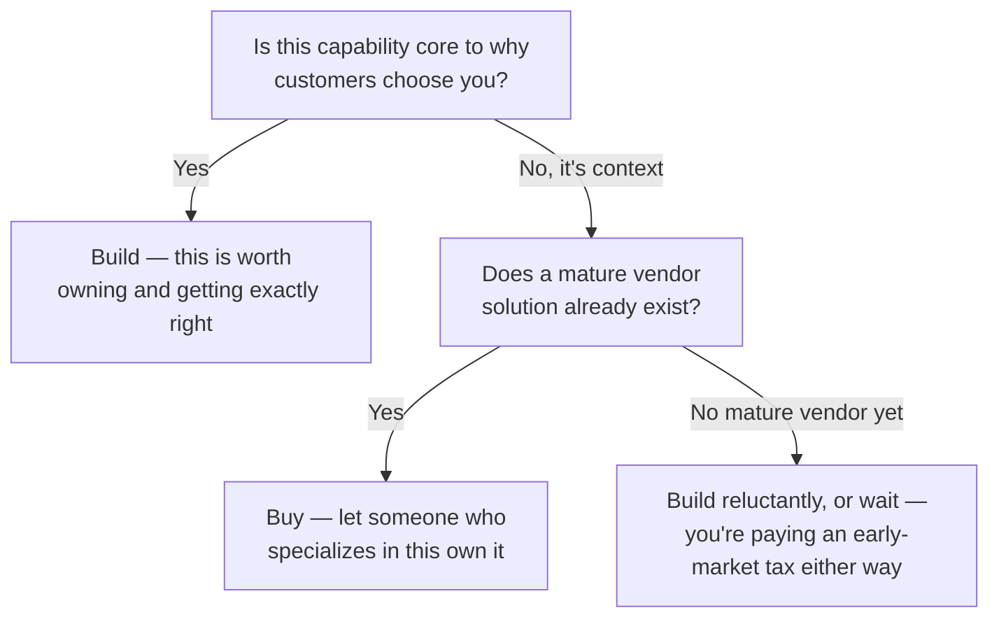
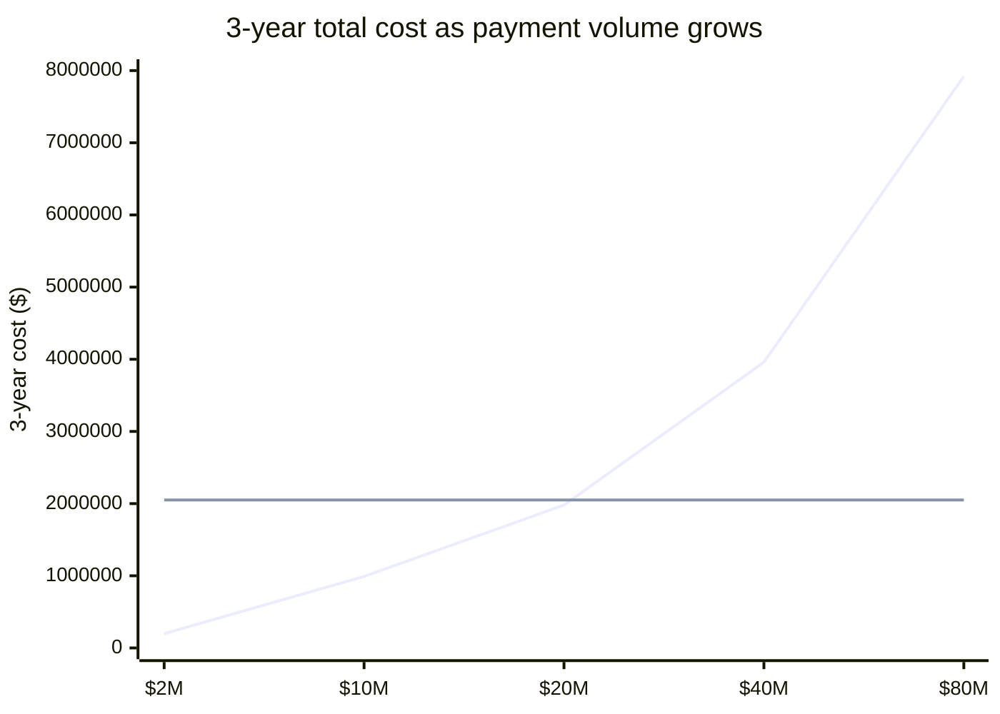

import LevelIntro from "../../../components/LevelIntro.astro";
import Checkpoint from "../../../components/Checkpoint.astro";

L1 named the two costs — build's mostly-fixed cost, buy's usually-growing
fee — without yet showing how to actually decide between them for a real
capability. L2 works out the two-question test that decides it, and why
"which one is cheaper" is a question with a different answer at different
points in a company's growth.

<LevelIntro
  items={[
    "The two-question decision test",
    "Why a vendor's cost curve and a build's cost curve cross",
    "What 'core' actually means, precisely",
  ]}
/>

## The decision, as two questions in order

**Before touching any numbers — what two things do you actually need to
know to make this call at all?** Not the price of either option yet: you
need to know (1) whether this capability is core to why customers choose
you, and (2) whether a mature vendor already exists that does it well.
Everything else is detail underneath those two answers.

Payment processing is **context** for almost every company except a payment
company itself — nobody chooses a checkout page because of what happens
after they click "pay." A mature vendor (Stripe, Adyen, Braintree) already
exists and specializes in exactly this. That routes straight to "buy,"
independent of what the fee costs — the fee is a separate question about
_how much_ to buy, not _whether_ to.

<Checkpoint question="A company is building a tool that automatically detects plagiarism in submitted essays — that's the entire product. Does the 'core vs. context' test say build or buy the detection engine, and why does that answer differ from the payments case above?">

Build. For this company, the detection engine isn't plumbing behind the
product — it _is_ the product; it's the reason a customer picks this tool
over a competitor. That's the opposite of the payments case, where
processing is necessary but invisible to why anyone chose the company. The
same test, "is this why customers choose you," gives opposite answers
because the two capabilities sit in opposite roles for their companies —
the test depends on what the company actually sells, not on how technically
hard the capability is to build.

</Checkpoint>

## Why the two cost curves cross

**If build is a wall of the same six-month rewrite question, why doesn't a
single "we'd save $X/year" number settle it?** Because build's cost is
close to fixed (mostly salaries and audits, which grow slowly) while a
usage-based vendor fee scales with the thing that's growing fastest at a
healthy company: volume. A number that looks like a clear "buy is cheaper"
verdict at today's volume can flip at tomorrow's.

The buy line (Stripe's ~3.3% blended cost, compounded over 3 years) starts
far below build's line and crosses it somewhere around $20M in annual
volume — below that line, buy is cheaper; above it, build's fixed cost
starts winning. L3 works out exactly where that crossover sits and what
it would take to actually reach it.

## What "core" precisely means, so this test doesn't get gamed

**Every engineer can argue their favorite system is "core" — so what stops
this test from just becoming a way to justify building everything?** "Core"
isn't "important" or "hard" — plenty of context capabilities are both
(payment processing is genuinely hard, and a checkout outage is genuinely
important). Core specifically means: **if you built this better than
everyone else, would customers switch to you because of it?** Almost
nobody switches payment processors because a company's checkout is
technically excellent underneath; they switch because of price, support,
or a feature they actually see. That's the tell that it's context, no
matter how technically interesting it is to build.

<Checkpoint question="A logistics startup's core pitch is 'we route delivery trucks 20% more efficiently than anyone else, using our own routing algorithm.' Using the precise definition of 'core' above, is their user-authentication system also core, just because the whole company depends on it?">

No. Depending on something and it being core are different claims — nearly
every system in the company "depends on" authentication working, but no
customer chooses this logistics company because its login page is
excellent. The routing algorithm passes the test (customers switch to them
specifically because of the routing quality); authentication doesn't
(customers would never notice or care if it were swapped for a
well-regarded off-the-shelf identity provider, as long as it worked).
Critical and core are not the same axis — something can be mission-critical
infrastructure and still be firmly context.

</Checkpoint>
