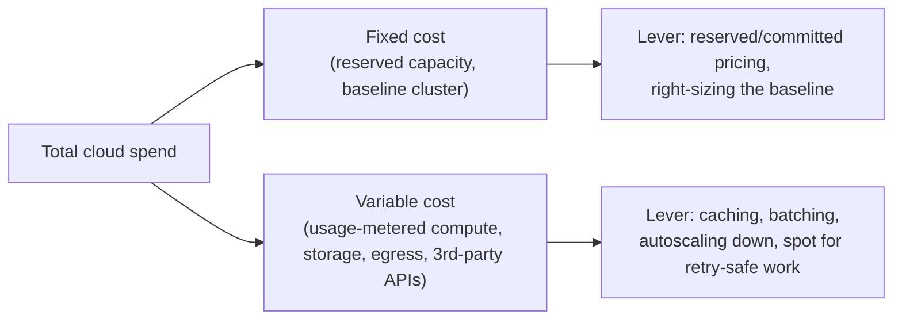

import Scenario from "../../../components/Scenario.astro";
import LevelIntro from "../../../components/LevelIntro.astro";

<Scenario>
  <Fragment slot="facts">
    

      

        $0.11
        cost per order, after (was $0.04)
      

      

        

      

    

    

      
📈 Traffic: <strong>10x</strong> during the sale

      
💵 Revenue: <strong>6x</strong>

      
💸 Cloud bill: <strong>12x</strong>

    

    
Why

    

      
🗄️ A DB write on every request, no caching

      
⚡ On-demand instances only, scaled up and never back down

    

  </Fragment>

GreenCart's checkout service handled a flash sale cleanly — no errors, no timeouts, every order processed correctly. Traffic went up 10x, revenue went up 6x, and everyone was relieved... until the cloud invoice arrived at 12x last month's.

| Metric         | Before | During sale | Multiplier |
| -------------- | ------ | ----------- | ---------- |
| Requests/month | 2M     | 20M         | 10x        |
| Revenue        | $80K   | $480K       | 6x         |
| Cloud bill     | $800   | $9,600      | 12x        |
| Cost per order | $0.04  | $0.11       | 2.75x      |

**The system was correct the entire time — every order was handled properly. So why did finance treat this as an incident?**

</Scenario>

Because correctness was never the only requirement. A system that answers every request right, but costs more per unit of value as it grows, doesn't scale — it just fails later, on a different dashboard.

<LevelIntro
  items={[
    "Cost as a first-class requirement, not an afterthought",
    "The real metric: cost per unit of value, not total spend",
    "Pricing models and the levers that bend the cost curve",
  ]}
/>

- **Cost is a non-functional requirement**, exactly like latency or availability — a design that's correct and fast but economically unsustainable is still a design that failed. It just fails on a slower clock, discovered in a monthly invoice instead of a monitoring alert.
- The metric that matters is **not total spend** — it's **cost per unit of value**: cost per request, per active user, per order, per GB processed. Total spend going up is expected and fine if the business is growing faster. Cost _per unit_ going up while volume grows is the actual warning sign — it means the architecture doesn't scale economically, even if it scales technically.
- Cloud spend breaks down into a **fixed** part (reserved capacity, licenses, a baseline cluster that runs even at 3am with no traffic) and a **variable** part (usage-metered compute, storage, egress, third-party API calls). Which lever helps depends on which part is out of control.
- **Pricing models** are a real architectural choice, not just a procurement checkbox:

| Model                       | You commit to                  | Discount vs. on-demand                                           | Best for                             |
| --------------------------- | ------------------------------ | ---------------------------------------------------------------- | ------------------------------------ |
| On-demand                   | Nothing                        | 0% (baseline)                                                    | Unpredictable or early-stage load    |
| Reserved / committed-use    | 1–3 years of baseline capacity | 30–70%                                                           | Steady, predictable load             |
| Spot / preemptible          | Nothing, but can be reclaimed  | 60–90%                                                           | Interruptible, retry-safe batch work |
| Serverless (pay-per-invoke) | Nothing                        | Varies — cheap at low volume, expensive at sustained high volume | Spiky or low-baseline traffic        |

- Some of the largest costs in a real bill are **easy to miss on a design diagram**: cross-region or egress data transfer, idle capacity kept "just in case," logging/observability ingestion, and metered third-party APIs charged per call. None of these show up as a box in an architecture diagram, but all of them show up on the invoice.
- The two highest-leverage architectural levers for cost, in most systems, are **caching** (turn a paid compute/DB call into a free cache hit) and **right-sizing** (stop paying for capacity nothing is using).
- None of this is optimizable without **visibility** first — cost tagging and allocation by service/team/feature. You cannot fix what you cannot attribute; "the bill went up" is not actionable, "checkout's DB write cost tripled" is.

