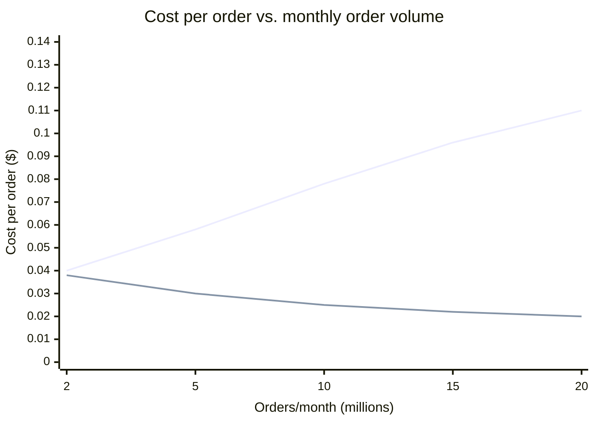
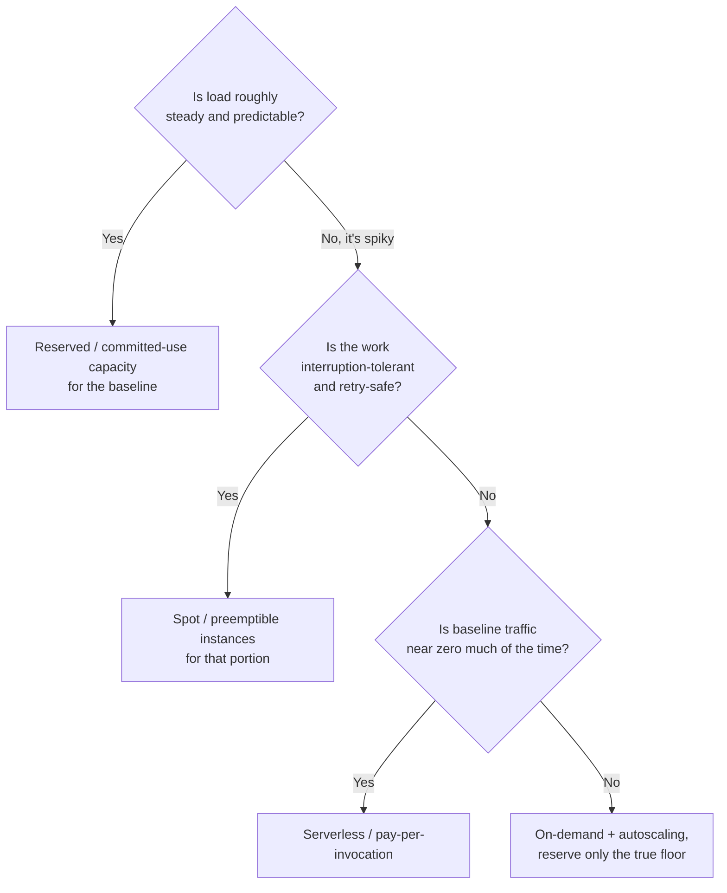

import Scenario from "../../../components/Scenario.astro";
import LevelIntro from "../../../components/LevelIntro.astro";
import Checkpoint from "../../../components/Checkpoint.astro";

<Scenario label="Two checkout services">
  <Fragment slot="facts">
    <div class="not-prose flex flex-col gap-1.5 text-sm text-slate-700 dark:text-slate-300">
      <div class="flex items-center gap-1.5"><span>🅰️</span> Service A: DB write + on-demand only</div>
      <div class="flex items-center gap-1.5"><span>🅱️</span> Service B: cache + batched writes + reserved baseline</div>
      <div class="flex items-center gap-1.5"><span>📉</span> A's cost/order rises with volume</div>
      <div class="flex items-center gap-1.5"><span>📈</span> B's cost/order falls with volume</div>
    </div>
  </Fragment>

Service A and Service B both handle checkout correctly, both pass every load test, and at 2M orders/month they cost almost the same. Roll volume forward to 20M orders/month and they diverge hard — one gets cheaper per order, the other gets more expensive. **Same job, same correctness, same traffic curve — what's different about the two designs that makes their cost curves point in opposite directions?**

</Scenario>

Nothing about correctness. Everything about which costs are fixed, which are variable, and what happens to each as volume grows.

<LevelIntro
  items={[
    "The cost-per-request formula and why its shape matters",
    "Why A's curve rises and B's falls, mechanically",
    "A decision framework for picking a pricing model",
  ]}
/>

## The formula behind both curves

Every request-driven system's cost can be modeled the same way:

```
totalCost(requests) = fixedCost + variableCostPerRequest * requests
costPerRequest(requests) = totalCost(requests) / requests
                          = (fixedCost / requests) + variableCostPerRequest
```

**If `variableCostPerRequest` is a true constant, what happens to `costPerRequest` as `requests` grows toward infinity?** It approaches `variableCostPerRequest` from above — the fixed-cost term (`fixedCost / requests`) shrinks toward zero, so cost per request keeps falling as volume grows. This is economies of scale, and it's the _default_ shape a healthy system should have: growth makes each unit cheaper, because the fixed cost is being spread across more of them.

<Checkpoint question="If costPerRequest keeps falling as requests grows, why did GreenCart's cost per order go UP (from $0.04 to $0.11) when its traffic went up 10x in L1's scenario?">

Because `variableCostPerRequest` wasn't actually constant — it was itself growing with volume. A DB write on every single request, with no caching, means each additional order adds real, un-amortized load to the database: more connections, more contention, more read replicas needed, more write throughput purchased at on-demand rates. The formula's "variable cost" term is only a flat constant when the underlying resource scales linearly and cheaply with usage. GreenCart's database didn't — it got proportionally more expensive per unit as concurrent load rose, which is what turned an economies-of-scale system into a diseconomies-of-scale one.

</Checkpoint>

## Why the two curves point opposite ways

Service A pays for a database write on every request, and only ever adds on-demand capacity — never removes it, never reserves it, never caches around it. Its `variableCostPerRequest` rises with volume because contention rises with volume, and its `fixedCost` isn't buying a discount because none of that capacity is committed. Service B caches the read-heavy majority of checkout traffic (inventory checks, price lookups), batches writes instead of one-per-request, and covers its predictable baseline load with reserved capacity instead of on-demand. Its `variableCostPerRequest` stays close to flat, and its `fixedCost` term keeps shrinking as it's spread over more orders — the textbook curve, restored.



The chart isn't two teams' opinions — it's the same formula, with different values plugged in for `fixedCost`, `variableCostPerRequest`, and whether `variableCostPerRequest` is actually constant. Architecture decided which curve a system landed on before a single order shipped.

## A decision framework for pricing model

The formula tells you _whether_ a curve should bend down. Picking a pricing model is about _which lever_ to pull to make `fixedCost` or `variableCostPerRequest` smaller, and that depends on how predictable and how interruptible the workload is:



Most real systems aren't one box on this chart — they're a **blend**: a reserved baseline sized to the traffic floor (never zero, never idle), autoscaled on-demand capacity for the middle, and serverless or spot for the truly bursty or retry-safe edges. Picking a single model for the whole system is usually the mistake, not picking the "wrong" one — GreenCart's failure wasn't choosing on-demand, it was choosing _only_ on-demand for a workload that had a very predictable daily floor underneath its spikes.

<Checkpoint question="GreenCart's checkout traffic has a predictable daily floor (nights are always quiet, business hours are always busier) plus occasional unpredictable sales-driven spikes on top. Following the framework above, should the whole service run on one pricing model, or split across models — and if split, which part gets which model?">

Split. The predictable daily floor is exactly the case reserved/committed-use capacity is for — it's there every day, so committing to it earns a real discount with no risk of paying for capacity that goes unused. The unpredictable spikes on top are the opposite case: committing capacity in advance for a spike that might not happen (or might be 3x bigger than expected) either wastes money or fails to scale. That part should stay on-demand with autoscaling (or serverless, if the spike traffic is bursty enough that even on-demand instances sit idle between requests) so it scales exactly with what shows up, and scales back down after.

</Checkpoint>
