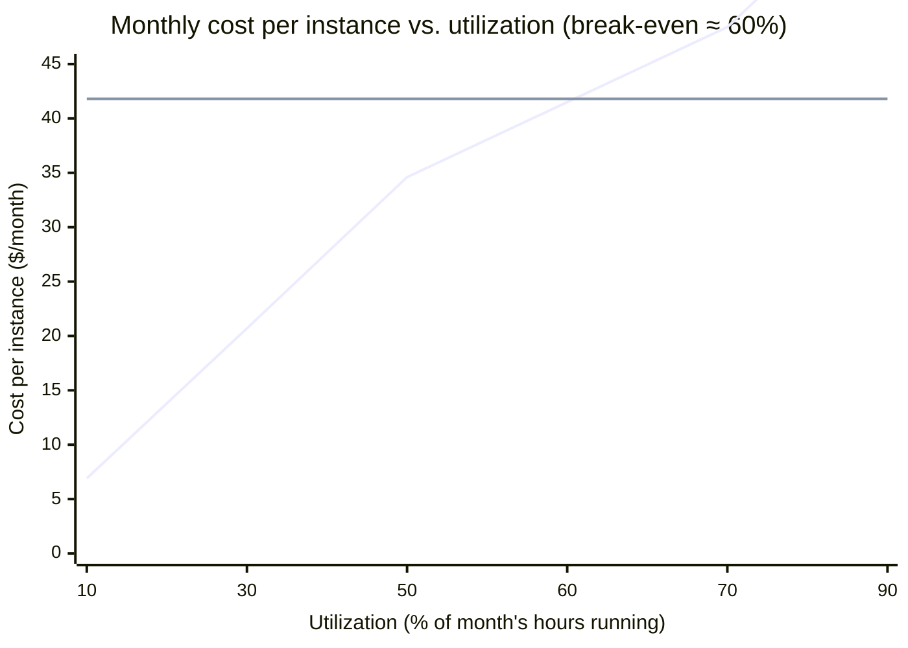

import Scenario from "../../../components/Scenario.astro";
import LevelIntro from "../../../components/LevelIntro.astro";
import Checkpoint from "../../../components/Checkpoint.astro";

This deep dive uses **TypeScript** — cost modeling is arithmetic over well-typed inputs (rates, hours, ratios), and TypeScript's structural types make the units of each number (dollars, requests, hours) visible in the signatures instead of buried in variable names. The formulas transfer to any language; only the syntax changes.

## GreenCart, six weeks after the flash sale

<Scenario label="The fix, in numbers">
  <Fragment slot="facts">
    <div class="not-prose flex flex-col gap-1.5 text-sm text-slate-700 dark:text-slate-300">
      <div class="flex items-center gap-1.5"><span>🖥️</span> On-demand: $0.096/hour per instance</div>
      <div class="flex items-center gap-1.5"><span>📦</span> 1-year reserved: $0.058/hour, same instance</div>
      <div class="flex items-center gap-1.5"><span>❓</span> Question: at what utilization does reserved win?</div>
      <div class="flex items-center gap-1.5"><span>🗄️</span> Cache hit ratio target: 80% of DB reads avoided</div>
    </div>
  </Fragment>

GreenCart's team has the L2 diagnosis — no caching, on-demand only, everything variable that should have been partly fixed — and now has to turn it into a decision: how many instances to reserve, and whether reserving is even worth it given how much their traffic actually varies hour to hour. **Committing to a 1-year reserved instance is cheaper per hour than on-demand — so is reserving always the right call, or does it depend on something else?**

</Scenario>

It depends on whether the instance would have been running anyway. A discounted rate on capacity that sits idle can still lose to full price on capacity that's always in use.

<LevelIntro
  items={[
    "A cost-per-request calculator across pricing tiers",
    "A break-even calculator: reserved vs. on-demand",
    "Right-sizing: turning utilization data into a real recommendation",
  ]}
/>

## The cost-per-request calculator

The first tool the team needs is the one from L2's formula, made concrete enough to run against real numbers instead of a chart:

```typescript
// cost-model/cost-per-request.ts

export interface TrafficProfile {
  requestsPerMonth: number;
  cacheHitRatio: number; // 0..1 — fraction of requests served from cache, never reaching the DB
}

export interface PricingInputs {
  reservedMonthlyCost: number; // baseline capacity, committed in advance
  onDemandCostPerRequest: number; // marginal compute cost for a request NOT covered by baseline
  dbCostPerUncachedRequest: number; // paid only for requests that miss the cache
  reservedCapacityRequestsPerMonth: number; // how many requests the reserved baseline can absorb
}

export interface CostBreakdown {
  totalCost: number;
  costPerRequest: number;
  uncachedRequests: number;
  requestsBeyondReservedCapacity: number;
}

export function computeMonthlyCost(
  traffic: TrafficProfile,
  pricing: PricingInputs,
): CostBreakdown {
  const uncachedRequests = Math.round(
    traffic.requestsPerMonth * (1 - traffic.cacheHitRatio),
  );

  const requestsBeyondReservedCapacity = Math.max(
    0,
    traffic.requestsPerMonth - pricing.reservedCapacityRequestsPerMonth,
  );

  const onDemandOverflowCost =
    requestsBeyondReservedCapacity * pricing.onDemandCostPerRequest;

  const dbCost = uncachedRequests * pricing.dbCostPerUncachedRequest;

  const totalCost = pricing.reservedMonthlyCost + onDemandOverflowCost + dbCost;

  return {
    totalCost,
    costPerRequest: totalCost / traffic.requestsPerMonth,
    uncachedRequests,
    requestsBeyondReservedCapacity,
  };
}
```

Run it against GreenCart's actual before/after numbers from L1 and L2:

```typescript
const beforeRedesign = computeMonthlyCost(
  { requestsPerMonth: 20_000_000, cacheHitRatio: 0 },
  {
    reservedMonthlyCost: 0,
    onDemandCostPerRequest: 0.00034,
    dbCostPerUncachedRequest: 0.00026,
    reservedCapacityRequestsPerMonth: 0,
  },
);
// totalCost ≈ $12,000, costPerRequest ≈ $0.0006 — no cache, everything on-demand

const afterRedesign = computeMonthlyCost(
  { requestsPerMonth: 20_000_000, cacheHitRatio: 0.8 },
  {
    reservedMonthlyCost: 3_200,
    onDemandCostPerRequest: 0.00034,
    dbCostPerUncachedRequest: 0.00026,
    reservedCapacityRequestsPerMonth: 14_000_000,
  },
);
// reserved baseline covers 14M of the 20M requests; only 6M overflow to on-demand,
// and only 20% of all 20M requests (4M) ever reach the database
```

<Checkpoint question="In afterRedesign, why is dbCost computed from uncachedRequests (4M) rather than from requestsBeyondReservedCapacity (6M) — aren't both just 'requests not covered by something'?">

Because they're covering two independent things, not the same thing counted two ways. `cacheHitRatio` determines how many requests reach the database at all — that's a property of the request itself (was the data already cached?), unrelated to which compute tier served it. `reservedCapacityRequestsPerMonth` determines how many requests are covered by the committed baseline instances versus spilling to on-demand — that's a property of _compute capacity_, unrelated to whether that request happened to hit the database. A request can be both cache-missed and on-demand, both cache-missed and reserved-covered, both cache-hit and on-demand, or both cache-hit and reserved-covered — treating them as the same pool would double-discount or double-charge requests that fall into different combinations of the two.

</Checkpoint>

## The break-even calculator: reserved vs. on-demand

The team's actual question — "is reserving worth it?" — isn't answered by the calculator above; it needs its own tool, because it's a question about a single instance's utilization, not about total traffic:

```typescript
// cost-model/reserved-vs-on-demand.ts

export interface InstancePricing {
  onDemandRatePerHour: number;
  reservedRatePerHour: number; // amortized: (upfront + monthly) / hours in the term
}

// Reserved capacity is paid for whether it's used or not. On-demand is paid
// only for hours actually run. Reserving only wins once the instance runs
// often enough that the flat reserved rate beats on-demand's pay-per-use rate.
export function breakEvenUtilization(pricing: InstancePricing): number {
  if (pricing.onDemandRatePerHour <= 0) {
    throw new RangeError("onDemandRatePerHour must be positive");
  }
  // hoursRunPerMonth * onDemandRate == hoursInMonth * reservedRate
  // => hoursRunPerMonth / hoursInMonth == reservedRate / onDemandRate
  return pricing.reservedRatePerHour / pricing.onDemandRatePerHour;
}

export function cheaperOption(
  pricing: InstancePricing,
  expectedUtilization: number, // 0..1 — fraction of hours in the month the instance would run
): "reserved" | "on-demand" {
  return expectedUtilization >= breakEvenUtilization(pricing)
    ? "reserved"
    : "on-demand";
}
```

```typescript
const breakEven = breakEvenUtilization({
  onDemandRatePerHour: 0.096,
  reservedRatePerHour: 0.058,
});
// breakEven ≈ 0.604 — reserved wins once the instance runs 60.4% of the month's hours or more

cheaperOption(
  { onDemandRatePerHour: 0.096, reservedRatePerHour: 0.058 },
  0.9, // GreenCart's baseline tier runs ~90% of hours — nights are quiet, never fully idle
); // "reserved"
```

A 40% per-hour discount does **not** mean "always reserve" — an instance that only runs 30% of the month, at that same discount, loses to on-demand, because 70% of the reserved commitment is paying for hours nothing ran.



<Checkpoint question="The chart's on-demand line keeps climbing past 90% while the reserved line stays flat — so why doesn't the team just reserve EVERY instance, including the ones covering unpredictable sale-day spikes?">

Because a flat line only wins when utilization stays high — and a spike instance's whole reason for existing is that it runs rarely. Reserving it locks in the flat $41.80/month cost every month, including the months with no sale at all, where its actual utilization might be 5%. On-demand at 5% utilization costs roughly $3.50 that month — reserving it would cost over 10x more than just letting it scale on demand. The break-even calculation isn't a one-time global answer; it has to be applied per workload segment, which is exactly why L2's decision framework said to split pricing models within one system rather than pick one for everything.

</Checkpoint>

## Right-sizing: from utilization data to a recommendation

The last lever — stop paying for capacity nothing uses — needs real utilization data, not a guess:

```typescript
// cost-model/right-sizing.ts

export interface InstanceTier {
  name: string;
  vCpus: number;
  costPerHour: number;
}

export interface UtilizationSample {
  timestamp: number;
  cpuPercent: number; // 0..100
}

// Recommends the cheapest tier whose capacity still covers observed peak
// load with headroom — not average load, which would leave no room for
// the next traffic spike.
export function recommendTier(
  samples: UtilizationSample[],
  currentTier: InstanceTier,
  candidateTiers: InstanceTier[],
  headroomPercent = 20,
): InstanceTier {
  if (samples.length === 0) {
    throw new RangeError("need at least one utilization sample");
  }

  const peakCpuPercent = Math.max(...samples.map((s) => s.cpuPercent));
  const currentVCpusUsedAtPeak = (peakCpuPercent / 100) * currentTier.vCpus;
  const requiredVCpus = currentVCpusUsedAtPeak * (1 + headroomPercent / 100);

  const fittingTiers = candidateTiers
    .filter((tier) => tier.vCpus >= requiredVCpus)
    .sort((a, b) => a.costPerHour - b.costPerHour);

  return fittingTiers[0] ?? currentTier; // nothing smaller fits — keep current
}
```

```typescript
const thirtyDaysOfSamples: UtilizationSample[] = [
  /* one sample every 5 minutes for 30 days, cpuPercent mostly 8-15,
     peaking at 22 during the daily business-hours window */
];

recommendTier(
  thirtyDaysOfSamples,
  { name: "m5.2xlarge", vCpus: 8, costPerHour: 0.384 },
  [
    { name: "m5.large", vCpus: 2, costPerHour: 0.096 },
    { name: "m5.xlarge", vCpus: 4, costPerHour: 0.192 },
    { name: "m5.2xlarge", vCpus: 8, costPerHour: 0.384 },
  ],
);
// peak 22% of 8 vCpus ≈ 1.76 vCpus used, +20% headroom ≈ 2.11 required vCpus
// → recommends m5.xlarge (4 vCpus) — m5.large's 2 vCpus don't clear the headroom
// m5.2xlarge was running at ~18% peak utilization the whole time it was billed
```

The function deliberately sizes to **peak**, not average — an instance sized to average load has no slack for the next spike, which is exactly the failure mode L1's scenario started from. Right-sizing isn't "shrink until it's cheap"; it's "shrink until it's cheap _and still covers the load you actually saw_."

**Extend it yourself:** the function above sizes for a single peak with a flat headroom. What would need to change if GreenCart's real traffic had two distinct peaks a day (a lunch rush and an evening rush of different heights), and the team wanted the recommendation to account for how _often_ peak is hit, not just how _high_ it gets once? A percentile-based threshold (e.g. p95 CPU instead of `Math.max`) would answer a related but different question — worth working out which one `recommendTier` is actually answering today, and whether that's the one GreenCart needs.

## Putting it together

| Lever                      | Tool from this deep dive | What it targets in the formula         |
| -------------------------- | ------------------------ | -------------------------------------- |
| Caching                    | `computeMonthlyCost`     | `variableCostPerRequest` (the DB term) |
| Reserved vs. on-demand mix | `breakEvenUtilization`   | `fixedCost` vs. variable overflow cost |
| Right-sizing               | `recommendTier`          | Waste inside `fixedCost` itself        |

None of these tools replace judgment — `computeMonthlyCost` still needs someone to decide the cache hit ratio is achievable, `breakEvenUtilization` still needs an honest utilization forecast, and `recommendTier` still needs real samples, not a guess. What they replace is deciding any of this by intuition on a bill that already arrived, instead of by a model that's cheap to re-run before it does.
