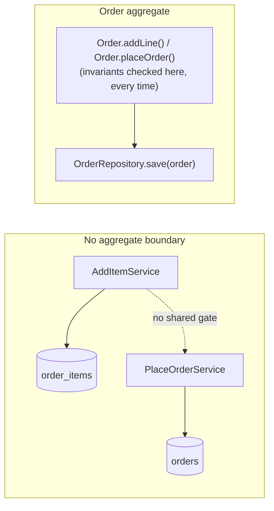

import Scenario from "../../../components/Scenario.astro";
import LevelIntro from "../../../components/LevelIntro.astro";

<Scenario label="Same aggregate, two writers, one silent loss">
  <Fragment slot="facts">
    

      
🧾 <strong>Order #4471</strong> — starts at $95, credit limit $100

      
🅰️ Request A reads total ($95), adds a $10 item

      
🅱️ Request B reads total ($95, same instant), adds an $8 item

      
💥 <strong>Whoever writes last wins</strong> — the other item ships but is never counted

    

    

      
Result

      Order ships with 2 items but a total that only reflects 1 — and neither
      the $100 credit limit nor the item count was ever actually checked
      against reality.
    

  </Fragment>

Two microservices both touch the `orders` and `order_items` tables directly:
an `AddItemService` that inserts a row into `order_items` and bumps
`orders.total`, and a `PlaceOrderService` that reads `orders.total` and
flips `status` to `placed`. A customer's cart triggers two "add item" calls
within the same 40ms window — one from a retried mobile request, one from a
promo widget auto-adding a bundled item. Both read the total as $95 before
either write lands.

| Step                  | `AddItemService` (Request A) | `AddItemService` (Request B) |
| --------------------- | ---------------------------- | ---------------------------- |
| Reads `orders.total`  | $95                          | $95                          |
| Computes new total    | $95 + $10 = $105             | $95 + $8 = $103              |
| Writes `orders.total` | $105                         | $103 (overwrites A)          |

**The database transaction for each individual write is perfectly valid —
neither request violated any SQL constraint. So what actually let an order
exceed its $100 credit limit and ship with an item nobody billed for?**

</Scenario>

Nothing was watching the _cluster of facts that has to stay true together_
— total, line items, and credit limit — as one thing. Each service treated
`orders` and `order_items` as tables to poke at independently, so the rule
"total must never exceed the credit limit" had no single place it was
actually enforced.

<LevelIntro
  items={[
    "Aggregates, roots, and invariants",
    "Entities vs. value objects",
    "Repositories and domain events",
  ]}
/>

**This unit assumes you already know what a bounded context and ubiquitous
language are** (see `product-domain/bounded-contexts` and
`product-domain/domain-driven-design-basics` if not) — it picks up from
there and asks the next question: once a bounded context exists, what
inside it actually stops two writers from corrupting the same cluster of
objects, and how does any of this turn into real module, service, and
deployment boundaries instead of just vocabulary?

If the scenario felt like it arrived with too many software words at
once, anchor it this way first:

| Word in the scenario   | Plain-language version                                                                              |
| ---------------------- | --------------------------------------------------------------------------------------------------- |
| Table                  | A spreadsheet-like place where rows are stored                                                      |
| Service                | A small program owned by a team, responsible for one job                                            |
| Two requests in 40ms   | Two people editing the same form before either one sees the other's change                          |
| Transaction            | "This one write fully happens or fully fails"; it is not automatically a business-rule check        |
| Lost update            | Two edits both started from the old value, and the later save silently erased the earlier one       |
| Credit-limit invariant | A rule that must stay true after every change, the way "a seat cannot be sold twice" must stay true |

For the background pieces, use `systems/transactions` for transactions,
`systems/concurrency` and `systems/race-conditions` for overlapping
writes, and `architecture/hexagonal-clean-architecture` for how a
repository later becomes a port that keeps storage outside the core.

- **Aggregate** — a cluster of objects (here: an order and its line items)
  that must be treated as a single consistency unit, because a business
  rule (the credit limit) spans more than one of them at once.
- **Aggregate root** — the one object in that cluster allowed to be the
  entry point for changes. Nothing outside the aggregate reaches in and
  edits a line item directly — every change goes through the root, which
  is the only place invariants get checked.
- **Invariant** — a rule that must hold true after every single change, not
  just eventually ("total ≤ credit limit," "no items added after the order
  is placed").
- **Entity vs. value object** — an entity has identity that persists across
  changes (`OrderLine #7` is still line 7 even after its quantity changes);
  a value object has no identity of its own and is compared purely by its
  contents (two `Money($10)` instances are simply _equal_, not "the same
  one").
- **Repository** — the only door in and out of an aggregate's storage; it
  loads and saves whole aggregates, never a lone line item.
- **Domain event** — a record of something the aggregate root decided
  actually happened (`OrderPlaced`), raised from inside it and published
  afterward for other parts of the system to react to.
- **Context mapping, one level deeper** — once contexts exist, _how_ they
  relate to each other in code: this unit goes past the
  anticorruption-layer/conformist pair already covered and into
  **customer-supplier** and **open host service / published language**,
  plus what a context map actually becomes once it's built: module
  boundaries, service boundaries, deployment units.

## What changes once an aggregate boundary exists

|                                          | No aggregate boundary (this scenario)                            | Order is an aggregate, `Order` is the root                         |
| ---------------------------------------- | ---------------------------------------------------------------- | ------------------------------------------------------------------ |
| Who can add a line item                  | Any service that can `INSERT` into `order_items`                 | Only `order.addLine(...)`, which checks the invariant first        |
| Where "total ≤ credit limit" is enforced | Nowhere consistently — depends which service remembered to check | Inside the aggregate root, on every mutation, no exceptions        |
| What a concurrent write does             | Last write silently wins; the invariant may already be broken    | The second write is rejected or retried against the current state  |
| What "save" means                        | Whichever table each service happens to touch                    | One repository call, saving the whole aggregate as one atomic unit |

L2 works through why the database transaction alone can't fix this, what
the aggregate root actually does differently, and how bounded contexts
turn into real module/service boundaries. L3 builds the `Order` aggregate,
its repository, and a domain event in full, working code — and fixes the
invariant and lost-update shape shown above.
