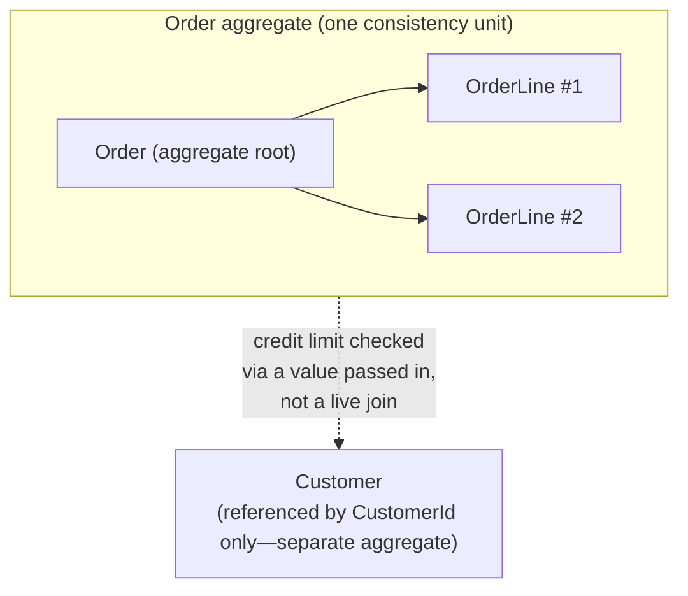
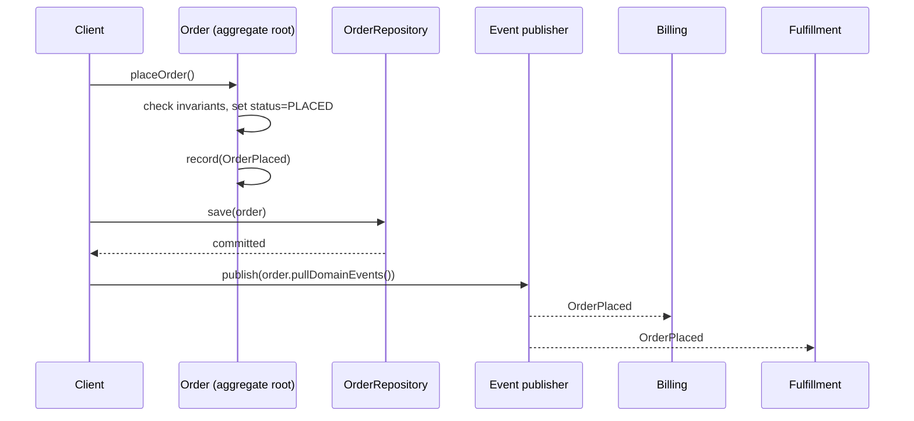
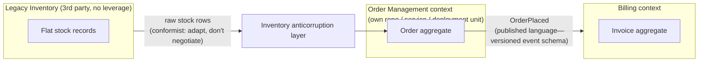

import LevelIntro from "../../../components/LevelIntro.astro";
import Checkpoint from "../../../components/Checkpoint.astro";

L1 named the concepts a lost update like Order #4471 exposes —
aggregate, aggregate root, invariant, entity vs. value object,
repository, domain event — without yet showing why wrapping each write
in its own database transaction couldn't have prevented it. L2 works
through that gap, then follows bounded contexts one level deeper into
the module, service, and deployment boundaries they actually become.

<LevelIntro
  items={[
    "Why transactions alone don't enforce invariants",
    "Entities vs. value objects, in practice",
    "Context mapping into real code boundaries",
  ]}
/>

## Why the database transaction alone didn't save Order #4471

**Each individual write in L1's race was inside a valid SQL transaction.
So why wasn't "wrap it in a transaction" the fix?** A transaction
guarantees that _one_ write either fully happens or doesn't — it says
nothing about which writes are even allowed to happen, or what has to
stay true across several of them at once. `AddItemService` and
`PlaceOrderService` each had their own perfectly valid transaction; there
was simply no rule, anywhere, saying "before you commit, check the
combined total against the credit limit." A transaction protects
_atomicity_. It doesn't know what "consistent" means for your domain —
only your code can define that.

That's what an **aggregate** actually is: not a database concept, a
**modeling decision** about which objects have to be checked together,
every time, because a business rule spans more than one of them.

That does **not** mean the database is useless. A database can enforce
atomic commit/rollback, unique constraints, row locks, isolation levels,
and version checks. Those tools are essential, and `systems/transactions`
goes deeper on them. What they do not decide for you is _which facts form
one business rule_. The aggregate answers that modeling question first;
then the repository uses database tools to persist that answer without a
silent lost update.



**Why isn't `Customer` inside the same aggregate, if the credit limit
check needs its data too?** Because `Customer` has its own lifecycle,
its own invariants (address changes, plan upgrades), and its own write
volume — folding it into `Order` would mean every order write also locks
the customer record, and every customer write has to worry about
in-flight orders. The aggregate boundary is drawn around _the smallest
cluster of objects that must be consistent with each other on every
single write_ — not around "everything this feature happens to touch."
`Order` needs the customer's credit limit as an input value at the
moment of the check, not permanent joint custody of the `Customer`
object.

<Checkpoint question="A teammate says: 'every order write already goes through a database transaction, so we're covered against Order #4471's bug.' Using the transaction/aggregate distinction just established, what's wrong with that claim?">

A transaction only guarantees that one write fully happens or fully
fails — it never decides which combined facts are allowed to be true at
once. `AddItemService`'s write and `PlaceOrderService`'s write were each
inside a valid transaction; the credit-limit check spanning both of them
simply had no code enforcing it anywhere. "Covered" would require an
aggregate — a modeling decision about which objects must be checked
together on every change — not just a transaction boundary around each
individual write.

</Checkpoint>

## The aggregate root is the only door in

**If `Order` and `OrderLine` are one consistency unit, what stops some
other part of the codebase from reaching in and editing an `OrderLine`
directly, the same way the old `AddItemService` reached into
`order_items`?** Nothing technical — this is a modeling discipline, not a
language feature. The rule: external code never holds a mutable
reference to a child object inside an aggregate. It only ever calls
methods on the root, and the root is the one place invariants are
checked, on every mutation:

```
class Order (aggregate root):
    lines: OrderLine[]
    status: PLACED | OPEN
    creditLimit: Money

    method addLine(product, quantity, unitPrice):
        assert status == OPEN                      # invariant: no changes after placed
        newTotal = total() + unitPrice * quantity
        assert newTotal <= creditLimit              # invariant: never exceed the limit
        lines.append(OrderLine(product, quantity, unitPrice))

    method placeOrder():
        assert lines.length > 0
        status = PLACED
        record(OrderPlaced(orderId, total()))        # domain event, see below
```

**What would go wrong if `addLine` just appended the line and left the
credit-limit check to a separate validation step run before "place
order"?** The order could sit in an invalid state — over the limit — for
however long it takes someone to call that separate check, and any other
code path that reads the order in between sees a value that shouldn't be
possible. Checking the invariant _inside_ the same method that changes
the state is what makes "the aggregate is never observably invalid"
true, not just usually true.

## Entity vs. value object: which of these needs an identity?

**`OrderLine #7`'s quantity changes from 2 to 3 — is it still line 7, or
a different line now?** Still line 7: it has an identity that persists
across changes, which makes it an **entity** (locally, inside the
aggregate — it doesn't need an ID meaningful outside `Order`). **Two
separate `$10` amounts in the system — are they "the same $10" or just
two things that happen to be equal?** Just equal — `Money($10)` has no
identity to track; you never ask "which $10 is this?", only "is this
amount equal to that one?" That's a **value object**: interchangeable,
immutable, compared purely by its fields.

| Question to ask                                      | Entity                                     | Value object                                         |
| ---------------------------------------------------- | ------------------------------------------ | ---------------------------------------------------- |
| Does "which one, specifically" matter?               | Yes — tracked by an ID                     | No — only "what does it equal"                       |
| Can it change over time and stay the same thing?     | Yes (`OrderLine #7`'s quantity can change) | No — a change produces a _new_ value, not a mutation |
| Two instances with identical fields — same or equal? | Different, even with identical fields      | The same, by definition                              |

Getting this backwards has a real cost: modeling `Money` as an entity
means writing identity-tracking and mutation code nothing needs, and
modeling `OrderLine` as a value object means losing the ability to say
"update line 7's quantity" without it silently becoming a different
line.

<Checkpoint question="A second $10 line item gets added to Order #4471, and later its quantity is corrected from 2 to 3. Which of these two facts — the $10 amount, or the line itself — needs to keep the same identity across that correction, and which one doesn't?">

The line needs to keep its identity: it's still `OrderLine #7` before and
after the quantity changes, which is exactly what makes it an entity.
The `$10` amount doesn't need identity at all — two `Money($10)`
instances are simply equal, and a "changed" amount is just a new `Money`
value, not the same object mutated. Getting this backwards is the
mistake L2 already flagged: treating `Money` as an entity adds
identity-tracking nothing needs, and treating `OrderLine` as a value
object loses the ability to say "update line 7" at all.

</Checkpoint>

## Repositories: the aggregate's only door to storage

**Now that `Order` guards its own invariants, what happens if the
persistence layer lets something save just one `OrderLine` row without
going through `Order` at all — an ORM `.save()` call on the line
directly?** The whole point of the aggregate root collapses: the
invariant-checking code path gets bypassed entirely, and you're back to
L1's bug with extra steps. A **repository** exists specifically to close
that door — it's an interface that only ever loads and saves whole
aggregates:

```
interface OrderRepository:
    findById(orderId) -> Order
    save(order: Order) -> void
```

**Why not just let each aggregate's fields be `public` and skip a whole
interface for what's really a `SELECT`/`UPDATE`?** Because the
repository's job isn't fetching rows — it's guaranteeing that the _only_
way to persist a change to `order_items` is by first going through
`Order`'s methods, then handing the entire, now-valid aggregate to
`save()`. There's no `OrderLineRepository`. That absence is deliberate.

## Domain events: telling the rest of the system what happened, without reaching into it

**`Order.placeOrder()` needs to notify Billing and Fulfillment. Should it
just call their APIs directly from inside the method?** No — that would
make `Order` depend on every downstream context's availability and
shape, the exact coupling bounded contexts exist to prevent. Instead,
the aggregate root records that something happened — `OrderPlaced` — and
hands that record off _after_ the transaction that changed its own state
commits. Other contexts subscribe to the event; `Order` never learns they
exist.



**Why publish _after_ the save commits, instead of the instant
`record()` is called?** Because if the save then fails — a constraint
violation, a dropped connection — you'd have already told Billing an
order exists that was never actually persisted. Publishing after commit
means the event is only ever true.

This is the bridge to `architecture/event-driven-architecture`: a domain
event starts as a fact raised inside one aggregate. Publishing it is a
separate application/infrastructure concern, often handled with an
outbox or broker so other contexts can react without the aggregate
calling them directly.

## From contexts to code: what a context map actually compiles into

L1's aggregate lives inside one bounded context (Order Management).
**Once you have several contexts, what does the boundary between them
actually look like in a real codebase — a folder? A package? A
service?** All three, at different points of a system's growth, and the
context map's job is to say which:

| Context map pattern                        | What it looks like in code                                                                                                              | When it fits                                                                                  |
| ------------------------------------------ | --------------------------------------------------------------------------------------------------------------------------------------- | --------------------------------------------------------------------------------------------- |
| (already known) Anticorruption layer       | A dedicated adapter module at the boundary, translating one context's model into another's                                              | The two contexts' models carry genuinely different guarantees                                 |
| (already known) Conformist                 | Downstream just imports/deserializes the upstream shape directly, no translation module                                                 | No leverage to negotiate the upstream model (e.g. a third-party API)                          |
| **Customer-supplier**                      | Upstream team's release process has a formal input — a ticket queue, a contract test suite — that the downstream team's needs feed into | Both teams answer to the same organization and can prioritize each other's asks               |
| **Open host service / published language** | Upstream context exposes one stable, versioned API/schema (a "published language") instead of many bespoke integrations per consumer    | Many downstream contexts need the same upstream data; one stable contract beats N custom ones |

**Why does it matter which pattern a given relationship actually is,
instead of just calling everything "an API"?** Because each implies a
different failure mode if ignored: treating a _conformist_ relationship
like a _customer-supplier_ one means filing feature requests a
third-party vendor will never see; treating a genuine
_customer-supplier_ relationship like _conformist_ means quietly eating
breaking changes you actually had standing to negotiate against.



A context's boundary is drawn once, in the design conversation. It gets
_enforced_ every day by: which repo/package the code lives in, which
service owns the deployment, and which of these four patterns governs
each edge on the map. L3 builds the `Order` aggregate, its repository,
its domain event, and an anticorruption layer against a legacy inventory
system, end to end.
