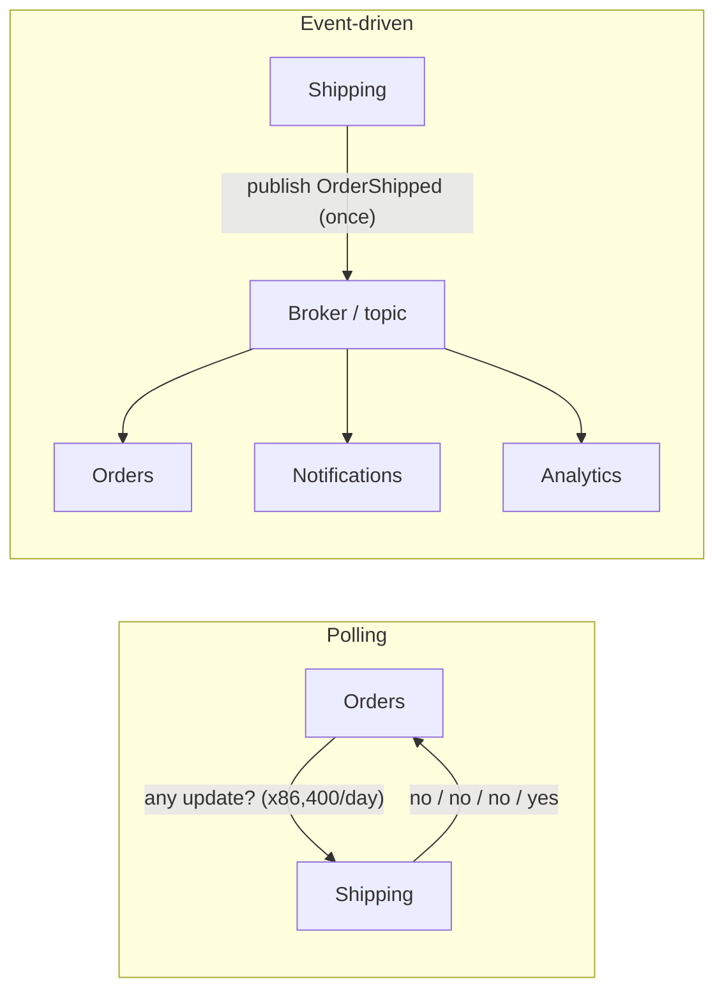

import Scenario from "../../../components/Scenario.astro";
import LevelIntro from "../../../components/LevelIntro.astro";

<Scenario label="The problem">
  <Fragment slot="facts">
    

      

        86,400
        polls/day, per consumer
      

      

        

      

      
~97% of those polls find nothing new

    

    

      
📦 Orders service polls Inventory every 1s for "is this order shipped yet?"

      
⏱️ Worst-case delay: up to 1 full poll interval, every time

      
💸 Load scales with (services × poll rate), not with actual shipments

    

    
The three patterns

    

      
📣 Pub/sub — publisher and subscriber decoupled by a broker

      
📜 Event sourcing — state is a replay of an append-only log

      
🔀 CQRS — writes and reads split into separate models

    

  </Fragment>

An e-commerce platform has an `Orders` service and a `Shipping` service. When
`Shipping` finally marks a package as dispatched, `Orders` needs to know —
so it can email the customer and unlock the "Track package" button.

The team's first fix: every second, `Orders` asks `Shipping`, _"is order
#4471 shipped yet?"_ Multiply that by every order in flight, every service
that cares about shipping status, and every second of the day.

| What the team wanted            | What polling actually gives them                                   |
| ------------------------------- | ------------------------------------------------------------------ |
| Near-instant reaction to events | A reaction delayed by up to one full poll interval, every time     |
| Low load                        | Load that scales with (services × poll rate), not with real events |
| Simple code                     | A cron-like loop hammering an API that says "no" 97% of the time   |

**Before reading on: if polling every second still isn't fast enough, why not just poll every 100ms — what actually breaks first, cost or correctness?**

</Scenario>

Polling makes the questioner pay for the answer whether or not anything
changed. The fix is to flip who initiates: instead of the consumer asking
_"did anything happen?"_ on a timer, the producer announces _"this
happened"_ once, the moment it's true — and anyone who cares can react.

<LevelIntro
  items={[
    "Why polling doesn't scale with more consumers",
    "Pub/sub, event sourcing, and CQRS, in one paragraph each",
    "Vocabulary: producer, consumer, broker, topic/queue",
  ]}
/>

If this is your first backend architecture topic, keep these translations
nearby:

| Term        | Plain version                                                                                   |
| ----------- | ----------------------------------------------------------------------------------------------- |
| Service     | A program or team-owned component responsible for one job                                       |
| Event       | A notice about something that already happened, named in past tense                             |
| Producer    | The service that publishes the notice                                                           |
| Consumer    | A service that reacts to the notice                                                             |
| Broker      | The middleman that stores and delivers notices so producer and consumers do not know each other |
| Topic/queue | A mailbox or line of messages waiting for the right consumer                                    |
| Async       | The producer can finish now; consumers may process shortly afterward                            |

For slower foundations, `web/http-request-response-basics` explains API
requests and webhooks, while `applied-math/queueing-theory-basics`
explains backlog, processing rate, and why a queue can lag behind.

- **Event-driven architecture (EDA)**: services communicate by publishing
  facts about the past (`OrderShipped`, `PaymentFailed`) instead of one
  service calling another directly or polling it. A producer doesn't know
  or care who's listening.
- **Pub/sub** is the delivery mechanism: producers publish events to a
  broker (a queue or topic); consumers subscribe to the topics they care
  about. The broker — not the producer — tracks who needs the message and
  redelivers it if a consumer is down.
- **Event sourcing** is a specific way to store state: instead of
  overwriting a row (`status: shipped`), you append every state-changing
  event to an immutable log (`OrderPlaced`, `PaymentReceived`,
  `OrderShipped`) and derive current state by replaying it. The log _is_
  the source of truth; the "current row" is just a cached projection of it.
- **CQRS** (Command Query Responsibility Segregation) splits the model
  that handles writes (commands) from the model that serves reads
  (queries) — often paired with event sourcing, since the write side
  appends events and one or more read-side projections rebuild
  query-friendly views from those events asynchronously.
- These three are related but separable: you can do pub/sub without event
  sourcing (most message-queue systems), event sourcing without CQRS (one
  model, rebuilt from the log), or CQRS without event sourcing (two
  databases kept in sync some other way). This unit covers all three
  because they solve overlapping instances of the same root problem —
  reacting to change without polling — but you adopt them independently
  based on which problem you actually have.
- What you gain: producers and consumers don't need to know about each
  other, consumers can be added later without touching the producer, and
  a burst of events can queue up instead of getting dropped.
- What you give up: **eventual consistency** (a consumer's view lags the
  producer's by however long delivery + processing takes), and a much
  harder debugging story — a request's effects are now spread across
  whichever services happened to react to its events, not a single call
  stack.

| #   | Question                                             | What it decides                                     |
| --- | ---------------------------------------------------- | --------------------------------------------------- |
| 1   | Who initiates — the asker or the thing that changed? | Polling vs. event-driven                            |
| 2   | Is current state enough, or do you need the history? | A row you overwrite vs. an event-sourced log        |
| 3   | Do reads and writes have different shapes/load?      | One shared model vs. CQRS's split read/write models |
