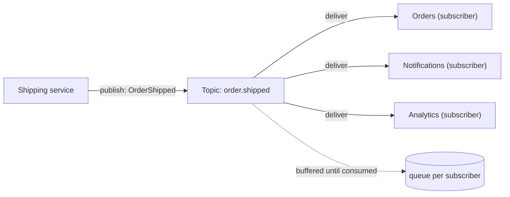
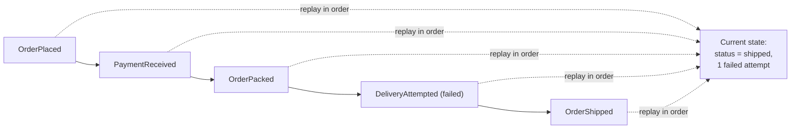
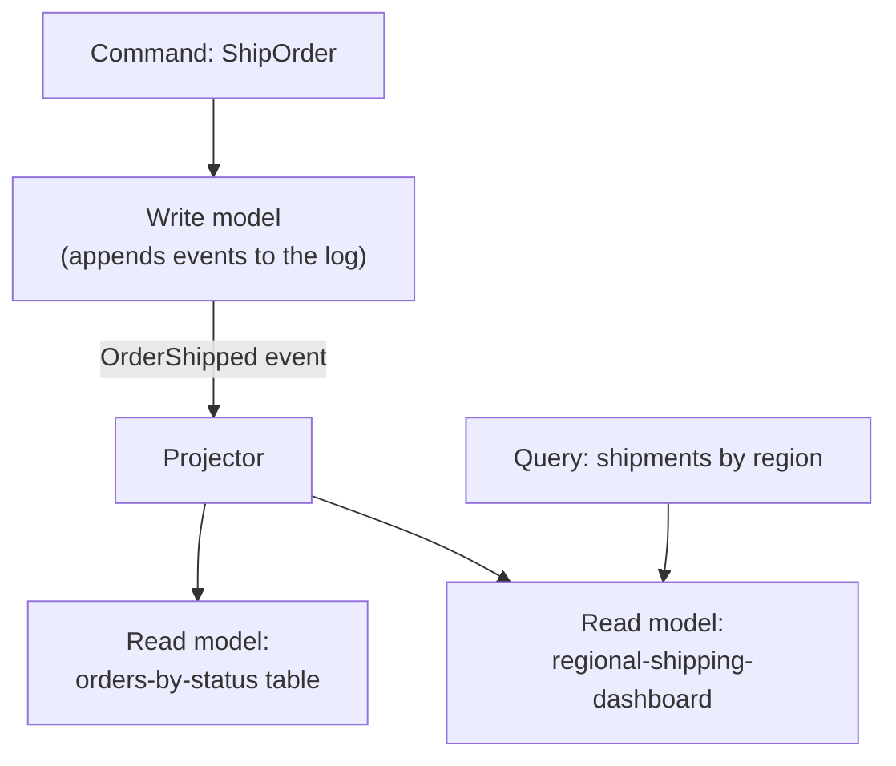

import Scenario from "../../../components/Scenario.astro";

<Scenario label="A new wrinkle">
  <Fragment slot="facts">
    

      
📣 Notifications and Analytics both need OrderShipped too

      
🔌 Direct calls: Shipping must know every caller's address

      
🧩 A broker: Shipping publishes once, knows nothing about who's listening

    

  </Fragment>

Say the team drops polling and has `Shipping` call `Orders` directly the
moment a package ships — an HTTP `POST` to `Orders`' webhook. That fixes the
delay. Then `Notifications` also needs to know, to send the "it's on the
way!" email. Then `Analytics` needs it too, for the shipping-time dashboard.

**Does `Shipping` now maintain a hardcoded list of every service that
might ever care about a shipment, and call all of them, synchronously, in
the request path that also has to update the database and lock the
warehouse slot?**

</Scenario>

That's the shape of the actual problem: point-to-point calls make the
producer responsible for knowing every consumer, and a slow or down
consumer now blocks (or fails) the producer's own work. Pub/sub removes
both problems by putting a broker in between.

## Pub/sub: decoupling who says something from who hears it

**How does adding a broker let `Shipping` stay ignorant of who's listening,
while still guaranteeing `Notifications` doesn't miss the event if it's
mid-deploy when the package ships?**

- `Shipping` publishes one message to a **topic** — it has zero knowledge
  of `Orders`, `Notifications`, or `Analytics`. Adding a fourth consumer
  tomorrow requires no change to `Shipping` at all.
- The broker holds a **queue per subscriber** (or per consumer group). If
  `Notifications` is down for five minutes, its messages wait in its queue
  — they aren't lost, and `Shipping` never notices the outage.
  `Shipping`'s own request finishes the instant the broker accepts the
  publish, not when every subscriber has processed it.
- This is the trade for **eventual consistency**: `Analytics`' dashboard
  is accurate a few hundred milliseconds to a few seconds after the
  shipment, not instantly. For a "was this order shipped" webhook, that's
  fine. For "does this account have enough balance right now," it usually
  isn't — pick this pattern based on whether the consumer can tolerate a
  lag, not by default.

## Event sourcing: state as a replay, not a row

`Shipping`'s database currently has one row per order:
`{ id: 4471, status: "shipped" }`. A support agent asks: _"when exactly
did this order move from packed to shipped, and was there a failed
delivery attempt in between?"_ The row can't answer that — it only holds
the latest status, and every earlier value was overwritten.

**What if, instead of overwriting the row on every change, you never
overwrote anything — you only ever appended?**

- The **event log is append-only** — every state change is recorded as a
  fact that happened, and facts don't get edited after the fact (if a
  correction is needed, you append a new compensating event, e.g.
  `ShippingAddressCorrected`, rather than mutating history).
- **Current state is a derived value**, computed by folding every event
  for that order, in order, into an accumulator — the same operation as
  `reduce()` over a list. Two systems that replay the same log always
  arrive at the same state, which is what makes this trustworthy as a
  source of truth rather than just an audit log bolted onto a real
  database.
- This buys you the support agent's question for free — the full history
  is the data model, not an afterthought logged separately — plus the
  ability to rebuild a brand-new read model later by replaying events
  that already happened, which matters a lot once CQRS enters the
  picture below.
- It costs you: replaying a long history from scratch is slow (fixed with
  periodic **snapshots** — a cached state at event #10,000 so you only
  replay from there forward), and every event's shape is now a long-term
  contract — changing what `OrderShipped` looks like means either
  supporting the old shape forever or migrating history, not just
  editing a column.

## CQRS: splitting the model that writes from the model that reads

Once `Shipping`'s state is an event log, a new problem shows up:
answering _"how many orders shipped last week, grouped by region"_ means
replaying and re-folding potentially millions of events on every query —
nobody wants that at request time.

**Does the thing that accepts new events (a write) have to be the same
thing that answers questions about existing state (a read)?**

- The **write side** accepts commands (`ShipOrder`), validates them
  against business rules, and appends the resulting event to the log. It
  has no idea what dashboards exist.
- A **projector** subscribes to the event stream (this is the same
  pub/sub mechanism from above — CQRS's read/write split and
  event-sourcing's log are two different concerns that compose through
  it) and incrementally updates one or more **read models**: plain,
  denormalized tables shaped exactly for the query that needs them —
  one for "orders by status," a completely different shape for "regional
  shipping dashboard."
- Queries hit the read model directly — no folding events at request
  time, no shared schema fighting between "what's fast to write" and
  "what's fast to read."
- The cost is the same eventual-consistency trade as pub/sub, now visible
  to the reader specifically: a query issued 50ms after a `ShipOrder`
  command might not reflect it yet, because the projector hasn't caught
  up. Systems that need the read to reflect a write it just made
  (submit-then-immediately-redisplay UIs) either read from the write side
  for that one case or show the reader their own pending state
  optimistically while the projection catches up.

| Pattern         | Problem it solves                                   | What it costs                                      |
| ---------------- | ---------------------------------------------------- | ---------------------------------------------------- |
| Pub/sub          | Producer shouldn't know or block on every consumer   | Eventual consistency; ordering across topics isn't guaranteed |
| Event sourcing   | Current state loses the history that produced it     | Replay cost (mitigated by snapshots); event shape is a long-term contract |
| CQRS             | One model can't be optimal for both writes and reads | Read models lag writes; more moving parts to keep in sync |
