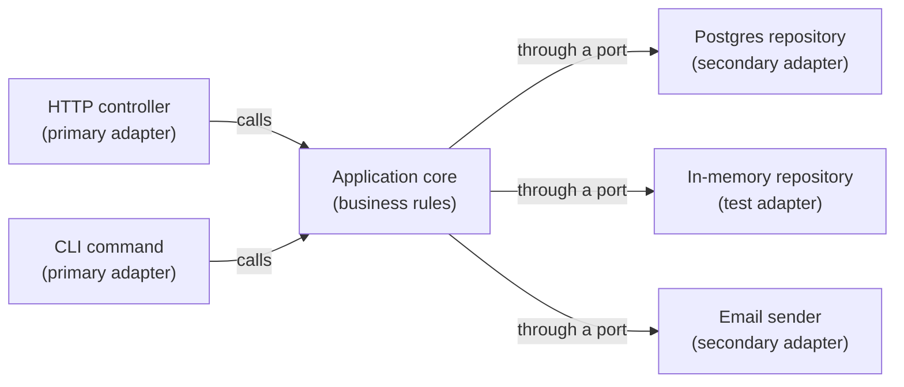

import Scenario from "../../../components/Scenario.astro";
import LevelIntro from "../../../components/LevelIntro.astro";

<Scenario>
  <Fragment slot="facts">
    

      

        🐘 Test suite, real Postgres
        ≈ 45 ms / test
      

      

        

      

      

        ⚡ Test suite, in-memory fake
        ≈ 0.05 ms / test
      

      

        

      

    

    
Symptoms

    

      
🧪 Can't unit-test a discount rule without Docker running

      
🔌 Swapping Postgres → DynamoDB means touching the use case

      
🕸️ `import { Request } from "express"` shows up inside pricing logic

    

  </Fragment>

`OrderService.placeOrder()` is 40 lines long. Fifteen of them are business rules — check stock, apply the discount, reject if the cart is empty. The other twenty-five are a raw SQL client, an Express `req`/`res` pair, and a try/catch around a connection pool. To unit-test the discount rule, you don't call a function — you spin up Docker, run migrations, seed rows, and hope the container is healthy before the test framework's timeout fires.

**Before reading on: none of that infrastructure has anything to do with whether the discount rule is correct. So why does testing it require all of it?**

</Scenario>

Because the business rule and the database call live in the _same function_, with no seam between them — the rule can't run without dragging the database along, and nothing enforces that separation as the codebase grows.

<LevelIntro
  items={[
    "Business logic vs. infrastructure",
    "Ports, adapters, and their two kinds",
    "The inward-pointing dependency rule",
  ]}
/>

If the scenario is packed with unfamiliar backend words, translate it
first:

| Term                  | Plain version                                                                  |
| --------------------- | ------------------------------------------------------------------------------ |
| Business rule         | The real-world rule the organization cares about                               |
| Infrastructure        | Tools that help the app run: database, web framework, queue, email service     |
| Framework             | Code you plug your app into, like Express for HTTP                             |
| HTTP request          | A web message asking the app to do something                                   |
| SQL/Postgres          | A database language and one database product                                   |
| Docker/migration/seed | Setup work to make a real database exist before tests can use it               |
| Fake adapter          | A small test-only replacement that behaves like the real dependency's contract |

For the pieces behind those words, see
`web/http-request-response-basics`, `testing-quality/test-doubles`,
`testing-quality/test-pyramid`, and `software-design/solid-principles`.

- **The core problem:** business logic (what an order _is_, what rules govern it) gets tangled with infrastructure logic (how to fetch it, store it, expose it over HTTP) inside the same functions and files. Neither can change, or be tested, without touching the other.
- **Ports & adapters** (a.k.a. **hexagonal architecture**, Alistair Cockburn) and **clean architecture** (Robert Martin) are the same underlying idea wearing two different vocabularies — this unit treats them as one pattern:
  - The **application core** holds the business logic and knows nothing about databases, HTTP, message queues, or any specific technology.
  - A **port** is an interface the core defines and depends on — e.g. "something that can save an order" — without saying _how_.
  - An **adapter** is a concrete implementation of a port — a Postgres adapter, an in-memory adapter for tests, an S3 adapter. The core never sees which one is plugged in.
  - **Primary (driving) adapters** call into the core (an HTTP controller, a CLI command, a scheduled job). **Secondary (driven) adapters** are called by the core through a port (a database repository, an email sender, a payment gateway).
- **The one rule that makes it work: dependencies point inward, always.** Adapters depend on the core's port interfaces; the core never imports an adapter, a framework, or a driver. This is the same **dependency inversion** idea from SOLID, applied at the architecture scale instead of the single-class scale — this unit assumes that principle and focuses on the ports/adapters pattern it enables, not on re-deriving SOLID from scratch.
- **What this buys you:** the discount rule becomes a plain function you call with plain objects — test it with an in-memory fake in microseconds, no container required. Swapping Postgres for DynamoDB means writing one new adapter; the core doesn't change a line.
- **What it costs:** an interface, a wiring/composition point, and more files for what might otherwise be one. For a five-endpoint CRUD app with no real business rules, that overhead can cost more than it returns — see L3 for when to actually reach for this.

| Adapter kind       | Direction                        | Examples                                 |
| ------------------ | -------------------------------- | ---------------------------------------- |
| Primary (driving)  | Calls _into_ core                | HTTP controller, CLI command, cron job   |
| Secondary (driven) | Called _by_ core, through a port | DB repository, email sender, payment API |

Dependencies never point outward from the core — every arrow into infrastructure crosses through a port the core itself defined.
