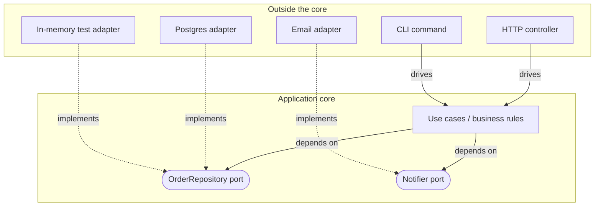
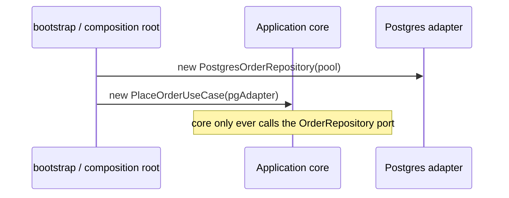

import Scenario from "../../../components/Scenario.astro";

**Where does the boundary actually go, and who's allowed to depend on whom across it?** L1 named the pieces — core, port, adapter — this section is about the shape they form together and the one rule that keeps that shape from collapsing back into the tangled version.

## The hexagon is a dependency diagram, not a shape requirement

The "hexagon" in hexagonal architecture isn't six-sided for any technical reason — Cockburn picked it just to have enough sides to draw several adapters around a core without implying a front/back like a layered box diagram does. What matters is what's inside versus outside, and which way the arrows point:

**Read the arrow direction, not just the boxes: which side names the interface, and which side is forced to conform to it?** The port arrows (`UC --> P1`) point from the core outward to an interface _the core owns_. The implementation arrows (dotted) point from each adapter _back_ toward that same port. The core never draws an arrow toward `PGa` or `Mema` by name — it only knows about `P1`. That's the entire trick: swapping `PGa` for `Mema` changes which dotted line exists, and touches nothing solid.

Another way to say it: the **port lives inside the core's vocabulary**.
The core says, "I need something that can save an order." Postgres,
DynamoDB, and the in-memory fake each bring an adapter that fits that
socket. The diagram may draw a line outward to the port so you can see
the need, but the code dependency still points inward because the core
owns the interface name and shape.

## Two families of adapters, two different questions

<Scenario label="A team's actual confusion">
  <Fragment slot="facts">
    

      
➡️ Primary: calls <strong>into</strong> the core

      
⬅️ Secondary: called <strong>by</strong> the core, through a port it defined

      
❓ A queue consumer is primary — it triggers a use case, even though "queue" sounds like infrastructure

    

  </Fragment>

A team adds a background worker that consumes messages from a queue and calls `placeOrder()` for each one. Someone argues it's a "secondary adapter" because a message queue is infrastructure, same category as the database. Someone else says it's primary. **Who's right, and does it actually matter which list it goes on?**

</Scenario>

It's primary — the direction of the _call_, not the "infrastructure-ness" of the technology, is what decides the category. The queue consumer calls into the core the same way an HTTP controller does; it just gets triggered by a message instead of a request. It matters because primary and secondary adapters are tested differently: a primary adapter's test asks "does this correctly translate an external trigger into a call on the core," while a secondary adapter's test asks "does this correctly implement the port's contract" — mixing the two up produces tests that check the wrong thing.

A tiny primary-adapter test might send a fake HTTP body like
`{ items: [...] }` and assert that the adapter called `placeOrder()` with
plain domain data. A secondary-adapter contract test might save an order
through `PostgresOrderRepository`, load it again through the same
`OrderRepository` port, and assert that the loaded order matches the
contract. Same app, different question.

| Question a primary adapter answers                                                                               | Question a secondary adapter answers                                     |
| ---------------------------------------------------------------------------------------------------------------- | ------------------------------------------------------------------------ |
| Did I correctly translate an external trigger (HTTP request, CLI args, a queue message) into a call on the core? | Did I correctly implement the port's contract against a real technology? |
| Owned by: whoever's driving the app (web team, CLI, scheduler)                                                   | Owned by: whoever the core depends on (DB team, infra)                   |

## Who defines the port's shape?

**If the core needs "something that can save an order," does the database team design that interface, or does the core?** The core does — always. A port's method signatures are written in the vocabulary of the business rule that uses them (`save(order: Order): Promise<void>`), not in the vocabulary of whatever will eventually implement it (no `INSERT INTO`, no connection string, no `AWS.DynamoDB.DocumentClient`). If the shape of a port is dictated by what's convenient for Postgres, the dependency has silently flipped — the core is now shaped by the database, even though the arrow on the diagram still points the "right" way.

**What breaks first if that rule is violated?** Usually testability: a port whose method takes a raw SQL `WHERE` clause as a string can't be satisfied by an honest in-memory fake — the fake would have to embed a tiny SQL interpreter just to pass. That's the tell that a port leaked its adapter's shape instead of the core's.

## Composition: where the adapters actually get plugged in

The core and the adapters both exist as compiled code before the app runs — something still has to decide, at startup, "use the Postgres adapter, not the in-memory one." That wiring lives in one place, usually called **composition root** or just `main`/`bootstrap` — it's the one file in the whole codebase allowed to know about the core's port interfaces _and_ every concrete adapter at the same time, because its only job is introducing them to each other.

**Why does it matter that this wiring lives in exactly one place instead of being sprinkled through the codebase?** Because that's the only spot a swap (Postgres → DynamoDB, real email → a fake for tests) needs to touch. If adapter construction were scattered across the core, "swap the adapter" would mean hunting down every `new PostgresOrderRepository()` instead of changing one line in `bootstrap`.

L3 makes this concrete with real TypeScript: one port, two working adapters, and the composition root that swaps between them — including where this pattern earns its cost and where it doesn't.
