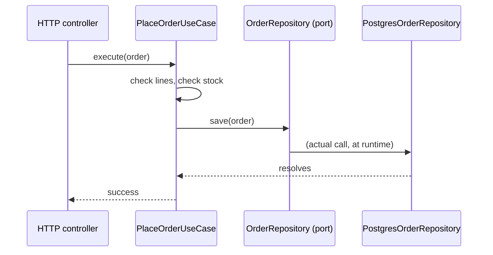

import Scenario from "../../../components/Scenario.astro";

This deep dive uses **TypeScript** — its structural interfaces map directly onto "a port is a contract, an adapter is an implementation" with no extra ceremony, and it's the language the rest of this track's readers are most likely to run into ports-and-adapters code in on the job. The ideas transfer directly to Go (interfaces), Java/Kotlin (interfaces), or Python (`Protocol`/ABCs) — only the syntax changes.

## The use case: placing an order

<Scenario label="What we're building">
  <Fragment slot="facts">
    <div class="not-prose flex flex-col gap-1 text-sm text-slate-700 dark:text-slate-300">
      <div class="flex items-center gap-1.5"><span>📦</span> Rule: reject if cart is empty</div>
      <div class="flex items-center gap-1.5"><span>📉</span> Rule: reject if any line is out of stock</div>
      <div class="flex items-center gap-1.5"><span>💾</span> Needs: save the order, somewhere</div>
      <div class="flex items-center gap-1.5"><span>🚫</span> Must NOT need: a running Postgres to unit-test the two rules above</div>
    </div>
  </Fragment>

`PlaceOrderUseCase` has exactly two business rules: an order needs at least one line, and every line needs enough stock. Everything else is "save it somewhere" — and "somewhere" is deliberately left open. **If the two rules above are the only things that make an order valid or invalid, why would testing them ever require a real database connection?**

</Scenario>

It shouldn't — and the port is what makes that true in code, not just in principle.

### The port: an interface the core defines

```typescript
// core/ports/order-repository.ts
// Owned by the core. Written in the core's vocabulary — no SQL, no table
// names, no connection details. This is the contract every adapter must
// satisfy, not a description of how Postgres happens to work.
export interface Order {
  id: string;
  lines: { sku: string; qty: number }[];
}

export interface OrderRepository {
  save(order: Order): Promise<void>;
  findById(id: string): Promise<Order | null>;
}
```

```typescript
// core/ports/stock-checker.ts
export interface StockChecker {
  hasStock(sku: string, qty: number): Promise<boolean>;
}
```

### The core: business rules, zero infrastructure imports

```typescript
// core/use-cases/place-order.ts
import type { Order, OrderRepository } from "../ports/order-repository";
import type { StockChecker } from "../ports/stock-checker";

export class EmptyCartError extends Error {}
export class OutOfStockError extends Error {
  constructor(readonly sku: string) {
    super(`Out of stock: ${sku}`);
  }
}

export class PlaceOrderUseCase {
  // Depends only on port interfaces — never on a concrete adapter class,
  // never on "pg" or "express" or any package name that implies a technology.
  constructor(
    private readonly orders: OrderRepository,
    private readonly stock: StockChecker,
  ) {}

  async execute(order: Order): Promise<void> {
    if (order.lines.length === 0) {
      throw new EmptyCartError("Cannot place an order with no lines");
    }
    for (const line of order.lines) {
      if (!(await this.stock.hasStock(line.sku, line.qty))) {
        throw new OutOfStockError(line.sku);
      }
    }
    await this.orders.save(order);
  }
}
```

Nothing above this line imports `pg`, `express`, or any driver. Grep the file for `import` and every result is either another port or a language built-in — that grep is a real, mechanical check you can run on any codebase claiming to follow this pattern.

### Two adapters implementing the same port

```typescript
// adapters/postgres-order-repository.ts
import type { Pool } from "pg";
import type { Order, OrderRepository } from "../core/ports/order-repository";

export class PostgresOrderRepository implements OrderRepository {
  constructor(private readonly pool: Pool) {}

  async save(order: Order): Promise<void> {
    await this.pool.query(
      `INSERT INTO orders (id, lines) VALUES ($1, $2)
       ON CONFLICT (id) DO UPDATE SET lines = $2`,
      [order.id, JSON.stringify(order.lines)],
    );
  }

  async findById(id: string): Promise<Order | null> {
    const { rows } = await this.pool.query(
      `SELECT id, lines FROM orders WHERE id = $1`,
      [id],
    );
    if (rows.length === 0) return null;
    return { id: rows[0].id, lines: JSON.parse(rows[0].lines) };
  }
}
```

```typescript
// adapters/in-memory-order-repository.ts
import type { Order, OrderRepository } from "../core/ports/order-repository";

// No database, no Docker, no network — a plain Map. This is a fully
// honest implementation of the same contract, not a mock that only
// pretends to satisfy it.
export class InMemoryOrderRepository implements OrderRepository {
  private readonly rows = new Map<string, Order>();

  async save(order: Order): Promise<void> {
    this.rows.set(order.id, { ...order, lines: [...order.lines] });
  }

  async findById(id: string): Promise<Order | null> {
    return this.rows.get(id) ?? null;
  }
}
```

### The test: swap the adapter, keep the core's test identical

```typescript
// core/use-cases/place-order.test.ts
import { PlaceOrderUseCase, EmptyCartError, OutOfStockError } from "./place-order";
import { InMemoryOrderRepository } from "../../adapters/in-memory-order-repository";

class AlwaysInStock {
  async hasStock(): Promise<boolean> {
    return true;
  }
}

test("rejects an empty cart", async () => {
  const useCase = new PlaceOrderUseCase(new InMemoryOrderRepository(), new AlwaysInStock());
  await expect(useCase.execute({ id: "o1", lines: [] })).rejects.toBeInstanceOf(EmptyCartError);
});

test("saves a valid order", async () => {
  const orders = new InMemoryOrderRepository();
  const useCase = new PlaceOrderUseCase(orders, new AlwaysInStock());
  await useCase.execute({ id: "o1", lines: [{ sku: "SKU-1", qty: 2 }] });
  expect(await orders.findById("o1")).toEqual({ id: "o1", lines: [{ sku: "SKU-1", qty: 2 }] });
});
```

This test file never imports `pg`, never starts a container, and runs in well under a millisecond. **Now the actual claim to check: if `PostgresOrderRepository` were swapped in instead, does a single line inside `place-order.ts` need to change?** Re-read the core file above — it doesn't. The constructor still takes an `OrderRepository`; it was never told which one.

### Wiring it together (the composition root)

```typescript
// bootstrap.ts — the one file allowed to know about both the core's
// ports and every concrete adapter.
import { Pool } from "pg";
import { PlaceOrderUseCase } from "./core/use-cases/place-order";
import { PostgresOrderRepository } from "./adapters/postgres-order-repository";
import { HttpStockChecker } from "./adapters/http-stock-checker";

export function buildPlaceOrderUseCase(): PlaceOrderUseCase {
  const pool = new Pool({ connectionString: process.env.DATABASE_URL });
  return new PlaceOrderUseCase(
    new PostgresOrderRepository(pool),
    new HttpStockChecker(process.env.INVENTORY_SERVICE_URL!),
  );
}
```

Production wires `PostgresOrderRepository`; the test file above wires `InMemoryOrderRepository`. Same `PlaceOrderUseCase` class, same constructor, same business rules — only the composition root's two lines differ.



## Trade-offs: this pattern is not free

| Situation                                                          | Worth it?                                                                     |
| -------------------------------------------------------------------- | -------------------------------------------------------------------------------- |
| Real business rules (pricing, eligibility, workflow state)          | Usually yes — the rules are exactly what you want to test without infra        |
| A five-endpoint CRUD app with no logic beyond validation             | Usually not — the port/adapter split adds files and indirection for rules that don't exist yet |
| A prototype that will likely be thrown away                          | Not yet — add the seam when the logic (or the pain of testing it) actually shows up |
| A team of one, on a script run twice a year                          | Almost never — the coordination cost this pattern buys you has nothing to coordinate |

**The over-abstraction risk in one sentence:** a port with exactly one adapter, forever, is an interface that costs a file and a level of indirection while returning nothing — it's only paying for itself once a second real implementation (a test double counts) actually exists or is genuinely coming.

## Edge cases and failure modes

- **A port that leaks its adapter's shape.** If `OrderRepository.save()` took a raw SQL fragment as an argument, an honest in-memory adapter couldn't implement it without embedding a SQL interpreter — that's the tell the port was designed around Postgres instead of around what the core actually needs.
- **Adapters throwing adapter-specific exceptions into the core.** If `PostgresOrderRepository.save()` lets a raw `pg` `UniqueViolationError` propagate up through the port, the core (and its tests) now have to know about Postgres error types to handle it — the adapter should translate infrastructure errors into errors the port's contract actually promises (or a core-level `DuplicateOrderError`), not let them leak through unchanged.
- **A "fake" that quietly diverges from the real adapter's behavior.** `InMemoryOrderRepository.save()` above does an upsert-by-id, matching the Postgres adapter's `ON CONFLICT DO UPDATE`. If someone "simplifies" the in-memory version to always insert, tests pass against a repository that no longer behaves like production — the in-memory adapter needs the same contract tests the real one does (see below), or it silently stops being trustworthy.
- **Contract tests, not just unit tests, for the port.** Both adapters implement the same interface, but only running the _same_ test suite against both (parameterized over "which adapter") actually proves they behave alike — a bug where the Postgres adapter double-saves duplicate SKUs but the in-memory one doesn't would otherwise hide until production.

**Extend it yourself: what changes if `placeOrder()` needed to both save the order _and_ decrement stock, atomically — and a partial failure (order saved, stock not decremented) is unacceptable?** `OrderRepository` and `StockChecker` are two separate ports today, each with its own adapter and its own transaction. Spanning both atomically needs either a third port (`UnitOfWork`, wrapping both operations in one commit) that both adapters plug into, or collapsing the two ports into one adapter that owns a single database transaction — and if `StockChecker` were genuinely a different system (an external inventory API, not the same database), true atomicity might not be achievable at all, only a compensating action if the second call fails. There's no code answer above for this — the point of the question is deciding which of those three shapes fits a case where the two things being coordinated live in different technologies entirely, not just different classes.
