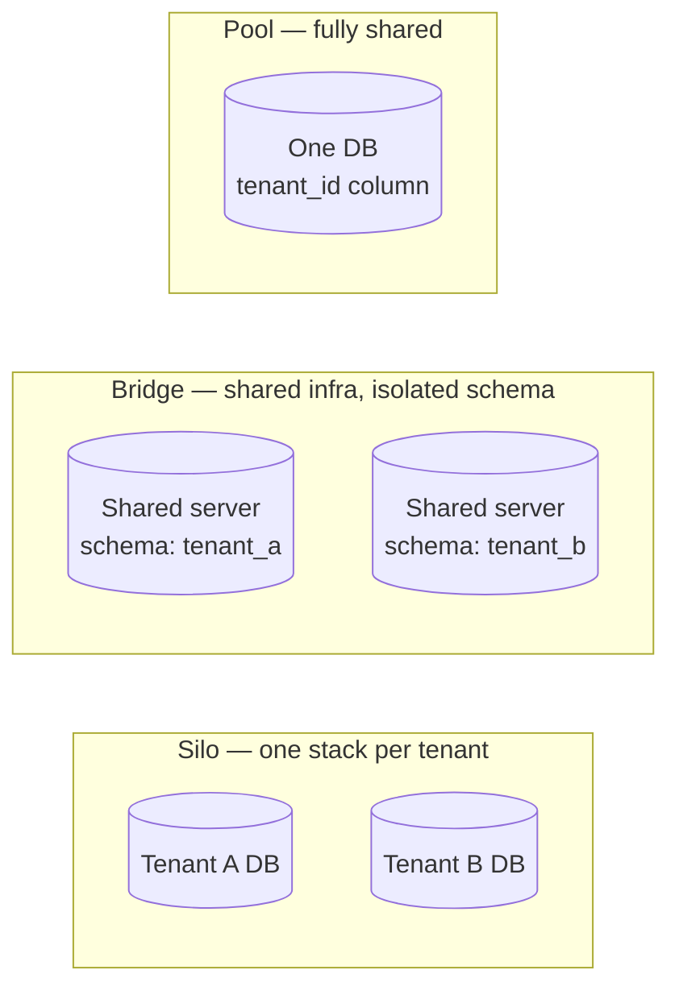
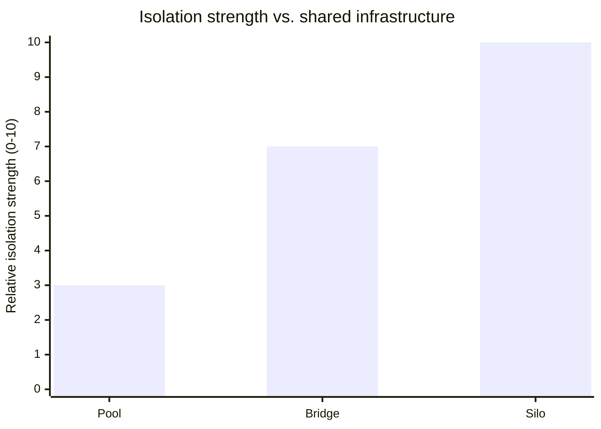

import Scenario from "../../../components/Scenario.astro";
import LevelIntro from "../../../components/LevelIntro.astro";

<Scenario label="The problem">
  <Fragment slot="facts">
    

      
🔓 <strong>Incident 1 — data leak</strong> — a query missing `WHERE tenant_id = ?` returned Company A's invoices inside Company B's dashboard

      
🐢 <strong>Incident 2 — noisy neighbor</strong> — one tenant's overnight batch export saturated the shared database, and every other tenant's dashboard timed out

    

    

      

        
Leaked data

        one tenant sees another tenant's rows
      

      

        
Leaked performance

        one tenant's load slows down everyone else
      

    

  </Fragment>

Two SaaS incidents, same root cause: the system was built to serve many
customers ("tenants") out of one codebase and one set of infrastructure, but
nothing actually enforced a boundary between them. Incident 1 leaked
_confidentiality_ — the wrong customer's data appeared on screen. Incident 2
leaked _capacity_ — no data crossed the line, but one tenant's behavior
degraded every other tenant's experience anyway.

| Incident       | What crossed the boundary | What was missing                          |
| -------------- | ------------------------- | ----------------------------------------- |
| Data leak      | Rows                      | A query-time tenant filter                |
| Noisy neighbor | Nothing — just latency    | A per-tenant limit on shared resource use |

**Both incidents happened in a system that "worked" for months. What has to be true architecturally so neither one is even possible, instead of just unlikely?**

</Scenario>

Multi-tenant architecture is the set of decisions that answer that question:
how much of the stack is shared across customers, and where exactly the
boundary between them is drawn and enforced.

<LevelIntro
  items={[
    "Three isolation models: silo, pool, bridge",
    "How a request gets tagged with its tenant",
    "Where isolation breaks: data vs. load",
  ]}
/>

## What is a tenant?

A **tenant** is one customer (or customer organization) whose data and usage
must stay separate from every other tenant's, even though they all run on the
same application. A single-tenant system has one deployment per customer —
multi-tenant means many customers share infrastructure, and the software
itself is what keeps them apart.

- **Isolation** — the guarantee that one tenant cannot read, write, or
  otherwise be affected by another tenant's data or load.
- **Tenant identity** — some value (an ID, a subdomain, a claim in a token)
  that tells the system, for every single request, _whose_ request this is.
- **Blast radius** — how much damage a bug, an outage, or a misbehaving
  tenant can do. A smaller blast radius means fewer tenants are affected when
  something goes wrong.
- **Noisy neighbor** — a tenant whose usage pattern (traffic spike, huge
  export, expensive query) degrades shared infrastructure for everyone else
  on it.

## Three isolation models at a glance

| Model      | What's shared                          | What's separate                      | Typical fit                                         |
| ---------- | -------------------------------------- | ------------------------------------ | --------------------------------------------------- |
| **Silo**   | Nothing (or only the codebase/deploy)  | Database, sometimes whole deployment | Regulated or very large tenants                     |
| **Pool**   | Everything — app, DB, tables           | Only a `tenant_id` column per row    | Many small tenants, low cost per one                |
| **Bridge** | App and DB server, not the schema/rows | A schema (or shard) per tenant       | Middle ground — isolation without one DB per tenant |

Neither incident's system is unusual for choosing pool — pooling is often the
right call for cost and operational simplicity. What's missing in both
incidents isn't "the wrong model," it's that the model's own responsibility
(scoping every query, limiting every tenant's resource use) was never
actually enforced in code.

## How does a request know which tenant it belongs to?

Every request has to carry tenant identity somehow, before any query or
resource limit can even be applied:

| Signal      | Example                      | Where it's read                            |
| ----------- | ---------------------------- | ------------------------------------------ |
| Subdomain   | `acme.example.com`           | Reverse proxy / router                     |
| Path prefix | `/t/acme/api/orders`         | Router                                     |
| Header      | `X-Tenant-Id: acme`          | API gateway or middleware                  |
| JWT claim   | `{"tenant_id": "acme", ...}` | Auth middleware, after verifying the token |

Whichever signal is used, it has to be resolved into a trusted tenant ID
**before** any data access happens — a signal a client can freely set (like a
header nobody validates) is not identity, it's a suggestion.

- Isolation has two independent dimensions: **data** (who can see which
  rows) and **load** (whose usage affects whose latency). A system can get
  one right and still fail the other, as both incidents above show.
- The three isolation models — silo, pool, bridge — trade cost and
  operational simplicity against isolation strength; there's no
  universally "correct" one, only a fit for a given tenant mix.
- Tenant identity has to be resolved from a trusted source (a verified
  token, a routing rule) before it's used to scope anything.
