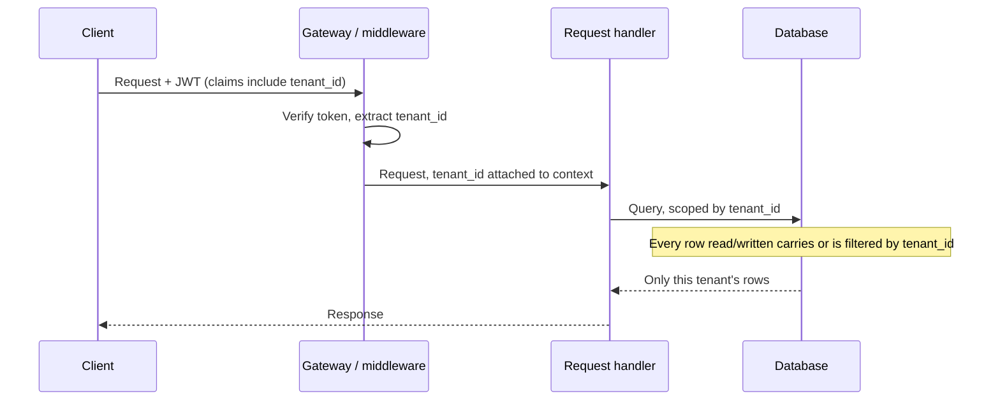
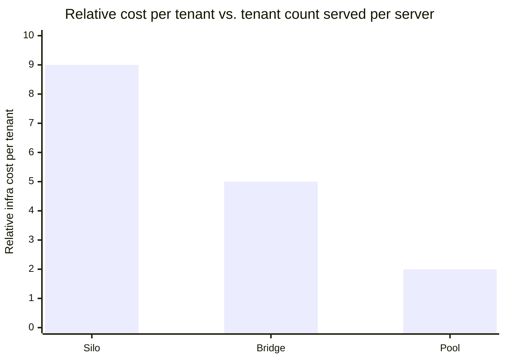

import Checkpoint from "../../../components/Checkpoint.astro";
import LevelIntro from "../../../components/LevelIntro.astro";

L1 named the two incidents — a data leak and a noisy neighbor — and the three
isolation models that trade cost against isolation strength. L2 goes one
level deeper: what actually has to happen, mechanically, for a request to
stay inside its tenant's boundary, and where each model puts the enforcement
point.

<LevelIntro
  items={[
    "How tenant context flows from request to query",
    "The shared-schema pattern and row-level security",
    "Why data isolation and load isolation are separate problems",
  ]}
/>

## How does tenant identity get from a request to a query?



Tenant identity has to be resolved exactly once, as early as possible in the
request lifecycle, and then carried forward as **context** — not
re-derived or re-trusted at every layer. If the gateway verifies the JWT and
extracts `tenant_id`, every downstream layer (handler, service, query) should
receive that already-trusted value rather than reading it again from
something a client could tamper with, such as a request body field.

## The shared-schema pattern: one table, a `tenant_id` column, and something that enforces it

The **pool** model (L1) puts every tenant's rows in the same tables. The
isolation guarantee then rests entirely on one fact: does every single query
against that table filter by `tenant_id`? In a codebase with dozens of query
sites, "always remember the filter" is exactly the kind of promise that
breaks under time pressure — which is precisely what happened in L1's
Incident 1.

Two ways to make that promise structural instead of a matter of discipline:

```
# Option A — enforce it at the query layer (application-side)
def find_orders(tenant_id, filters):
    return db.query("orders")
             .where(tenant_id=tenant_id)   # always present, never optional
             .where(**filters)
             .all()
```

```sql
-- Option B — enforce it at the database layer (row-level security)
-- Postgres example: the database itself refuses to return rows
-- outside the current session's tenant, even if a query forgets to filter.
ALTER TABLE orders ENABLE ROW LEVEL SECURITY;

CREATE POLICY tenant_isolation ON orders
    USING (tenant_id = current_setting('app.current_tenant')::uuid);
```

Option A depends on every developer, in every query, remembering the filter.
Option B moves the guarantee into the database itself: even a query that
forgets `WHERE tenant_id = ...` gets rows filtered by the database's own
policy, because the connection's session variable (`app.current_tenant`) is
what the policy checks — not the query text. This is the difference between
a convention and an enforced boundary, the same distinction L1 drew between
"the model" and "what actually enforces it."

<Checkpoint question="A junior engineer argues Option A is enough, since code review will always catch a missing tenant_id filter. What's the actual risk with relying on review alone?">

Review catches what a reviewer thinks to look for, on every single query
site, forever — including six months from now when someone adds a new query
under deadline pressure and the reviewer is tired, distracted, or new to the
codebase. Row-level security (Option B) doesn't depend on anyone remembering
anything on any given day; it moves the guarantee into a place that gets
checked automatically, on every query, by the database itself. Review is
still valuable, but as a second line of defense — not the only one standing
between "forgot a filter" and a cross-tenant leak.

</Checkpoint>

## Isolation models compared

| Model  | Enforcement point                          | Blast radius of a bug          | Cost per tenant | Onboarding a new tenant |
| ------ | ------------------------------------------ | ------------------------------ | --------------- | ----------------------- |
| Silo   | Infrastructure — separate DB/deployment    | One tenant                     | Highest         | Slowest (new stack)     |
| Bridge | Schema/shard boundary within shared infra  | One schema's tenants           | Medium          | Medium (new schema)     |
| Pool   | Application code and/or row-level security | Every tenant sharing the table | Lowest          | Fastest (a new row)     |



The pattern across the row: moving from silo toward pool trades isolation
strength for cost efficiency and onboarding speed. Neither incident in L1
required switching models — Incident 1 needed enforcement moved from
convention to the database; Incident 2 needed a completely different
mechanism, covered next.

## Why doesn't fixing the data leak also fix the noisy neighbor?

Because they're different resources being contended for. Row-level security
governs **which rows a query is allowed to see** — it says nothing about
**how much of the database's CPU, connections, or I/O bandwidth** that query
is allowed to consume. A tenant can be perfectly isolated from seeing anyone
else's data and still run a query so expensive it starves the shared
connection pool for every other tenant.

<Checkpoint question="A pooled database enforces row-level security perfectly — every tenant only ever sees their own rows. Does that guarantee the noisy-neighbor incident from L1 can't happen?">

No. Row-level security is purely about visibility of data, not about
consumption of shared capacity. A tenant running an expensive nightly export
still opens real connections, still burns real CPU and I/O on the shared
database — none of which row-level security limits in any way. Preventing
that requires a separate mechanism that caps how much of the shared resource
any one tenant can use, independent of whether their queries are correctly
scoped.

</Checkpoint>

That separate mechanism — a per-tenant limit on shared resource use — is
what L3 builds: a rate limiter that caps one tenant's request rate before it
can starve the rest.

- Tenant identity should be resolved once, early, from a trusted source, and
  carried as context — not re-derived at every layer.
- The shared-schema pattern's isolation guarantee is only as strong as its
  weakest enforcement point; row-level security moves that guarantee from
  "every developer remembered" to "the database enforces it."
- Data isolation and load isolation are separate problems requiring separate
  mechanisms — solving one does not solve the other.
