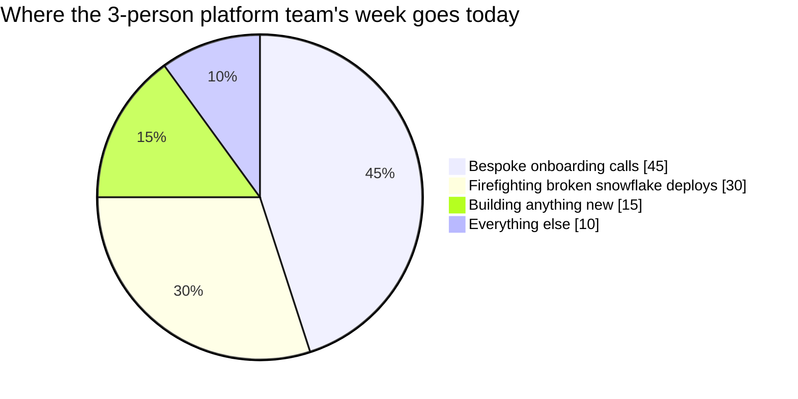

import Scenario from "../../../components/Scenario.astro";
import LevelIntro from "../../../components/LevelIntro.astro";

<Scenario label="The problem">
  <Fragment slot="facts">
    

      

        14 / 14
        teams onboarded, bespoke scripts written
      

      

        

      

      
0 teams shipped via a repeatable path

    

    

      
🧑‍🔧 Platform team: 3 engineers

      
🎫 Open onboarding tickets: 60

      
📞 Every new team's first deploy needs a Slack thread with the platform team

    

    
Platform vs. product

    

      
🛣️ Paved road — the default, supported, self-service way to do a thing

      
🚪 Escape hatch — an intentional, documented way off the paved road

      
🧩 Thinnest viable platform — build only what's proven needed, not speculative

    

  </Fragment>

A platform team built a slick "one-click deploy" script for the Payments
team — Terraform under the hood, a Jenkins job wired to their exact repo
layout. It worked great. Six months and 14 teams later, every new team's
onboarding still starts with a Slack thread: someone from the platform
team walks them through 40 Terraform variables by hand, because the
original script was never built to be reused — it was built to solve
Payments' problem.

Now the platform team of three is the bottleneck for every team's first
deploy, carrying a 60-ticket backlog, and spending more time in onboarding
calls than building anything new.

| What got built                        | What a platform actually needs to be                          |
| ------------------------------------- | ------------------------------------------------------------- |
| One script, tuned to one team's setup | A default path any team can self-serve without a ticket       |
| Undocumented, tribal-knowledge setup  | A documented, versioned template with a real owner            |
| No way to opt out cleanly             | An intentional, supported escape hatch for teams who need one |

**Before reading on: if the platform team just hires two more engineers to
answer tickets faster, does the bottleneck actually go away, or does it
just move?**

</Scenario>

The fix isn't more hands answering tickets — it's changing what gets
built in the first place. A **product** solves one customer's problem.
A **platform** solves the _class_ of problem, packaged so any team can
adopt it without the platform team in the room. The habit to build here is
treating other engineering teams as your customers, and the paved road as
the product you ship them.

<LevelIntro
  items={[
    "Platform vs. product: who the customer is and what 'done' means",
    "Paved roads, golden paths, and why they need escape hatches",
    "Self-service vs. ticket-driven, and the thinnest viable platform",
  ]}
/>

## Vocabulary

| Term                              | Plain version                                                                                            |
| --------------------------------- | -------------------------------------------------------------------------------------------------------- |
| Platform engineering              | Building internal tooling/infra _as a product_ for other engineering teams, not a one-off script         |
| Internal developer platform (IDP) | The set of self-service tools, APIs, and templates a platform team maintains for other teams             |
| Paved road / golden path          | The default, supported, opinionated way to do a common task (spin up a service, add a database)          |
| Self-service                      | A team provisions or deploys something themselves, with no ticket to the platform team                   |
| Escape hatch                      | A documented, supported way to deviate from the paved road when it genuinely doesn't fit                 |
| Thinnest viable platform (TVP)    | Build the smallest platform that removes real, observed friction — not speculative infra ahead of demand |
| Golden-path coverage              | The percentage of a team's stack/workflow the paved road actually handles, vs. what's still manual       |

## What a platform is, and isn't

- **A platform is not a bigger version of the first script.** The Payments
  deploy script _worked_, but it wasn't reusable — it encoded one team's
  assumptions (their repo layout, their exact Terraform variables) as if
  they were universal. A platform starts from "what's common across every
  team that needs this," not "what worked for the first team that asked."
- **The customer is other engineering teams**, not end users. That means
  platform work gets evaluated the same way product work does: does it
  reduce time-to-first-deploy, does it get adopted voluntarily, does it
  have a feedback loop — not just "does it technically function."
- **Self-service beats tickets** because a ticket puts the platform
  team's headcount on the critical path of every other team's work. A
  paved road that a team can walk without asking permission removes the
  platform team from that path entirely — they only get pulled in for the
  cases the paved road genuinely doesn't cover.
- **A paved road is a default, not a mandate.** Force every team onto one
  path with no way off and you've built a paved _prison_ — teams with a
  real reason to deviate either fight you or quietly fork around you. A
  documented escape hatch keeps the road optional, not obligatory.
- **Thinnest viable platform**: build the minimum that removes friction
  you've actually observed (three teams independently reinventing the
  same Terraform module), not infrastructure speculatively built ahead of
  any team asking for it. A platform team's roadmap should be driven by
  where the tickets and workarounds already are, not by what looks
  impressive to build.

That pie is the actual cost of shipping products instead of a platform:
almost all of the team's time is consumed by the _support burden_ of
one-off integrations, leaving almost none for the paved road that would
have prevented them.

| Signal you're building a product       | Signal you're building a platform                             |
| -------------------------------------- | ------------------------------------------------------------- |
| Each new team needs a bespoke setup    | Each new team follows the same documented path                |
| Platform team is in the room to deploy | A team deploys without the platform team present              |
| No version on what was shipped         | The paved road has a version; teams know which one they're on |
| Adoption is mandatory                  | Adoption is voluntary and measured                            |
