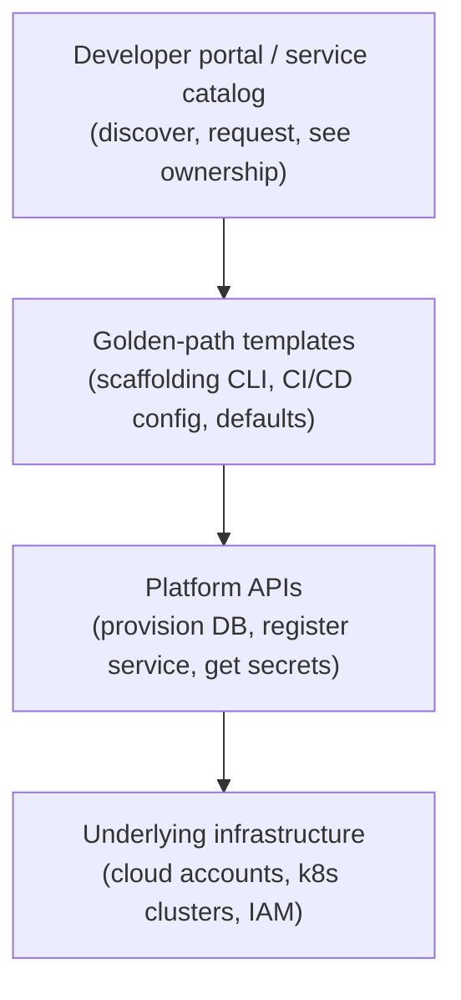
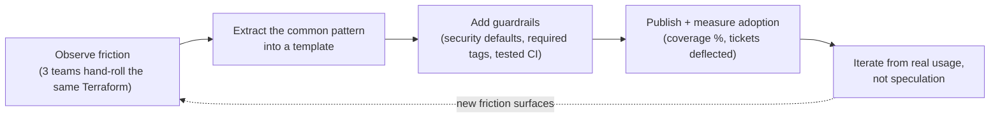

import Scenario from "../../../components/Scenario.astro";
import LevelIntro from "../../../components/LevelIntro.astro";
import Checkpoint from "../../../components/Checkpoint.astro";

<Scenario label="A new wrinkle">
  <Fragment slot="facts">
    

      
🏗️ Platform team extracts the Payments script into a reusable template

      
🧑‍🤝‍🧑 Team #15 asks to onboard — no ticket, no Slack thread

      
❓ But nobody defined what the template actually promises, or who owns it after today

    

  </Fragment>

The platform team from L1 extracts the Payments deploy script into a
generic template: fill in a service name, get a working CI pipeline and a
provisioned database. Team #15 uses it with zero platform-team
involvement — the first real self-service win.

**Does turning one script into a reusable template, by itself, make this
a platform — or is something still missing that decides whether Team #16
through Team #50 can trust it the same way?**

</Scenario>

A template that works once isn't a platform yet — a platform is a
template plus a contract: what it promises, who owns it, how it changes
over time, and how someone gets off it if it stops fitting. The rest of
this level is that contract.

<LevelIntro
  items={[
    "The layered shape of an internal developer platform",
    "How a golden path actually gets built, from friction to template",
    "Guardrails vs. mandates: keeping the road paved, not walled",
  ]}
/>

## The layers of an internal developer platform

**If Team #15's request only had to touch "fill in a service name," how
many layers of machinery had to already exist underneath that one input
for it to produce a running, deployed service?**

- **Infrastructure** is the raw cloud/cluster layer — necessary, but a
  team asking for a database directly at this layer is back to filing a
  ticket and waiting for a human.
- **Platform APIs** wrap infrastructure behind a self-service call:
  "provision a Postgres instance," "register a new service," "issue a
  secret" — callable by a script, not a person.
- **Golden-path templates** are the opinionated defaults built on top of
  those APIs: run one command, get a service skeleton wired to CI, a
  database, logging, and a catalog entry, all pre-configured to the
  platform's standards.
- **The developer portal / service catalog** is where the golden path
  becomes discoverable and where ownership, tier, and status live —
  without it, teams don't know the paved road exists, and nobody can
  answer "who owns this service" six months later.

Each layer only works because the one below it is self-service already —
a golden-path template calling a platform API that still requires a
human to approve a ticket just relocates the bottleneck one layer down.

<Checkpoint question="If the Platform APIs layer required a human to manually approve every database provisioning request, would the Golden-path templates layer above it still count as self-service?">

No — self-service has to hold all the way down, not just at the layer the developer directly touches. A golden-path template that looks instant from the requesting team's side but silently blocks on a human approval one layer down has just moved the bottleneck, not removed it; the team still can't get a running service without someone else's availability. This is exactly why platform APIs are built as callable, automated operations rather than ticket queues with a nicer form on top — every layer above depends on every layer below actually being self-service, not just the top one looking that way.

</Checkpoint>

## Building a golden path: from observed friction to a template

**Where should the platform team look to decide what the next golden
path should be — a roadmap brainstorm, or somewhere else?**

This is the thinnest-viable-platform loop from L1, made concrete:

1. **Observe friction that's already happening** — three teams
   independently writing near-identical Terraform for a Postgres
   instance is a signal; a platform engineer's hunch about what teams
   _might_ need someday is not.
2. **Extract the common pattern.** Diff the three teams' setups; keep
   what's actually shared, parameterize what genuinely varies (instance
   size, region), and drop the one-off logic that was specific to a
   single team's history rather than the general problem.
3. **Add guardrails, not just convenience.** The template should also
   bake in the defaults a security review would otherwise catch late —
   encryption at rest, least-privilege IAM, required ownership tags —
   so following the paved road is also the compliant path, not a
   separate checklist.
4. **Publish it and measure adoption**, not just "ship and assume." A
   golden path nobody uses hasn't solved anything; adoption percentage
   and tickets-deflected are the actual signal the template worked.
5. **Iterate from what real usage shows**, feeding back into step 1 —
   the loop doesn't end at publish; the next friction it surfaces (a
   team whose case genuinely doesn't fit) becomes the input to either
   widen the golden path or design its escape hatch properly.

| Golden path built from...        | Golden path built from...            |
| -------------------------------- | ------------------------------------ |
| Friction 3+ teams already hit    | One engineer's guess at future needs |
| A diffed, generalized pattern    | The first team's script, renamed     |
| Measured adoption after shipping | "We built it, they'll come"          |

## Guardrails vs. mandates: keeping the road paved, not walled

A golden path earns adoption by being _easier_ than the alternative, not
by being the only legal option. **If a team has a genuine reason the
golden path doesn't fit — an unusual compliance requirement, a legacy
system with different constraints — should the platform team block them,
or does the platform still owe them something?**

The platform still owes them an **escape hatch**: a documented, supported
way to deviate, with a clear line about what stops being guaranteed once
they take it (they now own their own CI maintenance, their own upgrade
path, etc.). Without one, a team with a real reason to deviate does it
anyway — quietly, undocumented, and now invisible to the platform team
until it breaks. A visible, sanctioned off-ramp is strictly better than
an invisible one, because at least the platform team knows it exists.

<Checkpoint question="A platform team makes the golden-path CI template mandatory for every service, with no documented way to opt out, to maximize consistency. Six months later they discover two teams silently forked the template and haven't updated it since. Was making it mandatory the fix for consistency, or did it work against it?">

It worked against it. Removing the legitimate escape hatch didn't remove the teams' real reasons to deviate — it just removed the platform team's visibility into when that happened. A documented, supported escape hatch keeps a deviation visible (the platform team knows who forked, why, and can revisit it later); a mandate with no legal way off just pushes the same deviation underground, where it drifts unnoticed and unmaintained, which is a worse consistency outcome than an acknowledged, tracked exception.

</Checkpoint>

## Signals a golden path is actually working

| Metric                                 | What it tells you                                                       |
| -------------------------------------- | ----------------------------------------------------------------------- |
| Golden-path coverage %                 | How much of teams' actual stack the paved road handles vs. manual       |
| Time-to-first-deploy for a new service | Whether the paved road is actually faster than the old way              |
| Tickets deflected per month            | Whether self-service is really removing the platform team from the path |
| Voluntary adoption rate                | Whether teams choose the road, or only use it because it's forced       |

These four together are the platform-as-product feedback loop: without
them, a platform team is shipping into the dark the same way the
one-off Payments script did — the difference this time is having a
measurable way to know whether the fix actually worked.
