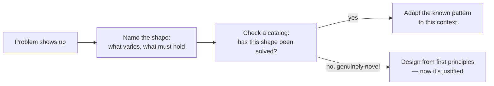

import Scenario from "../../../components/Scenario.astro";
import LevelIntro from "../../../components/LevelIntro.astro";

<Scenario label="The three sprints">
  <Fragment slot="facts">
    
The ask

    

      
📦 Notify 3 downstream systems when an order changes state

      
🔁 Must survive a downstream system being offline for hours

      
🧾 Must be replayable for an audit six months later

    

    
What actually happened

    

      
🗓️ ~3 sprints spent designing retries, ordering, and a replay log from a blank page

      
😬 The design converged on something that already has a name

    

  </Fragment>

A team is told: "when an order changes state, tell billing, shipping, and
analytics — reliably, even if one of them is down for a few hours, and keep
enough history to answer an auditor's question six months from now." No one
on the team has built this before, so they start from a blank page: how do
we retry, how do we keep order, how do we avoid re-sending the same
notification twice, how much history do we keep and where.

Three sprints later, the design that emerges — a durable log of "this
happened" events, written in the same transaction as the state change,
that other systems can read or replay independently — is not new. It has a
name (an event log with a transactional outbox), it has known failure
modes, and it has been described, argued over, and refined in public
architecture catalogs for over a decade.

**The team didn't fail — they just paid the full price of discovery for a
problem shape (reliable, replayable notification of a state change) that
was already solved. What would it have looked like to recognize the shape
first, and only then start designing?**

</Scenario>

<LevelIntro
  items={[
    "What a reference architecture actually is",
    "Why catalogs of known problem shapes exist",
    "How to recognize a shape before designing from scratch",
  ]}
/>

## What "reference architecture" means here

A **reference architecture** is a named, documented blueprint for a
recurring problem shape — not a single company's specific system, but the
distilled, reusable shape underneath many companies' versions of the same
problem. "Layered web app," "CQRS with event sourcing," "pipe-and-filter
batch pipeline," "circuit breaker between two services," "strangler fig
migration off a legacy system" — each names a shape, a set of known
trade-offs, and (usually) a diagram someone else already drew and stress-
tested in public.

This is a different, narrower question than **architectural style**
(covered in `architecture-styles`): a style is a broad category — layered,
hexagonal, event-driven, microservices — you choose between for a whole
system. A reference architecture is a specific, catalogued solution to a
specific recurring _sub_-problem that shows up inside any of those styles —
"how do I reliably notify other systems of a change" is one sub-problem
that has its own catalogued answer, independent of which broad style the
rest of the system uses.

## A small catalog of recognizable shapes

| Problem shape you're facing                                               | Reference pattern                               | What it solves                                                                                 |
| ------------------------------------------------------------------------- | ----------------------------------------------- | ---------------------------------------------------------------------------------------------- |
| "Tell other systems a state change happened, reliably"                    | Transactional outbox + event log                | No lost or duplicated notifications, replayable history                                        |
| "Reads vastly outnumber writes, and they need different shapes"           | CQRS (Command Query Responsibility Segregation) | A write model optimized for correctness, a read model optimized for the query you actually run |
| "A business transaction spans multiple services, no shared database"      | Saga (orchestrated or choreographed)            | Multi-step consistency without a distributed transaction                                       |
| "Data flows through independent transformation stages"                    | Pipe-and-filter                                 | Each stage stays testable and swappable on its own                                             |
| "One flaky downstream dependency shouldn't take down everything upstream" | Circuit breaker                                 | Fails fast instead of piling up timeouts and exhausting resources                              |
| "Migrate off a legacy system without a big-bang rewrite"                  | Strangler fig                                   | Old and new run side by side; traffic shifts incrementally                                     |

None of these is exotic — each has been implemented, documented, and
argued over publicly hundreds of times. The skill this unit teaches isn't
memorizing the table; it's recognizing which row your actual problem is
sitting in _before_ you start drawing boxes.

## Why catalogs exist at all

Two things stack up every time a problem shape gets solved in isolation
instead of looked up:

1. **Rediscovery cost.** Someone re-derives failure modes (duplicate
   delivery, out-of-order events, retry storms) that a catalog entry
   already lists, usually the hard way — in production.
2. **Lost shared vocabulary.** "We built a thing that logs state changes
   and replays them" takes a paragraph to explain to a new hire. "We used
   an outbox pattern" takes three words, because the listener can go look
   it up.

A catalog entry isn't a rule that says "you must implement it exactly this
way" — it's a documented starting point with the mistakes already priced
in, that you then adapt to your actual constraints (L2 and L3 dig into
that adaptation step, and where blindly copying a pattern goes wrong).
